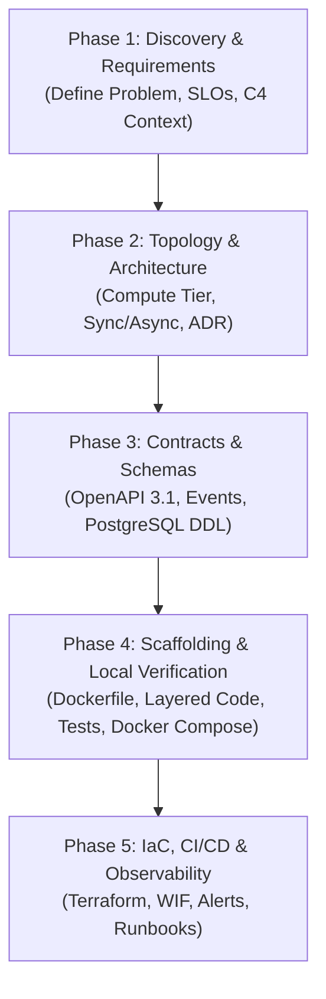

# Playbook: Design a New Microservice (5-Pass Progressive Plan Expansion)

> **Playbook ID**: `PB-01`  
> **Target**: AI Agents & Systems Architects  
> **Goal**: Systematically design, specify, scaffold, and operationalize a new microservice in this repository without contract drift, architectural hallucination, or unverified deployments.  
> **Methodology**: 5-Pass Progressive Plan Expansion

---

## Overview

Designing a new microservice is not a single prompt task. It is an iterative progression that moves from macro requirements (Pass 1) down to progressive cloud deployment (Pass 5). 

Follow these 5 progressive phases in sequence. Do NOT jump to code until Phase 3 contracts are formalized.



---

## Phase 1: Discovery & Requirements Expansion (Pass 1 / Zoom Level 1)

### Objective
Define *why* the service exists, who calls it, what boundaries constrain it, and its mathematical SLO envelope.

### Step-by-Step Prompting & Actions
1. **Define Service Mission**:
   * What business capability does this service own? (Single Responsibility Principle)
   * Who are the primary actors (End-users, third-party systems, internal services)?
2. **Quantify Non-Functional Requirements (NFRs)**:
   * Target Availability: (e.g., `99.9%` baseline)
   * Latency SLO: `p95 <= 150ms`, `p99 <= 250ms` (synchronous) or `p95 <= 30s` (asynchronous)
   * Throughput: Sustained RPS and peak burst RPS
   * Recovery: RTO / RPO targets
3. **Update System Context Model**:
   * Review `docs/01-architecture/c4-context-model.md`.
   * Add any new external actors or dependencies introduced by this service.

#### Gate 1 Verification Checklist:
- [ ] Service mission is documented in 1-2 paragraphs.
- [ ] At least 3 explicit non-goals are defined to prevent scope creep.
- [ ] Quantified SLOs are documented (no vague adjectives like "fast").

---

## Phase 2: Service Topology & Architecture Expansion (Pass 2 / Zoom Level 2)

### Objective
Determine the communication topology, compute runtime, and resilience patterns.

### Step-by-Step Prompting & Actions
1. **Determine Interaction Model**:
   * **Synchronous API** (`services/<name>`): Cloud Run v2 HTTP service behind Cloud Load Balancing / Cloud CDN. Best for low-latency queries and immediate command results.
   * **Asynchronous Worker** (`services/<name>-worker`): Cloud Run v2 service triggered via Cloud Pub/Sub push subscription or background job. Best for heavy compute, batch operations, third-party webhooks.
2. **Draft Architectural Decision Record (ADR)**:
   * Create `docs/adr/00XX-<service-name>-architecture.md` using `docs/adr/template.md`.
   * Document:
     - Context and problem statement.
     - Decision drivers (latency, cost, operational complexity).
     - Considered options and trade-offs.
     - Chosen runtime, scaling constraints (`min-instances`, `max-instances`, `concurrency`).
3. **Update Container Architecture Model**:
   * Update `docs/01-architecture/c4-container-model.md` to show the new container node, its database connections, and Pub/Sub topic subscriptions.

#### Gate 2 Verification Checklist:
- [ ] New ADR accepted in `docs/adr/`.
- [ ] C4 Container diagram updated with network boundaries and protocol annotations.
- [ ] Database isolation or shared schema boundaries agreed upon.

---

## Phase 3: Interface, Contract & Schema Expansion (Pass 3 / Zoom Level 3)

### Objective
Lock down the machine-readable contracts before touching any source code. Contracts are the Single Source of Truth (SSOT).

### Step-by-Step Prompting & Actions
1. **For Synchronous REST Endpoints**:
   * Open `contracts/api/openapi.yaml`.
   * Define new paths, request bodies, query parameters, and responses.
   * Enforce RFC 7807 problem details for 4xx/5xx errors (`application/problem+json`).
   * Provide complete mock examples in `contracts/api/mock-server.json`.
2. **For Asynchronous Events**:
   * Create `contracts/events/<event-name>.v1.json` adhering to CloudEvents v1.0.
   * Document event schema fields, types, and descriptions.
   * Update `contracts/events/README.md` catalog.
3. **For Database Persistence**:
   * Open `contracts/database/schema.sql`.
   * Define table DDL with UUIDv7 primary keys, created_at/updated_at timestamps, indexes, and foreign keys.
   * Update the Mermaid Entity-Relationship Diagram in `contracts/database/erd.md`.

#### Gate 3 Verification Checklist:
- [ ] OpenAPI specification is valid and linted.
- [ ] Event JSON Schemas validate against CloudEvents v1.0 meta-schema.
- [ ] PostgreSQL DDL uses UUID PKs and includes appropriate indexes.

---

## Phase 4: Service Scaffolding & Local Verification (Pass 4 / Zoom Level 4)

### Objective
Scaffold the service code, Dockerfile, tests, and integrate into the local developer feedback loop.

### Step-by-Step Prompting & Actions
1. **Initialize Service Directory**:
   * Create `services/<service-name>/` with standardized layered structure:
     ```
     services/<service-name>/
     ├── Dockerfile              # Multi-stage, non-root (alpine/distroless)
     ├── README.md               # Service-specific documentation
     ├── src/
     │   ├── domain/             # Entities, value objects, business rules
     │   ├── handlers/           # HTTP routes or Pub/Sub message decoders
     │   ├── repository/         # Database queries (parameterized SQL)
     │   └── index.ts (or main.go / app.py)
     └── tests/                  # Unit and integration test suites
     ```
2. **Author Hardened Dockerfile**:
   * Multi-stage build (Builder stage -> Runtime stage).
   * Non-root user (`USER nonroot:nonroot` or `USER 10001:10001`).
   * Minimal base image (Distroless or Alpine).
3. **Integrate with Local Orchestration**:
   * Add service definition to `docker-compose.yml` with port mapping, environment variables, and health checks.
4. **Implement Tests**:
   * Write unit tests for domain logic and handlers.
   * Write integration tests against PostgreSQL test instance.
5. **Run Local Verification**:
   ```bash
   make verify
   ```

#### Gate 4 Verification Checklist:
- [ ] Service container builds cleanly without root privileges.
- [ ] Layered architecture separates handlers, business logic, and database access.
- [ ] `make verify` passes with 100% success rate.

---

## Phase 5: IaC, CI/CD & Observability (Pass 5 / Zoom Level 5)

### Objective
Provision cloud infrastructure declaratively, wire into progressive delivery pipelines, and establish production alerting.

### Step-by-Step Prompting & Actions
1. **Terraform Infrastructure as Code**:
   * Define the Cloud Run v2 service in `infra/modules/cloud_run/`.
   * Configure environment roots (`infra/environments/dev/`, `staging/`, `prod/`).
   * Set CPU allocation, memory limit, scaling limits, and Serverless VPC Access connector.
   * Bind IAM least-privilege service account and Secret Manager access.
2. **CI/CD Pipeline Integration**:
   * Update `.github/workflows/ci.yaml` to include linting, test, and container build for the new service.
   * Update `.github/workflows/deploy-staging.yaml` and `deploy-prod.yaml` for container pushing and traffic-split rollouts.
3. **Observability & Alerting**:
   * Add Cloud Monitoring alert policies in `monitoring/alert-policies.yaml`:
     - 5xx Error Rate > 1% (Critical)
     - p95 Latency > Target SLO (Warning)
     - Cloud Run revision container crash loop (Critical)
   * Create an incident runbook entry in `docs/03-operations/incident-runbook.md`.

#### Gate 5 Verification Checklist:
- [ ] `terraform validate` and `terraform fmt` pass cleanly.
- [ ] GitHub Actions workflow passes security scan (Trivy).
- [ ] Alert policies and runbook entry created.
