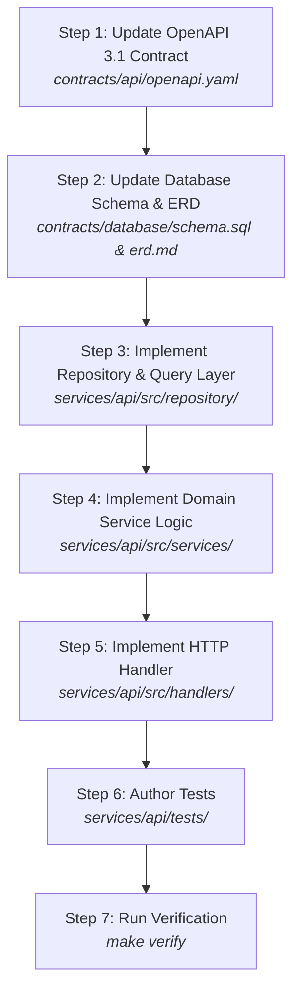

# Playbook: Scaffold a New API Endpoint (Contract-First Flow)

> **Playbook ID**: `PB-02`  
> **Target**: AI Agents & API Engineers  
> **Goal**: Add a new REST API endpoint to `services/api/` strictly adhering to the contract-first invariant.  
> **Rule**: Never write handler code before updating `contracts/api/openapi.yaml` and `contracts/database/schema.sql`.

---

## Workflow Overview



---

## Step 1: Update the OpenAPI 3.1 Contract

Before writing any application code, declare the complete endpoint specification in `contracts/api/openapi.yaml`.

### Instructions:
1. Open `contracts/api/openapi.yaml`.
2. Locate or declare the resource path (e.g., `/api/v1/projects/{projectId}/tasks`).
3. Define the HTTP operation (`get`, `post`, `put`, `delete`, `patch`):
   * `operationId`: Unique camelCase identifier (e.g., `createTask`, `getTaskById`).
   * `summary` & `description`: Clear purpose and security scope.
   * `parameters`: Path and query parameters with type, format (e.g., `format: uuid`), and validation constraints.
   * `requestBody`: JSON schema with required fields, property types, and examples.
   * `responses`:
     - `200` or `201`: Success payload schema with schema `$ref`.
     - `400`: Bad Request (`application/problem+json` RFC 7807).
     - `401`: Unauthorized.
     - `404`: Not Found (if path parameter is looked up).
     - `409`: Conflict (if unique constraint or optimistic lock failure).
     - `500`: Internal Server Error.
4. Add sample mock responses to `contracts/api/mock-server.json` to allow frontend decoupling.

#### Verification Gate:
Validate OpenAPI syntax:
```bash
# Verify YAML formatting and schema compliance
npx @stoplight/spectral-cli lint contracts/api/openapi.yaml || true
```

---

## Step 2: Update Database Schema & ERD (If Persistence Changes)

If the endpoint introduces new data entities, columns, or relationships:

### Instructions:
1. Open `contracts/database/schema.sql`.
2. Add new table or column definitions:
   * Primary key MUST use UUID (`id UUID PRIMARY KEY DEFAULT gen_random_uuid()`).
   * Include standard audit columns: `created_at TIMESTAMPTZ NOT NULL DEFAULT NOW()`, `updated_at TIMESTAMPTZ NOT NULL DEFAULT NOW()`.
   * Add B-Tree indexes on foreign keys, tenant IDs, and filter columns.
3. If an asynchronous event must be emitted:
   * Ensure the `outbox` table is utilized for atomic event publishing.
4. Update the visual Mermaid ERD in `contracts/database/erd.md`.

---

## Step 3: Implement Repository Layer (Data Access)

Write clean, parameterized database access logic in `services/api/src/repository/`:

### Instructions:
1. Define the repository interface and data models.
2. Ensure all SQL queries are strictly parameterized to prevent SQL injection:
   ```typescript
   // Example (TypeScript/pg)
   const query = `
     INSERT INTO tasks (id, tenant_id, title, status, created_at, updated_at)
     VALUES ($1, $2, $3, $4, NOW(), NOW())
     RETURNING *;
   `;
   const result = await db.query(query, [id, tenantId, title, status]);
   ```
3. If publishing an event:
   * Perform the entity write AND the outbox record insert in the **same database transaction**:
   ```sql
   BEGIN;
   INSERT INTO tasks (...) VALUES (...);
   INSERT INTO outbox (event_type, payload) VALUES ('task.created.v1', '...');
   COMMIT;
   ```

---

## Step 4: Implement Domain Service Logic

Implement business logic and authorization in `services/api/src/services/`:

### Instructions:
1. Decouple domain rules from HTTP headers and status codes.
2. Validate business invariants (e.g., cannot transition task from `ARCHIVED` to `IN_PROGRESS`).
3. Handle errors by returning domain error types (e.g., `NotFoundError`, `ConflictError`, `ValidationError`).

---

## Step 5: Implement HTTP Handler (Transport Layer)

Map HTTP requests to domain logic in `services/api/src/handlers/`:

### Instructions:
1. Parse and validate path parameters, query parameters, and JSON request bodies against the OpenAPI contract.
2. Invoke the domain service.
3. Return the response with the exact status code specified in `contracts/api/openapi.yaml` (e.g., `201 Created` for POST).
4. For all error conditions, return RFC 7807 problem details:
   ```json
   {
     "type": "https://api.example.com/errors/resource-not-found",
     "title": "Resource Not Found",
     "status": 404,
     "detail": "Task with ID 3fa85f64-5717-4562-b3fc-2c963f66afa6 was not found.",
     "instance": "/api/v1/tasks/3fa85f64-5717-4562-b3fc-2c963f66afa6"
   }
   ```

---

## Step 6: Author Automated Tests

Author automated test coverage verifying the new endpoint:

### Instructions:
1. **Unit Test (`services/api/tests/unit/`)**:
   * Test input validation (missing fields, invalid UUID formats).
   * Test service logic branch handling.
2. **Integration Test (`services/api/tests/integration/`)**:
   * Test HTTP request execution against mock or test database.
   * Verify status code, response payload structure, and headers.
   * Verify RFC 7807 error format on failure scenarios.

---

## Step 7: Run Full Verification Loop

Execute the local verification harness:

```bash
make verify
```

Ensure that:
* Linter passes without warnings.
* All unit and integration tests pass.
* No raw secrets or uncommitted files were leaked.
