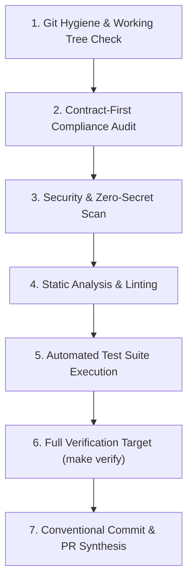

# Playbook: Pre-PR Branch Verification & Self-Audit

> **Playbook ID**: `PB-03`  
> **Target**: AI Agents & Engineers  
> **Goal**: Perform an exhaustive pre-PR self-audit to guarantee zero secret leaks, 100% contract adherence, passing tests, and clean Conventional Commits before submitting work.  
> **Mandate**: Never declare a task complete or submit a pull request without passing this audit.

---

## Pre-PR Verification Flow



---

## Step 1: Git Hygiene & Working Tree Check

Ensure no temporary files, debug artifacts, or unintended edits are present in the branch.

### Commands to Run:
```bash
# Check working tree state
git status --short

# Review all modified lines
git diff
```

### Audit Checklist:
- [ ] No temporary files (`.env`, `.DS_Store`, `*.swp`, `scratch/`, `debug.log`).
- [ ] Only files strictly within the task scope have been modified.
- [ ] No formatting-only churn across unrelated files.

---

## Step 2: Contract-First Compliance Audit

Verify that code changes are downstream of approved contracts in `contracts/`.

### Audit Checklist:
- [ ] **API Endpoints**: If any endpoint was created or altered in `services/api/`, is it fully specified in `contracts/api/openapi.yaml`?
- [ ] **Event Messages**: If any Pub/Sub message was added or modified in `services/worker/`, is its schema in `contracts/events/` conforming to CloudEvents v1.0?
- [ ] **Database Schema**: If any SQL tables or columns were changed, is `contracts/database/schema.sql` updated with UUID primary keys, and is `contracts/database/erd.md` in sync?
- [ ] **Error Formats**: Do all error paths return RFC 7807 problem details (`application/problem+json`)?

---

## Step 3: Security & Zero-Secret Audit

Guarantee no credentials, tokens, or security vulnerabilities are introduced.

### Audit Checklist:
- [ ] **Zero Secrets**: No API keys, passwords, bearer tokens, or service account credentials committed in code or configuration.
- [ ] **Container Hardening**: All Dockerfiles specify a non-root user (`USER nonroot` or `USER 10001:10001`).
- [ ] **Parameterized Queries**: All database interactions use parameter placeholders (`$1, $2` or `?`); zero raw SQL string concatenation.
- [ ] **No Public Ports**: Database and worker services are restricted to internal VPC / private IPs.

---

## Step 4: Static Analysis & Linting

Run automated linters to ensure code standards and type safety.

### Commands to Run:
```bash
# Execute lint suite
make lint
```

### Audit Checklist:
- [ ] Zero linter errors or compiler warnings.
- [ ] No forbidden suppression comments (`@ts-ignore`, `eslint-disable`, `# type: ignore`, `// nolint`) without explicit architectural justification.
- [ ] Strict types maintained (no TypeScript `any` types).

---

## Step 5: Automated Test Suite Execution

Execute all automated unit and integration tests.

### Commands to Run:
```bash
# Execute test suite
make test
```

### Audit Checklist:
- [ ] All tests execute and pass (100% pass rate).
- [ ] No failing tests skipped or commented out.
- [ ] New functionality is backed by corresponding unit or integration tests.

---

## Step 6: Full Verification Target

Execute the unified verification harness. This target replicates the GitHub Actions CI pipeline locally.

### Command to Run:
```bash
make verify
```

### Verification Criteria:
* Exit code must be `0`.
* Both stdout and stderr must indicate clean completion.

---

## Step 7: Conventional Commit & PR Synthesis

Audit git commit history and prepare the pull request description.

### Commit Format Audit:
Every commit must adhere to [Conventional Commits 1.0.0](https://www.conventionalcommits.org/):
```
<type>(<scope>): <summary>

[optional body]
```

* Allowed types: `feat`, `fix`, `docs`, `contracts`, `infra`, `ci`, `test`, `refactor`, `chore`.
* Summary is written in the imperative mood, lowercase, without trailing period.

### PR Description Template:
```markdown
## Summary of Changes
- Brief bulleted summary of architectural and code changes.

## Pass & Zoom Level Alignment
- **Pass Level**: Pass 4 (Agent Steering, Scaffolding & Task Expansion)
- **Contracts Affected**: contracts/api/openapi.yaml (or None)

## Verification Evidence
- [x] `make lint` passed cleanly
- [x] `make test` passed (X tests, 0 failures)
- [x] `make verify` completed with exit code 0

## Security Checklist
- [x] Zero raw secrets committed
- [x] Non-root container execution verified
- [x] Parameterized SQL queries verified
```
