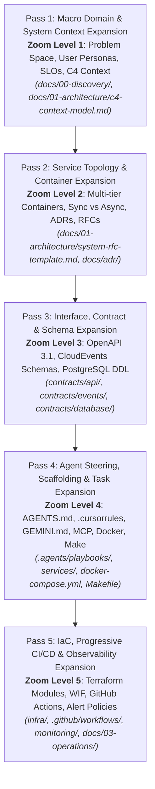
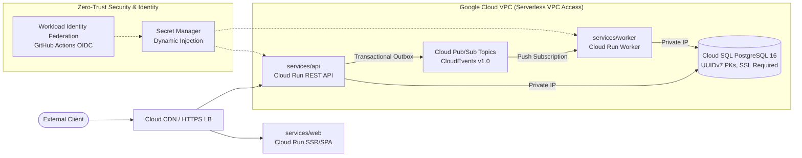

# AGENTS.md: AI Agent Operating Governance & Repository Standards

> **Pass 4 Artifact**: Agent Steering, Scaffolding & Task Expansion (Zoom Level 4)  
> **Target Audience**: Autonomous AI Agents (Antigravity, Claude Code, Cursor, Windsurf) and Human Engineers.  
> **Status**: Active & Authoritative  
> **Last Updated**: 2026-09-21

---

## 1. Architecture Mental Model

This repository is structured as an agent-native System Design-to-Deployment workflow targeting **Google Cloud Platform (GCP)**. All AI agents operating in this repository must ground their reasoning in the two foundational architectural pillars below.

### 1.1 The 5-Pass Progressive Plan Expansion Engine

System evolution follows a strict 5-pass progressive zoom methodology. Work must flow forward through these passes. An agent must never jump ahead to code without verifying that the upstream architecture and contracts are locked.



| Pass | Level | Core Concern | Primary Deliverables | Agent Gate Rule |
|---|---|---|---|---|
| **Pass 1** | Zoom 1 | Problem Space & Boundaries | `docs/00-discovery/`, `c4-context-model.md` | Non-goals locked, SLOs quantified. |
| **Pass 2** | Zoom 2 | Service Topology & Containers | `docs/01-architecture/`, `docs/adr/` | Container boundaries & ADRs accepted. |
| **Pass 3** | Zoom 3 | Contracts & Schemas | `contracts/api/`, `contracts/events/`, `contracts/database/` | Single Source of Truth (SSOT) locked. |
| **Pass 4** | Zoom 4 | Agent Steering & Local Runtimes | `AGENTS.md`, `.cursorrules`, `services/`, `docker-compose.yml` | `make verify` passes locally. |
| **Pass 5** | Zoom 5 | IaC, CI/CD & Observability | `infra/`, `.github/workflows/`, `monitoring/` | Trivy clean, progressive canary deploy. |

### 1.2 Multi-Tier Cloud Run Topology

The target production infrastructure executes on Google Cloud Platform with a zero-trust, serverless container topology:



* **Web Frontend (`services/web/`)**: Stateless client container deployed to Cloud Run, serving user interfaces and consuming the backend REST API.
* **API Backend (`services/api/`)**: High-concurrency synchronous API service on Cloud Run v2 executing core business logic and database transactions.
* **Asynchronous Worker (`services/worker/`)**: Event-driven background processing service running on Cloud Run, decoupled from user latency via Cloud Pub/Sub.
* **Event Backbone**: Cloud Pub/Sub topics enforcing the **CloudEvents v1.0** specification.
* **Data Tier**: Cloud SQL for PostgreSQL 16 with private IP, SSL enforcement, and connection pooling.
* **Security Fabric**: Zero static secrets; Workload Identity Federation (WIF) for CI/CD authentication, IAM service accounts, and Secret Manager.

### 1.3 Contract-First Invariants

The files in `contracts/` represent the **immutable contract authority**. 
* Source code in `services/` is downstream of `contracts/`.
* Code must NEVER define an API route, an event payload, or a database column that is not formally specified in `contracts/`.
* If a code change requires a contract change, the contract MUST be updated and validated first.

---

## 2. Directory Map & Ownership Boundaries

To maintain clean separation of concerns and avoid agent merge collisions, strict directory ownership boundaries are enforced:

```
.
├── .agents/                    # [Pass 4] Agent task playbooks and execution recipes
│   └── playbooks/              # Executable step-by-step agent playbooks
├── .github/                    # [Pass 5] CI/CD workflows and PR automation
│   └── workflows/              # GitHub Actions (ci.yaml, deploy-staging.yaml, deploy-prod.yaml)
├── .mcp/                       # [Pass 4] Model Context Protocol server configurations & guides
├── contracts/                  # [Pass 3] CONTRACTS SINGLE SOURCE OF TRUTH (Immutable SSOT)
│   ├── api/                    # OpenAPI 3.1 specifications and mock definitions
│   ├── database/               # PostgreSQL 16 DDL schema and Mermaid ERD
│   └── events/                 # CloudEvents v1.0 JSON schemas for Pub/Sub
├── docs/                       # [Pass 1 & 2] Documentation & Architectural Records
│   ├── 00-discovery/           # Problem statements, personas, and success metrics
│   ├── 01-architecture/        # C4 Context, C4 Container, and System RFCs
│   ├── 03-operations/          # Runbooks, SLO/SLI definitions, incident response
│   ├── adr/                    # Architecture Decision Records (Numbered: 0001, 0002, ...)
│   └── superpowers/            # Meta-planning specs and progressive implementation plans
├── infra/                      # [Pass 5] Infrastructure as Code (Terraform)
│   ├── environments/           # Environment roots: dev/, staging/, prod/
│   └── modules/                # Reusable modules: vpc, cloud_run, cloud_sql, pubsub, iam_wif
├── monitoring/                 # [Pass 5] Observability assets
│   ├── alert-policies.yaml     # Cloud Monitoring alert definitions
│   └── logging-config.md       # Structured JSON logging and audit trail standards
├── services/                   # [Pass 4] Application Microservices (Containerized)
│   ├── api/                    # Core REST API service (Dockerfile, src, tests)
│   ├── web/                    # Client frontend application (Dockerfile, src, tests)
│   └── worker/                 # Background event consumer (Dockerfile, src, tests)
├── .cursorrules                # High-density agent rules for Cursor / Copilot
├── AGENTS.md                   # Authoritative repository governance (This file)
├── docker-compose.yml          # Local multi-tier orchestration environment
├── GEMINI.md                   # Antigravity & Gemini CLI specific instruction file
└── Makefile                    # Unified build, test, and verification harness
```

### Ownership Boundaries

1. **`contracts/` (Pass 3 Authority)**:
   - Changes require explicit justification and cross-service validation.
   - Never edit generated code without updating the contract in this directory.
2. **`services/` (Pass 4 Implementation)**:
   - Each service is strictly decoupled and self-contained with its own tests, dependencies, and Dockerfile.
   - Inter-service communication must be via HTTP REST (`contracts/api/`) or Pub/Sub (`contracts/events/`). Never perform cross-database queries or shared memory access.
3. **`infra/` (Pass 5 Infrastructure)**:
   - Terraform manages all cloud resources. No manual GCP console modifications ("ClickOps") are permitted.
4. **`.agents/playbooks/`**:
   - Reusable prompt workflows for common developer tasks (designing services, adding endpoints, pre-PR audits).

---

## 3. Non-Negotiable Invariants

Every AI agent must preserve the following non-negotiable invariants across all code changes:

### Invariant 1: Zero Raw Secrets
* **NEVER** commit API keys, service account JSON files, passwords, private keys, or tokens.
* **NEVER** place real secrets in `.env`, `docker-compose.yml`, or test files.
* Secrets must be injected via GCP Secret Manager in production, and via safe environment variables (`.env.example` templates) in local development.

### Invariant 2: Contract Adherence
* **NEVER** create or modify an API endpoint in `services/api/` without first adding or updating the endpoint specification in `contracts/api/openapi.yaml`.
* **NEVER** introduce a new Pub/Sub message type without adding its JSON Schema to `contracts/events/`.
* **NEVER** add or alter a database column in service code without updating `contracts/database/schema.sql` and providing a migration script.

### Invariant 3: Transactional Outbox Pattern for Events
* Whenever an API mutation produces an asynchronous event, the event MUST be saved in the database within the **same atomic transaction** as the business entity update (the Transactional Outbox pattern).
* Direct publishing to Pub/Sub during an uncommitted database transaction is strictly forbidden (prevents dual-write data loss and phantom events).

### Invariant 4: UUID Primary Keys
* All relational database tables MUST use Universally Unique Identifiers (UUIDv7 or UUIDv4) as primary keys:
  ```sql
  id UUID PRIMARY KEY DEFAULT gen_random_uuid()
  ```
* Sequential integer IDs (`SERIAL`, `BIGSERIAL`, `AUTO_INCREMENT`) are strictly forbidden on business entities to prevent enumeration attacks and replication collisions.

### Invariant 5: Stateless Container Runtimes
* Containers deployed to Cloud Run must be 100% stateless.
* Local container filesystem writes must be confined to `/tmp` and treated as ephemeral.
* User sessions, caches, and state must be persisted in Cloud SQL PostgreSQL, Redis/Memorystore, or Google Cloud Storage.

### Invariant 6: CloudEvents v1.0 Standard
* All asynchronous messages published to Cloud Pub/Sub must adhere to the CNCF CloudEvents v1.0 specification defined in `contracts/events/event-envelope.json`:
  - Required fields: `id`, `source`, `specversion`, `type`, `time`, `datacontenttype`, `data`.

### Invariant 7: RFC 7807 Problem Details
* All HTTP error responses from `services/api/` must conform to RFC 7807 (`application/problem+json`):
  - Required fields: `type`, `title`, `status`, `detail`, `instance`.

---

## 4. Verification Mandate

Agents must adhere to the principle of **evidence before assertions**:

> [!IMPORTANT]
> **Verification Mandate**: An agent must ALWAYS run the local verification suite before declaring any task complete or submitting code for review. Never assume code works because it looks correct.

```bash
# Execute the full verification suite
make verify
```

### Protocol for Test Failures:
1. **Never skip or comment out failing tests** to force a passing build.
2. **Never suppress compiler, linter, or type-checker warnings** with permissive overrides (`any`, `@ts-ignore`, `# type: ignore`) unless specifically approved.
3. If `make verify` fails:
   - Read the exact failure log.
   - Locate the failing file and line number.
   - Formulate a root-cause diagnosis.
   - Apply a minimal, targeted fix.
   - Re-run `make verify` until all checks pass cleanly.

---

## 5. Commit Message Standards

This repository strictly enforces the [Conventional Commits 1.0.0](https://www.conventionalcommits.org/) specification. Every git commit generated by agents or developers must adhere to this standard.

### 5.1 Format Structure
```
<type>(<optional scope>): <imperative summary>

[optional body explaining context and architectural rationale]

[optional footer(s) referencing issues or breaking changes]
```

### 5.2 Allowed Types
* `feat`: A new user-facing feature or capability.
* `fix`: A bug fix or defect resolution.
* `docs`: Documentation updates, RFCs, ADRs, or README modifications.
* `contracts`: Modifications to OpenAPI specifications, JSON schemas, or database DDL.
* `infra`: Terraform modules, GCP resource configurations, or cloud policies.
* `ci`: GitHub Actions workflows, CI scripts, or pipeline configurations.
* `test`: Adding or correcting unit, integration, or contract tests.
* `refactor`: Code refactoring that neither fixes a bug nor adds a feature.
* `chore`: Maintenance tasks, dependency bumps, or toolchain updates.

### 5.3 Commit Examples
```bash
# Good examples:
git commit -m "feat(api): add task cancellation endpoint with outbox event"
git commit -m "contracts(database): add index on tasks(tenant_id, status)"
git commit -m "fix(worker): handle exponential backoff on dead-letter retries"
git commit -m "infra(cloudrun): tune max-instances and cpu allocation for api service"

# Bad examples (Will be rejected by CI):
git commit -m "update code"
git commit -m "wip"
git commit -m "fixed stuff"
```

---

## 6. Agent Interaction & Execution Protocol

When an AI agent receives a user prompt or task in this repository, it must follow this standardized execution protocol:

1. **Context Loading**:
   - Check `docs/` and `contracts/` to understand existing architectural decisions and contract boundaries.
   - Consult relevant ADRs in `docs/adr/` before proposing structural modifications.
2. **Playbook Consultation**:
   - Check `.agents/playbooks/` to see if a dedicated playbook exists for the task:
     - `design-service.md`: For designing a new microservice.
     - `scaffold-endpoint.md`: For adding a new API endpoint.
     - `verify-branch.md`: For performing a pre-PR self-audit.
3. **Execution with Minimal Blast Radius**:
   - Make targeted, minimal code modifications.
   - Preserve existing code comments, docstrings, and formatting.
   - Do not reformat unrelated files or introduce gratuitous dependencies.
4. **Verification**:
   - Execute `make verify` and inspect stdout/stderr.
   - Confirm all linter, type-check, and test gates pass.
5. **Clear Reporting**:
   - Report exactly what files were modified, what tests were executed, and the exact commands to reproduce the verification.
