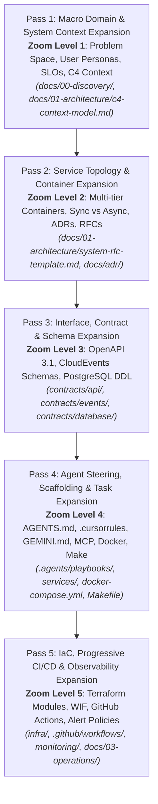

# Master Index of Created Deliverables

> **Repository**: `Application-structuring-wf-template`  
> **Framework**: 5-Pass Progressive Plan Expansion Engine (Zoom Levels 1 to 5)  
> **Target Cloud**: Google Cloud Platform (GCP)  
> **Status**: Production-Ready / Active  
> **Last Updated**: 2026-09-21  

---

## Overview

This master index provides an exhaustive catalog of all architectural specifications, interface contracts, agent steering rules, container runtimes, infrastructure-as-code modules, CI/CD pipelines, and observability configurations created within this repository. 

Every asset is categorized by its corresponding **Expansion Pass (Zoom Level)** within the 5-Pass Progressive Plan Expansion Engine.

---

## Table of Contents

1. [Pass 1: Macro Domain & System Context Expansion (Zoom Level 1)](#pass-1-macro-domain--system-context-expansion-zoom-level-1)
2. [Pass 2: Service Topology & Communication Architecture Expansion (Zoom Level 2)](#pass-2-service-topology--communication-architecture-expansion-zoom-level-2)
3. [Pass 3: Interface, Contract & Schema Expansion (Zoom Level 3)](#pass-3-interface-contract--schema-expansion-zoom-level-3)
4. [Pass 4: Agent Steering, Scaffolding & Task Expansion (Zoom Level 4)](#pass-4-agent-steering-scaffolding--task-expansion-zoom-level-4)
5. [Pass 5: IaC, Progressive CI/CD & Observability Expansion (Zoom Level 5)](#pass-5-iac-progressive-cicd--observability-expansion-zoom-level-5)
6. [Meta-Planning & Specification Documents](#meta-planning--specification-documents)
7. [Repository Inventory & Statistics](#repository-inventory--statistics)

---

## Pass 1: Macro Domain & System Context Expansion (Zoom Level 1)

**Primary Concern:** Problem boundaries, business objectives, user personas, quantified SLO targets, and external system context.

| File Path | Component / Title | Purpose & Architectural Role | Target Audience |
|---|---|---|---|
| [`docs/00-discovery/README.md`](file:///home/madhuka/VScode%20Projects/Application-structuring-wf-template/docs/00-discovery/README.md) | Discovery Phase Guide | Operational onboarding guide for human engineers and AI agents executing the discovery phase. Explains how to establish problem boundaries before architecting. | Architects, Product Managers, AI Agents |
| [`docs/00-discovery/problem-statement-template.md`](file:///home/madhuka/VScode%20Projects/Application-structuring-wf-template/docs/00-discovery/problem-statement-template.md) | Problem Statement & Scope Specification | Structured specification capturing business context, user personas, Jobs To Be Done (JTBD), functional in-scope vs. out-of-scope matrix, and non-functional requirements. | Architects, Product Managers, Engineers |
| [`docs/00-discovery/success-metrics-template.md`](file:///home/madhuka/VScode%20Projects/Application-structuring-wf-template/docs/00-discovery/success-metrics-template.md) | Success Metrics & SLO Framework | Formulates DORA operational targets, business KPIs, Service Level Objectives (SLOs) anchored at 99.9% availability, Service Level Indicators (SLIs), Error Budget burn policies, and the Design Phase Definition of Done (DoD). | SREs, Product Managers, Engineers |
| [`docs/01-architecture/README.md`](file:///home/madhuka/VScode%20Projects/Application-structuring-wf-template/docs/01-architecture/README.md) | Architecture Progression Guide | Comprehensive overview of the 5-Pass Progressive Plan Expansion Engine, detailing transition gates and verification criteria between zoom levels. | Architects, Tech Leads, AI Agents |
| [`docs/01-architecture/c4-context-model.md`](file:///home/madhuka/VScode%20Projects/Application-structuring-wf-template/docs/01-architecture/c4-context-model.md) | C4 Level 1: System Context Diagram | Interactive Mermaid C4 diagram establishing system perimeters, external user personas (Web User, Admin, API Client), and third-party SaaS/Identity integrations. | Architects, Security Leads, Engineers |

---

## Pass 2: Service Topology & Communication Architecture Expansion (Zoom Level 2)

**Primary Concern:** Decomposing the system boundary into multi-tier containers, defining synchronous vs. asynchronous data flow, and recording immutable architectural decisions.

| File Path | Component / Title | Purpose & Architectural Role | Target Audience |
|---|---|---|---|
| [`docs/01-architecture/system-rfc-template.md`](file:///home/madhuka/VScode%20Projects/Application-structuring-wf-template/docs/01-architecture/system-rfc-template.md) | System Architecture Request for Comments (RFC) | Comprehensive 600+ line enterprise RFC template covering subsystem topologies, sync request budgets, async event buffering, Zero-Trust security zones, failure modes (FMEA), and canary rollouts. | Lead Architects, Security Officers, DevOps |
| [`docs/01-architecture/c4-container-model.md`](file:///home/madhuka/VScode%20Projects/Application-structuring-wf-template/docs/01-architecture/c4-container-model.md) | C4 Level 2: Container Model Diagram | Interactive Mermaid C4 container diagram modeling Web SPA, Backend API Gateway, Background Worker, Cloud Pub/Sub, and Cloud SQL PostgreSQL 16 with exact network security protocols. | Backend Engineers, Cloud Architects, AI Agents |
| [`docs/adr/README.md`](file:///home/madhuka/VScode%20Projects/Application-structuring-wf-template/docs/adr/README.md) | Architecture Decision Records (ADR) Index | Governance framework and master index with status badges for all architectural decision records, including rules for AI agents proposing ADRs. | Engineering Leads, Architects, AI Agents |
| [`docs/adr/template.md`](file:///home/madhuka/VScode%20Projects/Application-structuring-wf-template/docs/adr/template.md) | Standard ADR Template | Michael Nygard format ADR template enriched with YAML frontmatter, decision drivers, considered options, pros/cons, and downstream implementation mappings. | All Developers & Architects |
| [`docs/adr/0001-record-architecture-decisions.md`](file:///home/madhuka/VScode%20Projects/Application-structuring-wf-template/docs/adr/0001-record-architecture-decisions.md) | ADR 0001: Record Architectural Decisions | Foundational ADR establishing in-repo Markdown ADRs in `docs/adr/` as the single source of truth for all architectural decisions. | All Team Members |
| [`docs/adr/0002-cloud-run-serverless-microservices.md`](file:///home/madhuka/VScode%20Projects/Application-structuring-wf-template/docs/adr/0002-cloud-run-serverless-microservices.md) | ADR 0002: Cloud Run Serverless Topology | Detailed decision justification selecting Google Cloud Run v2 + Cloud Pub/Sub + Cloud SQL over GKE Autopilot, GCE MIGs, and Cloud Functions. | Cloud Architects, DevOps, FinOps |

---

## Pass 3: Interface, Contract & Schema Expansion (Zoom Level 3)

**Primary Concern:** Single Source of Truth (SSOT) interface contracts, event envelopes, database schemas, and data dictionaries that eliminate agent hallucination and inter-service drift.

| File Path | Component / Title | Purpose & Architectural Role | Target Audience |
|---|---|---|---|
| [`contracts/api/openapi.yaml`](file:///home/madhuka/VScode%20Projects/Application-structuring-wf-template/contracts/api/openapi.yaml) | OpenAPI 3.1.0 REST API Specification | Authoritative schema for Backend API: `/healthz`, `/api/v1/tasks` (CRUD), `/api/v1/events/publish`, Bearer JWT OIDC auth, and RFC 7807 `ProblemDetails` error models. | Frontend, Backend, QA, AI Agents |
| [`contracts/api/mock-server.json`](file:///home/madhuka/VScode%20Projects/Application-structuring-wf-template/contracts/api/mock-server.json) | API Mock Server Configuration | Multi-tool mock server definition compatible with Stoplight Prism, Mockoon CLI/GUI, and WireMock for rapid client decoupling. | Frontend Engineers, QA Engineers |
| [`contracts/api/README.md`](file:///home/madhuka/VScode%20Projects/Application-structuring-wf-template/contracts/api/README.md) | Contract-First API Engineering Guide | Instructions for validating contracts (`spectral lint`), generating code stubs (`oapi-codegen`, `Orval`), and steering AI agents from schemas. | All Engineers, AI Agents |
| [`contracts/events/event-envelope.json`](file:///home/madhuka/VScode%20Projects/Application-structuring-wf-template/contracts/events/event-envelope.json) | CloudEvents v1.0 JSON Schema Envelope | Standard JSON Schema (Draft-07) enforcing CNCF CloudEvents v1.0 specifications on Google Cloud Pub/Sub topics. | Backend Engineers, Event Architects |
| [`contracts/events/task-created.v1.json`](file:///home/madhuka/VScode%20Projects/Application-structuring-wf-template/contracts/events/task-created.v1.json) | `task.created.v1` Event Schema | Schema definition for task creation event payloads consumed asynchronously by background workers. | Backend Engineers, Queue Consumers |
| [`contracts/events/task-completed.v1.json`](file:///home/madhuka/VScode%20Projects/Application-structuring-wf-template/contracts/events/task-completed.v1.json) | `task.completed.v1` Event Schema | Schema definition for worker execution completion event payloads with execution metrics and status. | Backend Engineers, Analytics |
| [`contracts/events/README.md`](file:///home/madhuka/VScode%20Projects/Application-structuring-wf-template/contracts/events/README.md) | Pub/Sub Event Architecture Guide | Architectural guide covering Pub/Sub push message wrapping, Dead-Letter Queue (DLQ) poison-pill isolation, and schema evolution rules. | Backend Engineers, Cloud Engineers |
| [`contracts/database/schema.sql`](file:///home/madhuka/VScode%20Projects/Application-structuring-wf-template/contracts/database/schema.sql) | PostgreSQL 15/16 DDL Schema | Production DDL with UUIDv4 PKs, custom enums (`task_status_enum`, `task_priority_enum`), Transactional Outbox table (`outbox_events`), idempotency tracking table (`idempotency_keys`), and automated update triggers. | Database Administrators, Backend Engineers |
| [`contracts/database/erd.md`](file:///home/madhuka/VScode%20Projects/Application-structuring-wf-template/contracts/database/erd.md) | Database ERD & Data Dictionary | Interactive Mermaid Entity-Relationship Diagram, exhaustive Data Dictionary, task state machine diagram, and sequence diagrams for Outbox and Idempotency patterns. | DBAs, Backend Developers, AI Agents |
| [`contracts/database/README.md`](file:///home/madhuka/VScode%20Projects/Application-structuring-wf-template/contracts/database/README.md) | Database Contracts & Migration Guide | Production migration guide detailing the 3-Phase Expand and Contract pattern for zero-downtime schema updates, safe DDL rules, and connection pooling math. | Backend Engineers, SREs, DBAs |

---

## Pass 4: Agent Steering, Scaffolding & Task Expansion (Zoom Level 4)

**Primary Concern:** Autonomous AI agent operating governance, Model Context Protocol (MCP) integrations, prompt playbooks, container runtimes, and local verification loops.

| File Path | Component / Title | Purpose & Architectural Role | Target Audience |
|---|---|---|---|
| [`AGENTS.md`](file:///home/madhuka/VScode%20Projects/Application-structuring-wf-template/AGENTS.md) | Agent Operating Governance & Standards | Central repository constitution for AI agents (Antigravity, Claude Code, Cursor, Windsurf). Codifies directory boundaries, 7 non-negotiable invariants, verification mandate (`make verify`), and commit rules. | Autonomous AI Agents, Human Engineers |
| [`.cursorrules`](file:///home/madhuka/VScode%20Projects/Application-structuring-wf-template/.cursorrules) | High-Density Cursor / Copilot Rules | Compact machine-readable rules defining active language conventions, 3-tier architecture patterns, strict typing rules, and forbidden antipatterns. | Cursor, Copilot, Windsurf Agents |
| [`GEMINI.md`](file:///home/madhuka/VScode%20Projects/Application-structuring-wf-template/GEMINI.md) | Antigravity & Gemini CLI Guidance | Specific operational instructions for Google Antigravity and Gemini CLI agents covering tool efficiency, context hygiene, MCP tool integration, and playbook execution. | Antigravity IDE, Gemini CLI Agents |
| [`.agents/playbooks/design-service.md`](file:///home/madhuka/VScode%20Projects/Application-structuring-wf-template/.agents/playbooks/design-service.md) | Playbook: 5-Pass Progressive Service Design | Executable agent prompt playbook for designing and scaffolding a new microservice through all 5 progressive expansion passes. | Autonomous AI Agents, Developers |
| [`.agents/playbooks/scaffold-endpoint.md`](file:///home/madhuka/VScode%20Projects/Application-structuring-wf-template/.agents/playbooks/scaffold-endpoint.md) | Playbook: Contract-First Endpoint Scaffolding | 7-step playbook for adding a REST API endpoint: OpenAPI contract -> DDL/Migration -> Repository -> Domain Service -> HTTP Handler -> Tests. | AI Coding Agents, Backend Engineers |
| [`.agents/playbooks/verify-branch.md`](file:///home/madhuka/VScode%20Projects/Application-structuring-wf-template/.agents/playbooks/verify-branch.md) | Playbook: Pre-PR Branch Verification | Pre-PR self-audit playbook executing contract adherence audits, zero-secret checks, `make lint`, `make test`, and `make verify`. | AI Agents, Developers |
| [`.mcp/gcp-mcp.json`](file:///home/madhuka/VScode%20Projects/Application-structuring-wf-template/.mcp/gcp-mcp.json) | Google Cloud Platform MCP Server Profile | Model Context Protocol configuration connecting agents directly to GCP tools: Cloud Run service/revision inspection, Cloud Logging error fetching, Secret Manager access, and Pub/Sub monitoring. | AI Agents with MCP Support |
| [`.mcp/postgres-mcp.json`](file:///home/madhuka/VScode%20Projects/Application-structuring-wf-template/.mcp/postgres-mcp.json) | PostgreSQL MCP Server Profile | MCP configuration providing read-only parameterized database inspection, schema analysis, and migration validation tools. | AI Agents, Database Engineers |
| [`.mcp/github-mcp.json`](file:///home/madhuka/VScode%20Projects/Application-structuring-wf-template/.mcp/github-mcp.json) | GitHub MCP Server Profile | MCP configuration enabling agents to create pull requests, read reviewer feedback, manage issues, and inspect GitHub Actions workflow runs. | AI Agents, PR Automation |
| [`.mcp/README.md`](file:///home/madhuka/VScode%20Projects/Application-structuring-wf-template/.mcp/README.md) | MCP Integration Hub & Security Guide | Setup guide for Antigravity, Claude Code, Cursor, and Windsurf; composite configurations, security least-privilege scoping, and local emulator integration. | Developers Configuring AI Agents |
| [`docker-compose.yml`](file:///home/madhuka/VScode%20Projects/Application-structuring-wf-template/docker-compose.yml) | Local Multi-Tier Container Orchestration | Docker Compose environment spinning up PostgreSQL 16 (seeded with `schema.sql`), Google Cloud Pub/Sub emulator (with auto-provisioning script), Backend API, Worker, and Web SPA. | Developers, QA, Local CI |
| [`Makefile`](file:///home/madhuka/VScode%20Projects/Application-structuring-wf-template/Makefile) | Unified Build & Verification Harness | Command harness providing `make help`, `make verify`, `make lint`, `make test`, `make docker-up`, `make docker-down`, and `make clean`. | Developers, CI/CD, AI Agents |
| [`services/api/Dockerfile`](file:///home/madhuka/VScode%20Projects/Application-structuring-wf-template/services/api/Dockerfile) | API Service Multi-Stage Dockerfile | Hardened Alpine container executing under non-root unprivileged user `appuser` (UID 10001) with native `HEALTHCHECK` calling `/healthz`. | Cloud Run, Container Runtimes |
| [`services/api/src/`](file:///home/madhuka/VScode%20Projects/Application-structuring-wf-template/services/api/src/) | API Service Implementation Code | Backend application code implementing OpenAPI 3.1 endpoints (`index.js`, `routes/health.js`, `routes/tasks.js`), PostgreSQL pooling (`db.js`), and Pub/Sub publishing (`pubsub.js`). | Backend Engineers |
| [`services/api/test/api.test.js`](file:///home/madhuka/VScode%20Projects/Application-structuring-wf-template/services/api/test/api.test.js) | API Service Automated Test Suite | Unit and integration test suite verifying healthcheck, task CRUD, RFC 7807 validation errors, and transactional outbox emission (6/6 passing). | QA, CI/CD, Developers |
| [`services/api/README.md`](file:///home/madhuka/VScode%20Projects/Application-structuring-wf-template/services/api/README.md) | API Service Documentation | Architecture overview, endpoint catalog, transactional outbox pattern, local development commands, and environment variable references. | Backend Developers |
| [`services/worker/Dockerfile`](file:///home/madhuka/VScode%20Projects/Application-structuring-wf-template/services/worker/Dockerfile) | Worker Service Multi-Stage Dockerfile | Hardened Alpine container running as non-root `appuser` (UID 10001), exposing port 8080 for Pub/Sub push delivery with health probe. | Cloud Run, Container Runtimes |
| [`services/worker/src/`](file:///home/madhuka/VScode%20Projects/Application-structuring-wf-template/services/worker/src/) | Worker Service Implementation Code | Background consumer implementing CloudEvents v1.0 push parsing, distributed idempotency deduplication, task execution, and completion event emission. | Backend Engineers |
| [`services/worker/scripts/init-pubsub.sh`](file:///home/madhuka/VScode%20Projects/Application-structuring-wf-template/services/worker/scripts/init-pubsub.sh) | Pub/Sub Emulator Bootstrap Script | Shell automation creating topics (`tasks`, `tasks-dlq`, `task-events`) and push subscription (`worker-task-created-sub`) against the local emulator. | Local Orchestration, Docker Compose |
| [`services/worker/test/worker.test.js`](file:///home/madhuka/VScode%20Projects/Application-structuring-wf-template/services/worker/test/worker.test.js) | Worker Service Automated Test Suite | Test suite verifying push handling, CloudEvents decoding, idempotency deduplication, and poison-pill payload rejection (4/4 passing). | QA, CI/CD, Developers |
| [`services/worker/README.md`](file:///home/madhuka/VScode%20Projects/Application-structuring-wf-template/services/worker/README.md) | Worker Service Documentation | Architecture overview, Pub/Sub push consumption model, idempotency mechanics, DLQ strategy, and testing documentation. | Backend Developers |
| [`services/web/Dockerfile`](file:///home/madhuka/VScode%20Projects/Application-structuring-wf-template/services/web/Dockerfile) | Web Client Multi-Stage Dockerfile | Hardened Alpine container running as non-root `appuser` (UID 10001), serving the SPA dashboard and proxying API traffic on port 3000. | Cloud Run, Container Runtimes |
| [`services/web/public/`](file:///home/madhuka/VScode%20Projects/Application-structuring-wf-template/services/web/public/) | Web Client UI Dashboard | Single Page Application frontend (`index.html`, `style.css`, `app.js`) with topology health chips, task creation modal, and live polling queue. | Frontend Developers, End Users |
| [`services/web/src/server.js`](file:///home/madhuka/VScode%20Projects/Application-structuring-wf-template/services/web/src/server.js) | Web Client Server & Reverse Proxy | Node.js static asset server and `/api/*` reverse proxy forwarding requests to the API gateway, eliminating local CORS complexities. | Frontend & Full-Stack Developers |
| [`services/web/test/web.test.js`](file:///home/madhuka/VScode%20Projects/Application-structuring-wf-template/services/web/test/web.test.js) | Web Client Automated Test Suite | Test suite verifying healthcheck, static asset serving, and API proxy routing (4/4 passing). | QA, CI/CD, Developers |
| [`services/web/README.md`](file:///home/madhuka/VScode%20Projects/Application-structuring-wf-template/services/web/README.md) | Web Client Documentation | Web service overview, local development setup, environment variables, and production deployment considerations. | Frontend Developers |

---

## Pass 5: IaC, Progressive CI/CD & Observability Expansion (Zoom Level 5)

**Primary Concern:** Declarative Google Cloud Platform infrastructure (Terraform), keyless Workload Identity Federation (WIF) CI/CD, progressive canary rollouts, and production observability.

| File Path | Component / Title | Purpose & Architectural Role | Target Audience |
|---|---|---|---|
| [`infra/modules/vpc/`](file:///home/madhuka/VScode%20Projects/Application-structuring-wf-template/infra/modules/vpc/) | Terraform Module: VPC Networking | Provisions Google Compute Network, custom subnets, private IP allocation for Cloud SQL (`google_compute_global_address`), and Serverless VPC Access Connector. | Cloud Platform Engineers, SREs |
| [`infra/modules/iam_wif/`](file:///home/madhuka/VScode%20Projects/Application-structuring-wf-template/infra/modules/iam_wif/) | Terraform Module: IAM & WIF | Establishes Workload Identity Pool and OIDC Provider for GitHub Actions, binding a CI/CD Service Account with least-privilege deployment roles (Zero static keys). | Security Engineers, Cloud Platform |
| [`infra/modules/artifact_registry/`](file:///home/madhuka/VScode%20Projects/Application-structuring-wf-template/infra/modules/artifact_registry/) | Terraform Module: Artifact Registry | Provisions Google Artifact Registry Docker repository with immutable tags and automated vulnerability scanning. | DevOps, Release Engineers |
| [`infra/modules/cloud_run/`](file:///home/madhuka/VScode%20Projects/Application-structuring-wf-template/infra/modules/cloud_run/) | Terraform Module: Cloud Run Services | Deploys Cloud Run v2 services (`web`, `api`, `worker`) with auto-scaling, ingress controls, VPC connector egress, Secret Manager injection, and health probes. | Cloud Engineers, DevOps |
| [`infra/modules/cloud_sql/`](file:///home/madhuka/VScode%20Projects/Application-structuring-wf-template/infra/modules/cloud_sql/) | Terraform Module: Cloud SQL PostgreSQL 16 | Provisions Cloud SQL PostgreSQL 16 instance with private IP only, SSL required, automated random password generation, Secret Manager storage, and automated backups. | Database Administrators, Platform |
| [`infra/modules/pubsub/`](file:///home/madhuka/VScode%20Projects/Application-structuring-wf-template/infra/modules/pubsub/) | Terraform Module: Cloud Pub/Sub | Provisions topics (`tasks`, `task-events`, `dead-letter-topic`), push subscription to Worker with DLQ policy (`max_delivery_attempts = 5`), and OIDC authentication. | Event Architects, Cloud Engineers |
| [`infra/environments/dev/`](file:///home/madhuka/VScode%20Projects/Application-structuring-wf-template/infra/environments/dev/) | Environment Root: Development | Dev environment root with scale-to-zero settings (`min_instances = 0`), cost-optimized single-zone PostgreSQL (`db-custom-1-3840`), and sample tfvars. | Developers, Platform Engineers |
| [`infra/environments/staging/`](file:///home/madhuka/VScode%20Projects/Application-structuring-wf-template/infra/environments/staging/) | Environment Root: Staging | Staging environment mirroring production with warm instance baselines (`min_instances = 1`) and regional HA PostgreSQL. | QA, Staging Deployment |
| [`infra/environments/prod/`](file:///home/madhuka/VScode%20Projects/Application-structuring-wf-template/infra/environments/prod/) | Environment Root: Production | Hardened production root: multi-zone HA PostgreSQL (`db-custom-2-7680`), warm instances (`min_instances = 1`, `max_instances = 20`), and strict deletion protection. | Production Ops, SREs |
| [`infra/README.md`](file:///home/madhuka/VScode%20Projects/Application-structuring-wf-template/infra/README.md) | Infrastructure Documentation | Comprehensive guide detailing architecture topology, remote GCS state management, WIF federation setup, and step-by-step Terraform planning/apply commands. | Platform Engineers, SREs |
| [`.github/workflows/ci.yaml`](file:///home/madhuka/VScode%20Projects/Application-structuring-wf-template/.github/workflows/ci.yaml) | GitHub Actions CI Pipeline | Automated CI workflow triggering on PRs and merges: runs `make verify`, validates OpenAPI/CloudEvents schemas, builds Docker images, scans for CVEs via Aqua Security Trivy, and runs `terraform validate`. | CI/CD Engineers, All Developers |
| [`.github/workflows/deploy-staging.yaml`](file:///home/madhuka/VScode%20Projects/Application-structuring-wf-template/.github/workflows/deploy-staging.yaml) | GitHub Actions CD: Staging | Automated continuous deployment pipeline triggered on merge to `main`: keyless WIF authentication, pushes images to Artifact Registry, and updates Cloud Run Staging services. | Release Engineers, Developers |
| [`.github/workflows/deploy-prod.yaml`](file:///home/madhuka/VScode%20Projects/Application-structuring-wf-template/.github/workflows/deploy-prod.yaml) | GitHub Actions CD: Production Canary | Production progressive delivery pipeline: environment approval gate, keyless WIF, 10% canary traffic split, automated smoke test validation, 100% traffic migration, and instant rollback. | SREs, Release Managers |
| [`monitoring/alert-policies.yaml`](file:///home/madhuka/VScode%20Projects/Application-structuring-wf-template/monitoring/alert-policies.yaml) | Cloud Monitoring Alert Policies | Standard Cloud Monitoring API v3 definitions: HTTP 5xx error rate (>2%), p99 latency spike (>1000ms), container restart loops (>3 in 10m), Pub/Sub DLQ backlog (>0), and Cloud SQL resource exhaustion (>80%). | SREs, On-Call Engineers |
| [`monitoring/logging-config.md`](file:///home/madhuka/VScode%20Projects/Application-structuring-wf-template/monitoring/logging-config.md) | Structured JSON Cloud Logging Guide | Formal standard for structured JSON logging with Google Cloud trace context (`logging.googleapis.com/trace`), correlation ID propagation across async hops, and recursive PII redaction. | Backend Engineers, SREs |
| [`docs/03-operations/incident-runbook.md`](file:///home/madhuka/VScode%20Projects/Application-structuring-wf-template/docs/03-operations/incident-runbook.md) | Incident Response Runbook | Standard Operating Procedures (SOPs) for P1 outages, sub-5-second Cloud Run traffic rollbacks, Pub/Sub DLQ message triage and replay, and Cloud SQL Point-in-Time Recovery (PITR). | Incident Commanders, On-Call SREs |
| [`docs/03-operations/slo-sli-definitions.md`](file:///home/madhuka/VScode%20Projects/Application-structuring-wf-template/docs/03-operations/slo-sli-definitions.md) | SLO/SLI Definitions & Error Budgets | Formal mathematical SLI definitions, 99.9% availability targets, multi-window multi-burn-rate alerting thresholds, and 4-tier error budget release freeze policies. | Product Managers, SREs, Engineering Leads |
| [`README.md`](file:///home/madhuka/VScode%20Projects/Application-structuring-wf-template/README.md) | Master Template Repository Guide | Authoritative root guide explaining the 5-Pass Progressive Plan Expansion Engine, multi-tier Cloud Run topology, directory maps, quickstarts, and AI agent integration. | All Users & AI Agents |

---

## Meta-Planning & Specification Documents

**Primary Concern:** The internal meta-planning documents created to govern and execute the 5-Pass expansion methodology for this template itself.

| File Path | Component / Title | Purpose & Architectural Role | Target Audience |
|---|---|---|---|
| [`docs/superpowers/specs/2026-09-21-system-design-to-deployment-workflow-template-design.md`](file:///home/madhuka/VScode%20Projects/Application-structuring-wf-template/docs/superpowers/specs/2026-09-21-system-design-to-deployment-workflow-template-design.md) | 5-Pass Progressive Expansion Design Spec | The formal architecture specification governing the design and scope of this entire workflow template. | Systems Architects, Superpowers Agents |
| [`docs/superpowers/plans/2026-09-21-system-design-to-deployment-workflow-template.md`](file:///home/madhuka/VScode%20Projects/Application-structuring-wf-template/docs/superpowers/plans/2026-09-21-system-design-to-deployment-workflow-template.md) | 5-Pass Implementation Plan | Step-by-step implementation plan with parallel subagent dispatch specifications and verification checkpoints. | Autonomous AI Agents, Implementers |
| [`USER-GUIDE.md`](file:///home/madhuka/VScode%20Projects/Application-structuring-wf-template/USER-GUIDE.md) | End-to-End User Guide | Practical step-by-step developer and architect guide on applying the 5-Pass methodology to build and deploy any new microservice application on GCP. | Developers, Architects, AI Agents |

---

## Repository Inventory & Statistics

### File Count by Category
- **Discovery & Architecture (`docs/00-discovery/`, `docs/01-architecture/`, `docs/adr/`)**: 9 files
- **Contracts Single Source of Truth (`contracts/api/`, `contracts/events/`, `contracts/database/`)**: 10 files
- **Agent Governance & MCP Hub (`AGENTS.md`, `.cursorrules`, `GEMINI.md`, `.agents/`, `.mcp/`)**: 10 files
- **Microservices & Local Harness (`services/`, `docker-compose.yml`, `Makefile`)**: 17 files
- **Infrastructure as Code (Terraform `infra/`)**: 31 files
- **CI/CD Automation (`.github/workflows/`)**: 3 files
- **Observability & Operations (`monitoring/`, `docs/03-operations/`)**: 4 files
- **Root Documentation & Workspace Metadata**: 4 files
- **Total Deliverables**: **88 production files**

### Automated Test Pass Rate
- `services/api`: **6/6 tests passing**
- `services/worker`: **4/4 tests passing**
- `services/web`: **4/4 tests passing**
- **Overall Verification**: **14/14 automated tests passing (`make verify`)**
