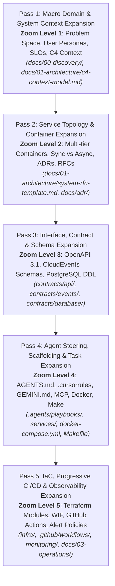
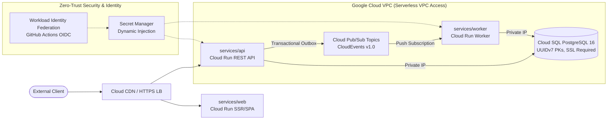
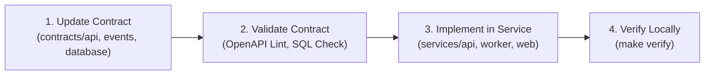
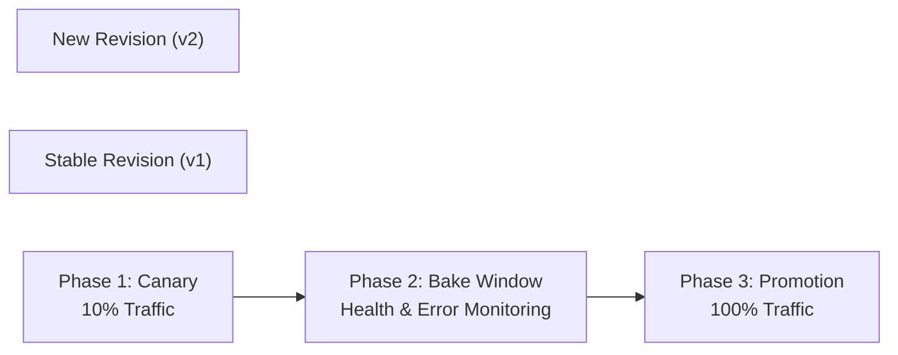

# System Design-to-Deployment Workflow Template

> **An Agent-Native SDLC Architecture Targeting Google Cloud Platform (GCP)**  
> Designed for Autonomous AI Coding Agents (*Antigravity*, *Claude Code*, *Cursor*, *Windsurf*) and High-Velocity Engineering Teams.

[](LICENSE)
[](Makefile)
[](https://cloud.google.com/run)
[](contracts/database/schema.sql)
[](contracts/events/)

---

## 1. Executive Summary & Philosophy

Traditional software engineering approaches treat system design, contract specification, application coding, infrastructure provisioning, and production operations as disconnected phases. In the era of autonomous AI agents, this fragmentation leads to hallucinated endpoints, broken schema migrations, leaky abstractions, and fragile deployments.

This repository provides an **authoritative, agent-native System Design-to-Deployment workflow**. It is built on two core pillars:
1. **The 5-Pass Progressive Plan Expansion Engine**: A structured methodology that progressively zooms from high-level problem discovery down to granular contracts, local services, declarative infrastructure, and production observability.
2. **Contract-First Invariants**: Strict Single Sources of Truth (SSOT) across OpenAPI 3.1, CloudEvents v1.0, and PostgreSQL DDL that eliminate AI hallucination and prevent drift between distributed services.

---

## 2. Architecture Mental Model

### 2.1 The 5-Pass Progressive Plan Expansion Engine

System planning and execution flow forward through 5 distinct zoom levels. Upstream contracts and architecture must be validated and locked before downstream code or infrastructure is modified:



| Pass | Level | Focus | Primary Deliverables | Verification Gate |
|---|---|---|---|---|
| **Pass 1** | **Zoom 1** | Problem Space & Macro Boundaries | `docs/00-discovery/`, `c4-context-model.md` | Non-goals and quantitative KPIs agreed. |
| **Pass 2** | **Zoom 2** | Service Topology & Containers | `docs/01-architecture/`, `docs/adr/` | Container boundaries & ADRs accepted. |
| **Pass 3** | **Zoom 3** | Interfaces, Contracts & Schemas | `contracts/api/`, `contracts/events/`, `contracts/database/` | OpenAPI, CloudEvents, and SQL DDL locked. |
| **Pass 4** | **Zoom 4** | Agent Steering & Local Runtimes | `AGENTS.md`, `.cursorrules`, `services/`, `docker-compose.yml` | `make verify` passes cleanly. |
| **Pass 5** | **Zoom 5** | Cloud IaC, CI/CD & Operations | `infra/`, `.github/workflows/`, `monitoring/` | Trivy CVE-clean, progressive canary deploy. |

---

### 2.2 Multi-Tier Cloud Run Topology

Targeting Google Cloud Platform with a zero-trust, serverless container architecture:



- **Web Frontend (`services/web/`)**: Cloud Run container serving the client application and reverse-proxying API calls.
- **REST API Gateway (`services/api/`)**: High-concurrency synchronous API service processing business transactions and staging asynchronous events via the Transactional Outbox pattern.
- **Asynchronous Worker (`services/worker/`)**: Event-driven background worker on Cloud Run consuming push events from Cloud Pub/Sub with dead-letter queue (DLQ) protection.
- **Data Tier (`contracts/database/`)**: Cloud SQL for PostgreSQL 16 with UUID primary keys, connection pooling, and automated point-in-time recovery (PITR).
- **Security Perimeter**: Keyless CI/CD via Workload Identity Federation (WIF) and dynamic secret injection via Secret Manager.

---

## 3. Directory Map & Repository Boundaries

Strict ownership boundaries prevent merge collisions and establish clear spheres of responsibility:

```
.
├── .agents/                    # [Pass 4] Agent task playbooks and execution recipes
│   └── playbooks/              # Step-by-step agent playbooks (design-service, scaffold-endpoint, verify-branch)
├── .github/                    # [Pass 5] Keyless CI/CD pipelines with Workload Identity Federation
│   └── workflows/              # ci.yaml, deploy-staging.yaml, deploy-prod.yaml
├── .mcp/                       # [Pass 4] Model Context Protocol configs for GCP, Postgres, GitHub
│   ├── gcp-mcp.json            # Cloud Run, Cloud Logging, and Secret Manager tools
│   ├── postgres-mcp.json       # Table description and query analysis tools
│   └── github-mcp.json         # Automated pull request and issue tools
├── contracts/                  # [Pass 3] CONTRACTS IMMUTABLE SINGLE SOURCE OF TRUTH (SSOT)
│   ├── api/                    # OpenAPI 3.1 specs (openapi.yaml) & mock server definitions
│   ├── database/               # PostgreSQL 16 DDL schema (schema.sql) & Mermaid ERD (erd.md)
│   └── events/                 # CloudEvents v1.0 JSON schemas for Pub/Sub (task-created, task-completed)
├── docs/                       # [Pass 1 & 2] Documentation & Architectural Decision Records
│   ├── 00-discovery/           # Problem statement, user personas, and success metrics
│   ├── 01-architecture/        # C4 Context, C4 Container model, and System RFCs
│   ├── 03-operations/          # Incident response runbook and SLO/SLI engineering definitions
│   └── adr/                    # Architecture Decision Records (0001-ADRs, 0002-Cloud-Run)
├── infra/                      # [Pass 5] Infrastructure as Code (Terraform)
│   ├── environments/           # Environment roots: dev/, staging/, prod/
│   └── modules/                # Reusable modules: vpc, iam_wif, cloud_run, cloud_sql, pubsub
├── monitoring/                 # [Pass 5] Production Observability Assets
│   ├── alert-policies.yaml     # Google Cloud Monitoring alerting policies (5xx, latency, restart loops, DLQ)
│   └── logging-config.md       # Structured JSON logging and distributed trace propagation standards
├── services/                   # [Pass 4] Application Microservices (Containerized)
│   ├── api/                    # Core REST API service (Dockerfile, src, tests)
│   ├── web/                    # Client frontend application (Dockerfile, src, tests)
│   └── worker/                 # Background event consumer (Dockerfile, src, tests)
├── .cursorrules                # High-density agent steering rules for Cursor / Copilot
├── AGENTS.md                   # Authoritative repository governance and operating rules
├── docker-compose.yml          # Local multi-tier orchestration environment
├── GEMINI.md                   # Antigravity & Gemini CLI specific instruction file
├── Makefile                    # Unified build, test, and verification harness
└── README.md                   # Master template guide (This file)
```

---

## 4. Non-Negotiable Invariants

All agents and contributors MUST adhere to these architectural invariants:

1. **Zero Raw Secrets**: No credentials, API tokens, or private keys committed to git. Use Secret Manager in production and `.env.example` in local development.
2. **Contract Adherence**: Source code in `services/` is strictly downstream of `contracts/`. Never modify or invent an endpoint, column, or event without first updating `contracts/`.
3. **Transactional Outbox Pattern**: When an API endpoint triggers an asynchronous event, the event MUST be saved in the database within the **same atomic transaction** as the entity update.
4. **UUID Primary Keys**: All relational tables use UUIDv7 or UUIDv4 primary keys (`id UUID PRIMARY KEY DEFAULT gen_random_uuid()`). Sequential integer IDs are prohibited.
5. **Stateless Containers**: Container filesystems are ephemeral. All state resides in Cloud SQL, Memorystore/Redis, or Cloud Storage.
6. **CloudEvents v1.0 Standard**: All asynchronous messages published to Cloud Pub/Sub conform to the CNCF CloudEvents 1.0 envelope.
7. **RFC 7807 Problem Details**: All HTTP error responses from the API conform to RFC 7807 (`application/problem+json`).

---

## 5. Quickstart Guide

### 5.1 Prerequisites
- **Node.js**: v20.x or v22.x LTS
- **Docker & Docker Compose**: v2.20+
- **Make**: Standard GNU Make
- **Google Cloud SDK (`gcloud`)**: For cloud deployments and telemetry inspection
- **Terraform**: v1.7+ (for infrastructure management)

### 5.2 Local Development Loop

Clone the repository and launch the full multi-tier local stack (Postgres, Pub/Sub emulator, API, Worker, Web):

```bash
# 1. Start all containers in background with health checking
make docker-up

# 2. Check running container statuses
make docker-ps

# 3. View live unified logs
make docker-logs
```

Local service ports:
- **Web Frontend**: [http://localhost:3000](http://localhost:3000)
- **REST API**: [http://localhost:8080](http://localhost:8080) (`/healthz`, `/api/v1/tasks`)
- **Background Worker**: [http://localhost:8081](http://localhost:8081) (`/healthz`, `/events/push`)
- **PostgreSQL 16**: `localhost:5432` (`app_db` / `postgres` / `postgres`)
- **Pub/Sub Emulator**: `localhost:8085`

### 5.3 Verification Mandate
Before opening a PR or claiming task completion, execute the unified verification harness:

```bash
# Runs linting, syntax checks, and test suites across all services
make verify
```

To run individual checks:
```bash
make lint       # ESLint / syntax checks
make typecheck  # Node.js syntax & type validation
make test       # Unit and integration test suites
make clean      # Clean caches and temporary logs
```

---

## 6. Contract-First Workflows

When adding features or modifying behavior:



1. **REST API**: Add routes, query parameters, and RFC 7807 responses to [`contracts/api/openapi.yaml`](contracts/api/openapi.yaml).
2. **Pub/Sub Events**: Define CloudEvents schemas in [`contracts/events/`](contracts/events/).
3. **Database Schema**: Update [`contracts/database/schema.sql`](contracts/database/schema.sql) and regenerate the Mermaid diagram in [`contracts/database/erd.md`](contracts/database/erd.md).

---

## 7. Cloud Infrastructure & Progressive Delivery (GCP)

### 7.1 Infrastructure as Code (Terraform)
Infrastructure is managed declaratively under `infra/`:
- `infra/modules/`: Modular blocks (`vpc`, `iam_wif`, `cloud_run`, `cloud_sql`, `pubsub`).
- `infra/environments/`: Isolated environment roots (`dev/`, `staging/`, `prod/`).

```bash
# Initialize and plan staging infrastructure
cd infra/environments/staging
terraform init
terraform plan
```

### 7.2 Progressive CD with Traffic Splitting
GitHub Actions deploys new Cloud Run revisions using Workload Identity Federation (keyless OIDC). Production rollouts follow canary traffic shifting:



---

## 8. Observability & Operations

Production telemetry and operational readiness are governed by:
- **Cloud Monitoring Alert Policies**: [`monitoring/alert-policies.yaml`](monitoring/alert-policies.yaml)
  - 5xx error rate spikes (> 2% over 5 mins)
  - p99 latency degradation (> 1000ms)
  - Cloud Run container crash loops (> 3 in 10 mins)
  - Pub/Sub Dead-Letter Queue (DLQ) backlog (> 0 messages)
  - Cloud SQL CPU & storage exhaustion (> 80%)
- **Structured JSON Logging**: [`monitoring/logging-config.md`](monitoring/logging-config.md)
  - Native Cloud Logging format with `severity`, `httpRequest`, and `serviceContext`.
  - W3C `traceparent` and distributed correlation IDs across Web $\to$ API $\to$ Pub/Sub $\to$ Worker.
  - Automated PII and credential redaction.
- **Incident Response Runbook**: [`docs/03-operations/incident-runbook.md`](docs/03-operations/incident-runbook.md)
  - Sev-1 outage triage protocols and war room coordination.
  - Sub-5-second Cloud Run instant revision rollback (`gcloud run services update-traffic --to-revisions`).
  - Pub/Sub dead-letter queue message inspection and replay.
  - Cloud SQL Point-In-Time Recovery (PITR).
- **SLO/SLI Engineering**: [`docs/03-operations/slo-sli-definitions.md`](docs/03-operations/slo-sli-definitions.md)
  - 99.9% API availability and 95% < 200ms latency targets.
  - Multi-window multi-burn-rate alerting (14.4x in 1h, 6x in 6h).
  - Automated release freeze policies when error budgets are exhausted.

---

## 9. Autonomous AI Agent Steering & MCP Tooling

This repository is optimized for autonomous AI coding agents:
- **Steering Configurations**: [`AGENTS.md`](AGENTS.md), [`.cursorrules`](.cursorrules), and [`GEMINI.md`](GEMINI.md) provide behavioral guardrails and context loading priorities.
- **Executable Agent Playbooks**: Located in [`.agents/playbooks/`](.agents/playbooks/):
  - `design-service.md`: Progressive microservice design from discovery to contracts.
  - `scaffold-endpoint.md`: Contract-first REST endpoint generation.
  - `verify-branch.md`: Pre-PR verification and evidence gathering.
- **Model Context Protocol (MCP)**: Pre-configured MCP integrations in [`.mcp/`](.mcp/):
  - `.mcp/gcp-mcp.json`: Cloud Run diagnostics, revision logs, and Secret Manager access.
  - `.mcp/postgres-mcp.json`: Schema inspection, index profiling, and read queries.
  - `.mcp/github-mcp.json`: Automated PR management and CI status checks.

---

## 10. License & Contributing

- **License**: Licensed under the Apache License, Version 2.0. See [LICENSE](LICENSE) for details.
- **Contributing**: All commits must follow the [Conventional Commits 1.0.0](https://www.conventionalcommits.org/) standard. Always execute `make verify` prior to opening pull requests.
