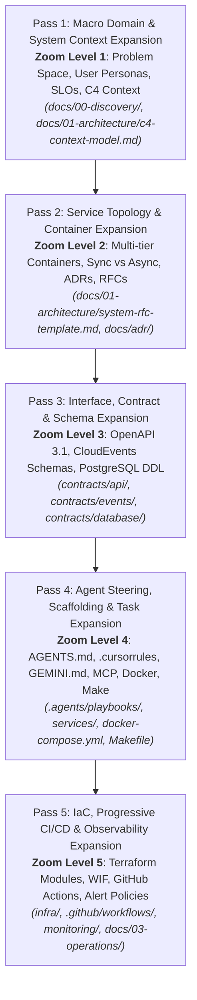
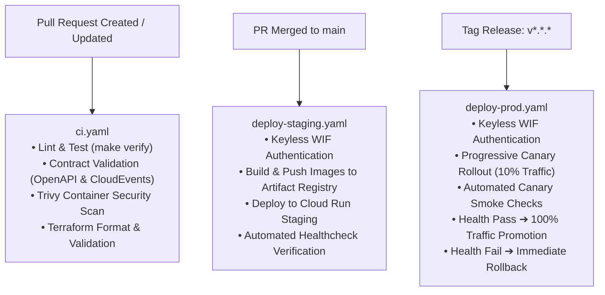

# User Guide: System Design-to-Deployment Workflow Template

> **Authoritative Operational & Engineering Guide**  
> **Target Audience**: Human Software Engineers, Solution Architects, DevOps Specialists, and Autonomous AI Coding Agents (*Antigravity*, *Claude Code*, *Cursor*, *Windsurf*).  
> **Status**: Active & Production-Ready  
> **Last Updated**: 2026-09-21

---

## 1. Welcome & Mental Model

Welcome to the **System Design-to-Deployment Workflow Template**. This repository is an agent-native, production-grade template engineered to take applications from blank-canvas domain discovery down to keyless, multi-environment deployment on **Google Cloud Platform (GCP)**.

Unlike traditional scaffolds that only offer boilerplate code, this repository operationalizes a rigorous **5-Pass Progressive Plan Expansion Engine** coupled with **Contract-First Invariants**.



### Core Invariants You Must Preserve
1. **Zero Raw Secrets**: No API keys, passwords, or service account JSON files are ever checked into source control. All production identity uses GCP Workload Identity Federation (WIF) and Secret Manager.
2. **Contracts as SSOT**: `contracts/` is the single source of truth. Code never invents an API route, an event payload, or a database column without upstream contract locking.
3. **Transactional Outbox**: Business state mutations and asynchronous event production share the same atomic database transaction to prevent dual-write data loss.
4. **Verification Mandate**: `make verify` must execute cleanly and pass 100% of linting, type checks, and tests before any code is committed.

---

## 2. Prerequisites & Local Toolchain Setup

Ensure the following tools are installed and available on your system `PATH`:

| Tool | Minimum Version | Verification Command | Purpose |
|---|---|---|---|
| **Docker & Docker Compose** | 24.0+ (Compose v2) | `docker compose version` | Local container runtime & multi-tier orchestration |
| **Node.js** | 20.x LTS | `node --version` | Services runtime (`services/web`, `api`, `worker`) |
| **Terraform** | 1.8+ | `terraform version` | Infrastructure as Code provisioning |
| **Google Cloud SDK** | 470.0+ | `gcloud version` | GCP authentication and resource management |
| **GNU Make** | 4.0+ | `make --version` | Unified developer & agent command harness |

### Rapid Setup Steps
```bash
# 1. Clone the repository
git clone https://github.com/<your-org>/<your-repo>.git
cd <your-repo>

# 2. Copy the environment configuration template
cp .env.example .env

# 3. Verify the local environment and run unit tests
make verify
```

`make verify` executes lint checks and unit tests across all services (`services/web`, `services/api`, `services/worker`). All 14 tests should pass in ~1 second.

---

## 3. The 5-Pass Progressive Expansion Workflow

When building a new system or adding major capabilities, follow the 5-pass progressive expansion workflow. Work flows forward through each zoom level:

```
Pass 1 (Discovery) ➔ Pass 2 (Topology) ➔ Pass 3 (Contracts) ➔ Pass 4 (Implementation) ➔ Pass 5 (Deployment)
```

### Pass 1: Macro Domain & System Context Expansion (Zoom Level 1)
* **Goal**: Establish the problem space, target personas, quantitative business metrics, and boundary context before writing technical specs.
* **Key Artifacts**:
  - `docs/00-discovery/problem-statement-template.md`: Problem space, JTBD (Jobs To Be Done), functional boundaries, and non-goals.
  - `docs/00-discovery/success-metrics-template.md`: Target MTTR, deployment frequencies, SLOs (99.9% availability), and Definition of Done.
  - `docs/01-architecture/c4-context-model.md`: C4 Level 1 context diagram detailing external users, payment gateways, identity providers, and boundary trust zones.
* **Gate Rule**: Do not progress to Pass 2 until non-goals are locked and SLO baselines are quantified.

### Pass 2: Service Topology & Communication Architecture (Zoom Level 2)
* **Goal**: Define container boundaries, compute platforms, synchronous vs asynchronous communication patterns, and architectural trade-offs.
* **Key Artifacts**:
  - `docs/01-architecture/system-rfc-template.md`: Complete enterprise RFC specifying microservice boundaries, failure modes, circuit breakers, and scaling limits.
  - `docs/01-architecture/c4-container-model.md`: C4 Level 2 container diagram detailing web client, REST API, worker, Cloud Pub/Sub, and Cloud SQL network perimeters.
  - `docs/adr/0001-record-architecture-decisions.md` & `0002-cloud-run-serverless-microservices.md`: Formal ADRs recording technology choices.
* **Gate Rule**: Container boundaries and ADRs must be formally accepted before designing schemas.

### Pass 3: Interface, Contract & Schema Expansion (Zoom Level 3)
* **Goal**: Lock down the immutable contracts governing all inter-service communication and persistence.
* **Key Artifacts**:
  - `contracts/api/openapi.yaml`: OpenAPI 3.1 specification for synchronous REST endpoints, security schemes, and RFC 7807 error models.
  - `contracts/events/event-envelope.json`: CloudEvents v1.0 specification for Pub/Sub asynchronous messages (`task-created.v1.json`, `task-completed.v1.json`).
  - `contracts/database/schema.sql`: PostgreSQL 16 DDL with UUIDv7 primary keys, transactional outbox tables, idempotency records, and auto-updating timestamps.
  - `contracts/database/erd.md`: Visual Entity-Relationship Diagram (ERD) with data dictionary.
* **Gate Rule**: Contracts are immutable Single Sources of Truth (SSOT). Upstream contracts must be validated and committed before writing service code.

### Pass 4: Agent Steering, Scaffolding & Local Runtimes (Zoom Level 4)
* **Goal**: Steer human developers and autonomous AI agents to build containerized microservices that strictly implement Pass 3 contracts.
* **Key Artifacts**:
  - `AGENTS.md`, `.cursorrules`, `GEMINI.md`: Authoritative steering rules and boundary definitions for AI agents.
  - `.agents/playbooks/`: Executable recipes (`design-service.md`, `scaffold-endpoint.md`, `verify-branch.md`).
  - `services/web/`: Cloud Run SSR/SPA frontend container with non-root security.
  - `services/api/`: REST API container on Cloud Run v2 with outbox event recording.
  - `services/worker/`: Asynchronous Pub/Sub push consumer on Cloud Run v2 with DLQ handling.
  - `docker-compose.yml`: Local multi-tier orchestration including PostgreSQL 16 and Pub/Sub emulator.
  - `Makefile`: Unified command harness (`make verify`, `make docker-up`, `make test`).
* **Gate Rule**: Local verification suite (`make verify`) must pass 100% cleanly.

### Pass 5: Cloud IaC, Progressive CI/CD & Observability (Zoom Level 5)
* **Goal**: Deploy the system to GCP using declarative Terraform modules, keyless Workload Identity Federation, canary deployments, and proactive monitoring.
* **Key Artifacts**:
  - `infra/modules/`: Reusable Terraform modules for `vpc`, `iam_wif`, `artifact_registry`, `cloud_run`, `cloud_sql`, `pubsub`.
  - `infra/environments/`: Root configurations for `dev`, `staging`, and `prod`.
  - `.github/workflows/ci.yaml`: Automated PR checks (lint, test, contract validation, Trivy container security scans, terraform validate).
  - `.github/workflows/deploy-staging.yaml`: Push-to-main continuous deployment with keyless WIF.
  - `.github/workflows/deploy-prod.yaml`: Progressive canary rollout (10% traffic split, automated smoke tests, promote to 100% or auto-rollback).
  - `monitoring/alert-policies.yaml`: Google Cloud Monitoring alert policies (5xx rates, latency spikes, container crash loops, DLQ messages, database load).
  - `monitoring/logging-config.md`: Structured JSON logging standards with distributed W3C trace correlation.
  - `docs/03-operations/incident-runbook.md`: Standard Operating Procedures (SOPs) for incident response, revision rollback, and DLQ message replay.

---

## 4. Vibe Coding with AI Agents

This repository is optimized for autonomous AI coding agents (*Antigravity*, *Claude Code*, *Cursor*, *Windsurf*). When working with an agent, leverage the included steering files and playbooks to ensure zero hallucinations and maximum code quality.

### 4.1 Steering Files Map

```
Repository Root
├── AGENTS.md        <-- Authoritative governance (read by Antigravity, Claude Code, Windsurf)
├── .cursorrules     <-- High-density context & rules (read by Cursor & GitHub Copilot)
├── GEMINI.md        <-- Specific guidance for Antigravity & Gemini CLI agents
└── .agents/
    └── playbooks/   <-- Step-by-step recipes for specific engineering tasks
```

### 4.2 Using the Agent Playbooks

When you want an AI agent to execute a task, point it directly to the corresponding playbook:

#### Designing a New Microservice
Prompt your agent:
> *"Read `.agents/playbooks/design-service.md` and execute Pass 1 through Pass 4 to design a notification service."*

The agent will:
1. Create discovery documents in `docs/00-discovery/`.
2. Update the C4 Container model and write an ADR in `docs/adr/`.
3. Add OpenAPI endpoints and CloudEvents schemas to `contracts/`.
4. Scaffold the service in `services/notification/` with Dockerfile and tests.
5. Run `make verify` and report proof of completion.

#### Scaffolding a New REST API Endpoint
Prompt your agent:
> *"Read `.agents/playbooks/scaffold-endpoint.md` and add a task cancellation endpoint (`POST /api/v1/tasks/{id}/cancel`)."*

The agent will:
1. Update `contracts/api/openapi.yaml` with the endpoint and response models.
2. Update database DDL and create a migration script in `contracts/database/`.
3. Implement the route handler in `services/api/src/`.
4. Write unit and integration tests.
5. Run `make verify` to confirm all checks pass.

#### Pre-PR Branch Verification
Prompt your agent:
> *"Read `.agents/playbooks/verify-branch.md` and perform a pre-PR self-audit on this branch."*

The agent will:
1. Verify contract synchronization across `contracts/` and `services/`.
2. Scan for raw secrets, credentials, or `.env` inclusions.
3. Run `make verify` and `terraform fmt -check`.
4. Validate git commit message compliance with Conventional Commits 1.0.0.

---

## 5. Model Context Protocol (MCP) Integration

Model Context Protocol (MCP) connects AI coding assistants directly to your infrastructure, databases, and version control tools without exposing static credentials.

### 5.1 Pre-Configured MCP Servers (`.mcp/`)

```
.mcp/
├── gcp-mcp.json       # Google Cloud Platform integration
├── postgres-mcp.json  # PostgreSQL schema & query tuning
├── github-mcp.json    # GitHub PR & CI workflow inspection
└── README.md          # Exhaustive MCP configuration guide
```

### 5.2 Connecting MCP in Your Editor

#### Antigravity IDE / Gemini CLI
Antigravity automatically reads the configurations in `.mcp/`. Ensure your local environment is authenticated with Application Default Credentials (ADC):
```bash
gcloud auth application-default login
```

#### Cursor (`~/.cursor/mcp.json` or `.cursor/mcp.json`)
Add the server configurations from `.mcp/gcp-mcp.json`, `postgres-mcp.json`, and `github-mcp.json` into your Cursor MCP settings.

#### Claude Code (`claude_desktop_config.json`)
Reference the `.mcp/*.json` files under the `mcpServers` configuration key in Claude Desktop or Claude Code CLI.

### 5.3 Practical MCP Workflows
* **Inspect Cloud Run Health**: Ask your agent: *"Use GCP MCP to check the latest revision traffic split for `production-api`."*
* **Analyze Database Queries**: Ask your agent: *"Use Postgres MCP to run EXPLAIN ANALYZE on `SELECT * FROM tasks WHERE status = 'PENDING'`."*
* **Inspect CI Failures**: Ask your agent: *"Use GitHub MCP to fetch the failing log step from the latest PR workflow run."*

---

## 6. Local Development & Inner Loop

You can run and test the complete distributed multi-tier topology on your local machine using Docker Compose and GNU Make.

### 6.1 Inner Loop Commands

```bash
# Build and run all services in the background
make docker-up

# Check container health and status
docker compose ps

# View streaming logs across all containers
docker compose logs -f

# Run the complete verification harness (linting + tests)
make verify

# Stop all containers and preserve volumes
make docker-down

# Clean up all containers, volumes, and temporary caches
make clean
```

### 6.2 Service Port Allocation in Docker Compose

| Service | Host Port | Internal Port | Protocol | Purpose |
|---|---|---|---|---|
| **PostgreSQL 16** | `5432` | `5432` | TCP | Relational DB initialized with `schema.sql` |
| **Pub/Sub Emulator** | `8085` | `8085` | HTTP | Local Google Cloud Pub/Sub emulator |
| **API Gateway** | `8080` | `8080` | HTTP | Core REST API (`http://localhost:8080/healthz`) |
| **Worker Service** | `8081` | `8080` | HTTP | Background event consumer |
| **Web Client** | `3000` | `8080` | HTTP | Client frontend & API reverse proxy |

### 6.3 End-to-End Local Testing Flow

1. **Start the environment**:
   ```bash
   make docker-up
   ```
2. **Verify API Health**:
   ```bash
   curl http://localhost:8080/healthz
   # Response: {"status":"healthy","uptime":...,"version":"1.0.0","checks":{"database":"connected"}}
   ```
3. **Create a Task via API**:
   ```bash
   curl -X POST http://localhost:8080/api/v1/tasks \
     -H "Content-Type: application/json" \
     -d '{"title":"Process Invoice","priority":"HIGH","payload":{"invoiceId":"INV-1001"}}'
   ```
   *The API creates the task in PostgreSQL and writes an outbox record to `outbox_events` in the same transaction.*
4. **Inspect Asynchronous Worker**:
   ```bash
   docker compose logs worker
   ```
   *Observe the worker receiving the Pub/Sub push event, executing the background job, and updating the task status to `COMPLETED`.*

---

## 7. Cloud Infrastructure Provisioning (Terraform)

Infrastructure is managed 100% declaratively via Terraform under `infra/`.

### 7.1 Infrastructure Directory Architecture

```
infra/
├── environments/
│   ├── dev/            # Scale-to-zero, single-zone, cost-optimized
│   ├── staging/        # Mirrors production configuration
│   └── prod/           # Multi-zone, HA PostgreSQL, warm instances (min_instances = 1)
└── modules/
    ├── vpc/            # VPC, private IP peering, Serverless VPC Access Connector
    ├── iam_wif/        # Workload Identity Federation & keyless CI/CD service accounts
    ├── artifact_registry/ # Docker container repositories with vulnerability scanning
    ├── cloud_run/      # Serverless container services with traffic splitting
    ├── cloud_sql/      # Private-IP PostgreSQL 16 with Secret Manager passwords
    └── pubsub/         # CloudEvents topics, push subscriptions, and Dead-Letter Queues
```

### 7.2 Provisioning an Environment (e.g., `dev`)

```bash
cd infra/environments/dev

# 1. Initialize Terraform plugins and remote state
terraform init

# 2. Copy and configure variables
cp terraform.tfvars.example terraform.tfvars
# Edit terraform.tfvars with your GCP project ID and region

# 3. Plan changes
terraform plan -out=tfplan

# 4. Apply infrastructure
terraform apply tfplan
```

### 7.3 Workload Identity Federation (WIF) Setup

To connect GitHub Actions without static service account keys:
1. Apply the `iam_wif` module in your target environment.
2. Note the outputs:
   - `workload_identity_provider`: Full resource name of the provider.
   - `service_account_email`: CI/CD service account email.
3. Configure your GitHub repository secrets:
   - `GCP_PROJECT_ID`: Your Google Cloud project ID.
   - `GCP_WIF_PROVIDER`: Value from `workload_identity_provider` output.
   - `GCP_SA_EMAIL`: Value from `service_account_email` output.

---

## 8. Continuous Integration & Deployment (CI/CD)

The repository provides three GitHub Actions workflows in `.github/workflows/`:



### Workflow Summary

| Workflow File | Trigger | Key Actions |
|---|---|---|
| `.github/workflows/ci.yaml` | Pull Request to `main` | `make verify`, OpenAPI & JSON schema validation, Aqua Trivy CVE security scanning, `terraform fmt -check` |
| `.github/workflows/deploy-staging.yaml` | Push / Merge to `main` | Keyless WIF authentication, Docker build & push to Artifact Registry, deploy revisions to Cloud Run Staging |
| `.github/workflows/deploy-prod.yaml` | Release tag (`v*.*.*`) or manual trigger | Progressive canary rollout (10% traffic split), canary health check probe, automatic 100% promotion or instant rollback |

---

## 9. Observability & Incident Response

### 9.1 Alerting Policies (`monitoring/alert-policies.yaml`)

The template includes pre-configured Google Cloud Monitoring policies:
* **High HTTP 5xx Error Rate**: Triggers if 5xx errors exceed 2% over a 5-minute rolling window.
* **Latency Spike (p99)**: Triggers if 99th-percentile response time exceeds 1,000ms.
* **Container CrashLoop**: Triggers if container restart count exceeds 3 in 10 minutes.
* **Pub/Sub DLQ Backlog**: Triggers if any message enters the Dead-Letter Queue subscription.
* **Cloud SQL Resource Pressure**: Triggers if CPU or storage utilization exceeds 80%.

### 9.2 Structured JSON Logging (`monitoring/logging-config.md`)

All services emit single-line structured JSON logs with trace correlation headers:
```json
{
  "severity": "INFO",
  "message": "Task processed successfully",
  "timestamp": "2026-09-21T12:00:00.000Z",
  "logging.googleapis.com/trace": "projects/my-gcp-project/traces/4bf92f3577b34da6a3ce929d0e0e4736",
  "logging.googleapis.com/spanId": "00f067aa0ba902b7",
  "service": "worker",
  "taskId": "018d3a7e-4b21-7000-8000-000000000001"
}
```

### 9.3 Incident Response Cheat Sheet (`docs/03-operations/incident-runbook.md`)

#### Instant Cloud Run Revision Rollback
If a production deployment causes degraded performance or errors, instantly revert 100% of traffic to the known-good revision:
```bash
gcloud run services update-traffic production-api \
  --project=my-gcp-project \
  --region=us-central1 \
  --to-revisions=production-api-00042=100
```

#### Pub/Sub Dead-Letter Queue (DLQ) Triage & Replay
1. Inspect dead-letter messages:
   ```bash
   gcloud pubsub subscriptions pull dead-letter-subscription \
     --project=my-gcp-project \
     --limit=10 --auto-ack=false
   ```
2. Diagnose root cause (schema mismatch, timeout, unhandled exception).
3. Deploy fix via standard CI/CD.
4. Replay messages back into the primary processing topic.

---

## 10. Frequently Asked Questions (FAQ) & Troubleshooting

### Q: Why did `make verify` fail when I added a new API endpoint?
**A**: You violated **Invariant 2 (Contract Adherence)**. You must add the endpoint specification to `contracts/api/openapi.yaml` before adding code in `services/api/`. `make verify` runs contract validation checks.

### Q: Can I use sequential integer IDs (1, 2, 3) in the database?
**A**: No. **Invariant 4 (UUID Primary Keys)** strictly mandates UUIDs (`gen_random_uuid()` or UUIDv7) to prevent enumeration attacks, distributed ID collisions, and security vulnerabilities.

### Q: How do I test with local secrets without committing them?
**A**: Copy `.env.example` to `.env`. The `.env` file is excluded in `.gitignore`. For local Docker Compose, environment variables are dynamically sourced from your local `.env`. In production, secrets are injected directly from GCP Secret Manager into Cloud Run container environment variables.

### Q: How do I add a new microservice to this template?
**A**: Follow `.agents/playbooks/design-service.md`:
1. Document the service in `docs/01-architecture/c4-container-model.md`.
2. Add an ADR to `docs/adr/`.
3. Define its API in `contracts/api/` or events in `contracts/events/`.
4. Scaffold the service under `services/<service-name>/` with a Dockerfile, `package.json`, and tests.
5. Add the service to `docker-compose.yml` and `Makefile`.
6. Add the Terraform configuration under `infra/modules/cloud_run/`.
7. Verify with `make verify`.

---

## 11. Master Deliverables Directory Reference

For an exhaustive, itemized manifest of every single file created across all 5 passes, consult:
* **[MASTER-INDEX.md](file:///home/madhuka/VScode%20Projects/Application-structuring-wf-template/MASTER-INDEX.md)**: Full inventory of all 88 production files, categorized by pass, zoom level, and purpose.

---
*System Design-to-Deployment Workflow Template • Built for Autonomous AI Agents & Cloud Run on GCP*
