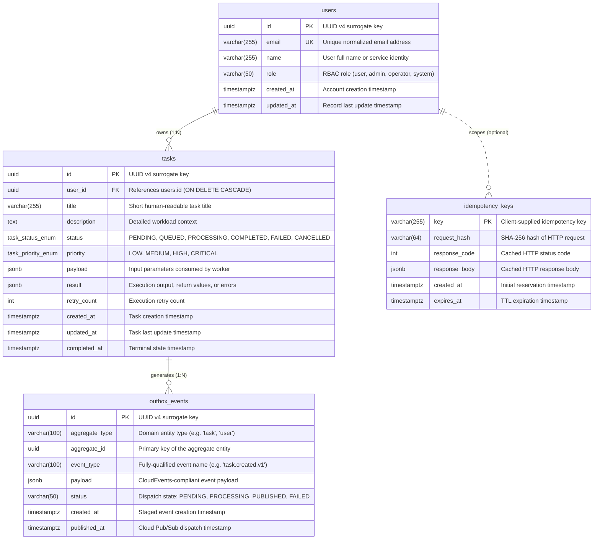
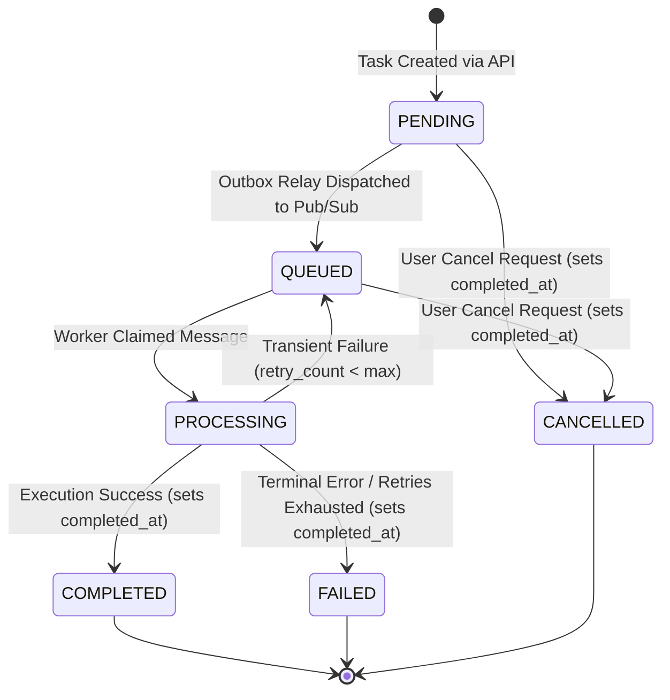
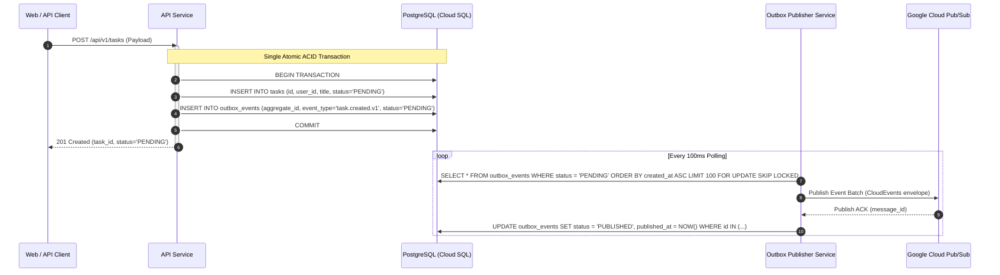

# Database Entity-Relationship Model & Data Dictionary

<!-- @agent-meta: {"phase": "pass-3", "artifact": "database-erd", "system": "Task Management Microservices", "version": "1.0.0", "target_db": "PostgreSQL 15/16"} -->

## 1. Overview & Architectural Role

The relational persistence layer serves as the authoritative single source of truth (SSOT) for domain entities, transactional guarantees, and distributed event coordination within the Task Management System. 

Implemented on **Cloud SQL for PostgreSQL (15/16)**, this schema is engineered around four core architectural principles:
1. **Strong Referential Integrity**: Strict foreign keys and domain constraints (`CHECK`, `UNIQUE`, `NOT NULL`) ensure data corruption cannot occur at the application layer.
2. **Transactional Outbox Pattern**: Decouples local PostgreSQL database transactions from asynchronous event publishing to Google Cloud Pub/Sub, completely eliminating dual-write race conditions.
3. **Distributed Idempotency Invariants**: Prevents duplicate task execution and side-effects resulting from network timeouts or retry loops from HTTP clients and queue consumers.
4. **Optimized Read/Write Access Paths**: Targeted B-tree indices and partial filtered indices ensure sub-millisecond query lookups, efficient cursor pagination, and high-frequency queue polling without table bloat.

---

## 2. Entity-Relationship Diagram (ERD)



---

## 3. Data Dictionary

### 3.1 Table: `users`
Represents registered users, API service principals, and administrative operators.

| Column | Data Type | Nullable | Default | Constraints / References | Description |
|---|---|---|---|---|---|
| `id` | `UUID` | No | `gen_random_uuid()` | `PRIMARY KEY` | RFC 4122 v4 unique surrogate identifier. |
| `email` | `VARCHAR(255)` | No | None | `UNIQUE`, `chk_users_email_format` | User login email. Must conform to RFC standard email regex. |
| `name` | `VARCHAR(255)` | No | None | `chk_users_name_not_empty` | User full name or principal identifier. |
| `role` | `VARCHAR(50)` | No | `'user'` | `chk_users_role` | RBAC role: `'user'`, `'admin'`, `'operator'`, or `'system'`. |
| `created_at` | `TIMESTAMPTZ` | No | `CURRENT_TIMESTAMP` | None | UTC timestamp when account was registered. |
| `updated_at` | `TIMESTAMPTZ` | No | `CURRENT_TIMESTAMP` | Managed by Trigger | UTC timestamp when account was last updated. |

#### Indices & Access Paths:
- `pk_users`: Primary key B-tree index on `(id)`.
- `uq_users_email`: Unique constraint B-tree index on `(email)` for fast authentication and collision detection.
- `idx_users_created_at`: B-tree index on `(created_at DESC)` for operator auditing and administrative listings.
- `idx_users_role`: B-tree index on `(role)` for filtering accounts by permission tier.

---

### 3.2 Table: `tasks`
Represents units of asynchronous execution scheduled by users and processed by background worker pools.

| Column | Data Type | Nullable | Default | Constraints / References | Description |
|---|---|---|---|---|---|
| `id` | `UUID` | No | `gen_random_uuid()` | `PRIMARY KEY` | RFC 4122 v4 unique identifier. |
| `user_id` | `UUID` | No | None | `FOREIGN KEY (users.id) ON DELETE CASCADE` | Owner user identifier. Cascade deletes tasks if user is purged. |
| `title` | `VARCHAR(255)` | No | None | `chk_tasks_title_not_empty` | Short title/subject of the task workload. |
| `description` | `TEXT` | Yes | `NULL` | None | Optional long-form markdown/plain-text task instructions. |
| `status` | `task_status_enum` | No | `'PENDING'` | Enum | Lifecycle state: `PENDING`, `QUEUED`, `PROCESSING`, `COMPLETED`, `FAILED`, `CANCELLED`. |
| `priority` | `task_priority_enum` | No | `'MEDIUM'` | Enum | Scheduling priority: `LOW`, `MEDIUM`, `HIGH`, `CRITICAL`. |
| `payload` | `JSONB` | No | `'{}'::jsonb` | None | Input parameters and arguments required for task execution. |
| `result` | `JSONB` | Yes | `NULL` | None | Output payload, return artifacts, or execution error trace. |
| `retry_count` | `INT` | No | `0` | `chk_tasks_retry_count_positive` | Incremented upon transient execution failures. |
| `created_at` | `TIMESTAMPTZ` | No | `CURRENT_TIMESTAMP` | None | UTC timestamp when task was submitted. |
| `updated_at` | `TIMESTAMPTZ` | No | `CURRENT_TIMESTAMP` | Managed by Trigger | UTC timestamp when task state or fields were last mutated. |
| `completed_at` | `TIMESTAMPTZ` | Yes | `NULL` | `chk_tasks_completed_after_created`, `chk_tasks_terminal_completed_at` | UTC timestamp when task transitioned to terminal state. |

#### Indices & Access Paths:
- `pk_tasks`: Primary key B-tree index on `(id)`.
- `idx_tasks_user_id`: B-tree index on `(user_id)` to accelerate parent-child relational joins.
- `idx_tasks_status`: B-tree index on `(status)` to support operational queries and dashboard views.
- `idx_tasks_priority`: B-tree index on `(priority)` to support priority scheduling pipelines.
- `idx_tasks_created_at`: B-tree index on `(created_at DESC)` for chronological timeline queries.
- `idx_tasks_user_id_created_at`: Composite B-tree index on `(user_id, created_at DESC)` optimizing keyset pagination on user dashboards.
- `idx_tasks_user_id_status`: Composite B-tree index on `(user_id, status)` for user-filtered task queries.

#### State Machine (`task_status_enum`):


---

### 3.3 Table: `outbox_events`
Implements the **Transactional Outbox Pattern** to guarantee reliable, ordered, at-least-once event delivery from the relational database to Google Cloud Pub/Sub without distributed transaction coordination (2PC).

| Column | Data Type | Nullable | Default | Constraints / References | Description |
|---|---|---|---|---|---|
| `id` | `UUID` | No | `gen_random_uuid()` | `PRIMARY KEY` | Unique event identifier. Matches CloudEvents `id`. |
| `aggregate_type` | `VARCHAR(100)` | No | None | None | Aggregate root name (e.g., `'task'`, `'user'`). |
| `aggregate_id` | `UUID` | No | None | None | Primary key of the entity emitting the event (`tasks.id`). |
| `event_type` | `VARCHAR(100)` | No | None | None | CloudEvents `type` (e.g., `'task.created.v1'`, `'task.completed.v1'`). |
| `payload` | `JSONB` | No | None | None | CloudEvents JSON envelope including metadata and domain payload. |
| `status` | `VARCHAR(50)` | No | `'PENDING'` | `chk_outbox_events_status` | Outbox lifecycle: `'PENDING'`, `'PROCESSING'`, `'PUBLISHED'`, `'FAILED'`. |
| `created_at` | `TIMESTAMPTZ` | No | `CURRENT_TIMESTAMP` | None | UTC timestamp when outbox row was committed with business entity. |
| `published_at` | `TIMESTAMPTZ` | Yes | `NULL` | `chk_outbox_events_published_after_created` | UTC timestamp when dispatch to Pub/Sub was confirmed. |

#### Indices & Access Paths:
- `pk_outbox_events`: Primary key B-tree index on `(id)`.
- `idx_outbox_events_status`: B-tree index on `(status)` for metric aggregation and DLQ monitoring.
- `idx_outbox_events_created_at`: B-tree index on `(created_at DESC)` for audit trails.
- `idx_outbox_events_aggregate`: Composite index on `(aggregate_type, aggregate_id)` for tracing an aggregate's lifecycle history.
- **CRITICAL PARTIAL INDEX** `idx_outbox_events_pending`:
  ```sql
  CREATE INDEX idx_outbox_events_pending 
  ON outbox_events (created_at ASC) 
  WHERE status = 'PENDING';
  ```
  *Optimization Rationale*: The outbox publisher polls pending records every 100ms. In high-volume systems where millions of published events accumulate, a full index on `status` would scan millions of entries. The partial index contains only records where `status = 'PENDING'`, keeping the index tree footprint tiny (< 50 KB) and cached in RAM, delivering consistent sub-millisecond poll performance.

---

### 3.4 Table: `idempotency_keys`
Provides atomic de-duplication for HTTP API operations (e.g. `POST /api/v1/tasks`) and Pub/Sub subscriber processing.

| Column | Data Type | Nullable | Default | Constraints / References | Description |
|---|---|---|---|---|---|
| `key` | `VARCHAR(255)` | No | None | `PRIMARY KEY` | Client-provided token (from `Idempotency-Key` header) or message ID. |
| `request_hash` | `VARCHAR(64)` | No | None | None | SHA-256 checksum of request method, path, and body to guard against payload mutation. |
| `response_code` | `INT` | Yes | `NULL` | `chk_idempotency_response_code_range` | HTTP status code (e.g. `201`, `200`) returned upon execution completion. |
| `response_body` | `JSONB` | Yes | `NULL` | None | Serialized response payload cached for atomic replaying. |
| `created_at` | `TIMESTAMPTZ` | No | `CURRENT_TIMESTAMP` | None | UTC timestamp when operation was initiated. |
| `expires_at` | `TIMESTAMPTZ` | No | None | `chk_idempotency_expires_after_created` | UTC timestamp when reservation expires (typically `created_at + INTERVAL '24 hours'`). |

#### Indices & Access Paths:
- `pk_idempotency_keys`: Primary key B-tree index on `(key)`.
- `idx_idempotency_keys_expires_at`: B-tree index on `(expires_at ASC)` used by background TTL garbage collection jobs to prune expired keys.

---

## 4. Key Architectural Patterns & Guarantees

### 4.1 Transactional Outbox Pattern


### 4.2 Idempotent Deduplication Workflow
When an API request arrives with header `Idempotency-Key: <key>`:
1. **Lock & Reserve**:
   ```sql
   INSERT INTO idempotency_keys (key, request_hash, expires_at)
   VALUES ($key, $hash, NOW() + INTERVAL '24 hours')
   ON CONFLICT (key) DO NOTHING;
   ```
2. **Conflict Resolution**:
   - If row was inserted: Execute business logic within transactional boundaries.
   - If row already existed:
     - Check `request_hash`. If hashes differ, reject with `422 Unprocessable Entity` (key reused for different payload).
     - If `response_code` is `NULL` and `created_at > NOW() - INTERVAL '1 minute'`: Another thread is currently processing; return `409 Conflict` or `429 Retry-After`.
     - If `response_code` is present: Return cached `(response_code, response_body)` immediately without executing side effects.
