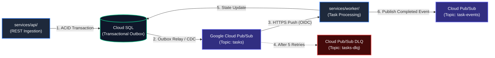
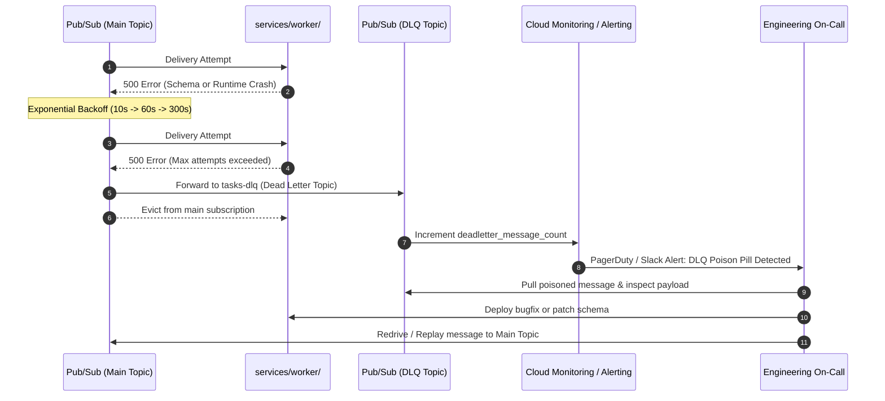
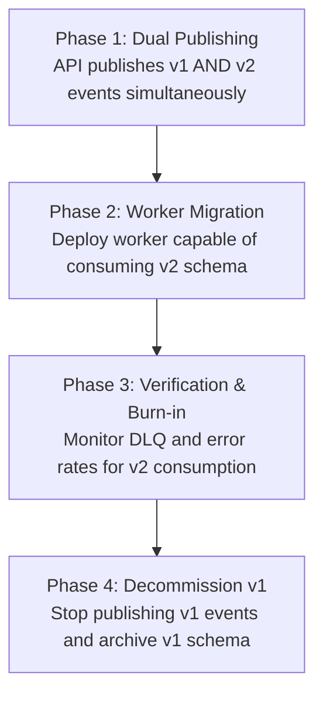

# CloudEvents Specification & Pub/Sub Event Contracts

This directory defines the machine-readable event contracts and architectural standards governing asynchronous, event-driven communication across subsystems in the **System Design-to-Deployment Template**.

---

## 1. Architectural Overview

The platform uses asynchronous event-driven choreography to decouple API ingestion from long-running background execution:



All asynchronous events published to Google Cloud Pub/Sub adhere strictly to the **CNCF CloudEvents v1.0** specification. By standardizing message metadata, distributed tracing, and event types, the system eliminates serialization ambiguities, facilitates cross-service contract testing, and establishes robust auditing.

---

## 2. Event Contract Catalog

| Schema File | Event Type | Description | Producer | Consumer |
|---|---|---|---|---|
| [`event-envelope.json`](./event-envelope.json) | `*` (Universal Envelope) | CloudEvents v1.0 JSON Schema envelope with W3C trace context | All Producers | All Consumers |
| [`task-created.v1.json`](./task-created.v1.json) | `com.system.task.created.v1` | Triggers background processing for a newly created task | `services/api/` (via Outbox) | `services/worker/` |
| [`task-completed.v1.json`](./task-completed.v1.json) | `com.system.task.completed.v1` | Emits task completion status, execution duration, and results | `services/worker/` | Analytics, Notifications, UI Webhooks |

---

## 3. CloudEvents Envelope (`event-envelope.json`)

All events transmitted over Cloud Pub/Sub must be wrapped in the standardized envelope. The envelope guarantees uniform metadata for routing, deduplication, and observability.

### Envelope Attributes

| Field | Type | Required | Description | Example |
|---|---|---|---|---|
| `specversion` | string | **Yes** | CloudEvents version; must be `"1.0"`. | `"1.0"` |
| `id` | string (UUIDv4) | **Yes** | Unique event identifier for idempotency and deduplication. | `"a0eebc99-9c0b-4ef8-bb6d-6bb9bd380a11"` |
| `source` | string (URI) | **Yes** | Context identifier of the producing subsystem. | `"https://api.system.template/tasks"` |
| `type` | string | **Yes** | Reverse-DNS formatted event type. | `"com.system.task.created.v1"` |
| `subject` | string | No | Specific entity identifier or resource path. | `"tasks/f47ac10b-58cc-4372-a567-0e02b2c3d479"` |
| `time` | string (RFC 3339) | **Yes** | Event timestamp in UTC with microsecond precision. | `"2026-09-21T12:00:00.000000Z"` |
| `datacontenttype` | string | **Yes** | MIME type of the payload; must be `"application/json"`. | `"application/json"` |
| `dataschema` | string (URI) | No | Canonical URI pointing to the specific payload schema. | `"https://schemas.system.template/events/task-created.v1.json"` |
| `traceparent` | string | No | W3C trace context header (`version-traceid-spanid-flags`). | `"00-4bf92f3577b34da6a3ce929d0e0e4736-00f067aa0ba902b7-01"` |
| `tracestate` | string | No | W3C trace context vendor routing states. | `"congo=t61rcWkgMzE"` |
| `data` | object | **Yes** | Domain-specific payload conforming to the event schema. | `{ "taskId": "...", ... }` |

### Distributed Tracing via `traceparent`

To achieve end-to-end distributed tracing across asynchronous boundaries:
1. When an HTTP request enters `services/api/`, OpenTelemetry extracts or generates the W3C `traceparent` header.
2. When the API persists an event to the `outbox_events` table, the active `traceparent` is stored alongside the payload.
3. The outbox relay includes the `traceparent` in the CloudEvent envelope.
4. When `services/worker/` receives the message from Pub/Sub, it starts a child span linked to the parent trace context, ensuring a continuous trace from user action to background execution.

---

## 4. Google Cloud Pub/Sub Integration

### 4.1 Content Modes: Structured vs. Binary

Google Cloud Pub/Sub supports two patterns for transporting CloudEvents:

1. **Structured Content Mode (Default)**:
   The entire CloudEvent (envelope + data) is serialized as a single JSON object inside the Pub/Sub message body (`message.data`).
   - **Advantage**: Full protocol independence, message payload immutability, and deterministic validation.
2. **Binary Content Mode**:
   CloudEvent metadata fields are mapped to native Pub/Sub message attributes with a `ce-` prefix (e.g. `attributes["ce-type"] = "com.system.task.created.v1"`), and `message.data` contains only the raw domain payload.
   - **Advantage**: Enables Pub/Sub server-side subscription filtering without deserializing the message body.

> **Production Recommendation**: Use **Structured Mode** inside `message.data` while simultaneously mirroring key routing attributes (`ce-type`, `ce-source`, `traceparent`) in the Pub/Sub message attributes. This enables efficient subscription filtering in Google Cloud Pub/Sub while maintaining self-contained message payloads.

### 4.2 Push Subscription Wrapper Format

Cloud Run workers receive messages via Pub/Sub HTTP Push Subscriptions authenticated with OIDC service account tokens. The incoming HTTP `POST` body wraps the Pub/Sub message as follows:

```json
{
  "message": {
    "attributes": {
      "ce-type": "com.system.task.created.v1",
      "ce-source": "https://api.system.template/tasks",
      "traceparent": "00-4bf92f3577b34da6a3ce929d0e0e4736-00f067aa0ba902b7-01"
    },
    "data": "eyJzcGVjdmVyc2lvbiI6IjEuMCIsImlkIjoiYTBlZWJjOTktOWMwYi00ZWY4LWJiNmQtNmJiOWJkMzgwYTExIiwic291cmNlIjoiaHR0cHM6Ly9hcGkuc3lzdGVtLnRlbXBsYXRlL3Rhc2tzIiwidHlwZSI6ImNvbS5zeXN0ZW0udGFzay5jcmVhdGVkLnYxIiwidGltZSI6IjIwMjYtMDktMjFUMTI6MDA6MDBaIiwiZGF0YWNvbnRlbnR0eXBlIjoiYXBwbGljYXRpb24vanNvbiIsImRhdGEiOnsidGFza0lkIjoiZjQ3YWMxMGItNThjYy00MzcyLWE1NjctMGUwMmIyYzNkNDc5IiwidXNlcklkIjoiM2ZhODVmNjQtNTcxNy00NTYyLWIzZmMtMmM5NjNmNjZhZmE2IiwidGl0bGUiOiJQcm9jZXNzIE9DUiIsInByaW9yaXR5IjoiSElHSCIsImFjdGlvblBheWxvYWQiOnsiZG9jSWQiOiIxMjMifSwibWV0YWRhdGEiOnt9LCJjcmVhdGVkQXQiOiIyMDI2LTA5LTIxVDEyOjAwOjAwWiJ9fQ==",
    "messageId": "136969346945",
    "publishTime": "2026-09-21T12:00:01.450Z"
  },
  "subscription": "projects/my-gcp-project/subscriptions/worker-task-created-sub"
}
```

### 4.3 Worker Consumption Flow

When handling push requests at `/events/push`:
1. **Authenticate**: Validate the Google-signed OIDC bearer token in the `Authorization` header.
2. **Decode**: Extract `message.data` and base64-decode the UTF-8 JSON string.
3. **Validate Envelope**: Validate the decoded JSON against `contracts/events/event-envelope.json`.
4. **Dispatch by Type**: Switch on `type` (e.g., `com.system.task.created.v1`) and validate `data` against `contracts/events/task-created.v1.json`.
5. **Acknowledge**: Return HTTP `200 OK` or `204 No Content` to acknowledge the message. Returning `5xx` or `429` triggers Pub/Sub retry backoff.

---

## 5. Dead-Letter Queue (DLQ) & Poison Pill Isolation

### 5.1 The Poison Pill Problem

A "poison pill" is a message that cannot be processed successfully regardless of how many times it is retried (e.g., malformed syntax, schema violations, data corruption, or unhandled null pointer exceptions in worker code). Without isolation, poison pills trigger continuous retry storms that exhaust worker CPU and block subsequent messages.

### 5.2 Google Cloud Pub/Sub DLQ Configuration

To isolate poison pills, all Pub/Sub subscriptions configuring worker ingestion must define a **Dead-Letter Policy**:

```hcl
# Example Terraform Configuration for Subscription DLQ
resource "google_pubsub_subscription" "worker_tasks_sub" {
  name  = "worker-task-created-sub"
  topic = google_pubsub_topic.tasks.id

  ack_deadline_seconds = 60

  dead_letter_policy {
    dead_letter_topic     = google_pubsub_topic.tasks_dlq.id
    max_delivery_attempts = 5
  }

  retry_policy {
    minimum_backoff = "10s"
    maximum_backoff = "300s"
  }
}
```

### 5.3 Quarantine & Triage Workflow



1. **Automatic Quarantine**: After 5 failed delivery attempts (`max_delivery_attempts = 5`), Google Cloud Pub/Sub automatically reroutes the message to the DLQ topic.
2. **Alerting**: Cloud Monitoring fires an alert when `pubsub.googleapis.com/subscription/dead_letter_message_count > 0`.
3. **Investigation**: On-call engineers inspect the quarantined message attributes and CloudEvent payload in Cloud Logging.
4. **Replay (Redrive)**: Once the root cause or worker bug is resolved, a Cloud Run replay job or admin CLI script pulls from the DLQ subscription and republishes the payload to the main topic.

---

## 6. Schema Evolution & Versioning Rules

To ensure reliable communication across microservices deployed independently, event schemas follow strict evolution constraints.

### 6.1 Compatibility Guardrails

1. **Never Remove or Rename Existing Fields**: Fields in active schemas cannot be deleted or renamed.
2. **Only Add Optional Fields**: Any newly introduced property must be optional in the JSON schema or supply a sensible default.
3. **Never Narrow Enum Values**: Never remove an enum value from an active schema (e.g. priority levels).
4. **Do Not Restrict Types**: Existing string fields cannot be changed to integers or objects.
5. **Tolerant Reader Pattern**: While schemas enforce strict validation at boundaries (`additionalProperties: false`), consumers evolving across minor versions should allow forward-compatible extension attributes where appropriate.

### 6.2 Semantic Versioning in Event Types

Event types follow a reverse-DNS naming convention incorporating major versions:

```
com.<organization>.<domain>.<entity>.<action>.v<major>
```

- **Minor / Patch Changes** (Non-breaking additions):
  - Example: Adding an optional `tags` array to `task-created.v1.json`.
  - Schema remains on `v1` (e.g., `com.system.task.created.v1`).
- **Major Breaking Changes** (Incompatible contract alterations):
  - Example: Renaming `taskId` to `jobId` or removing `priority`.
  - Creates a new schema file `task-created.v2.json` and new type `com.system.task.created.v2`.

### 6.3 Safe Migration Lifecycle (Dual-Publishing)

Breaking schema migrations follow a zero-downtime, four-phase rollout:



1. **Phase 1 (Dual Publishing)**: The producer (`services/api/`) publishes both `com.system.task.created.v1` and `com.system.task.created.v2` events for every occurrence.
2. **Phase 2 (Consumer Upgrade)**: Consumers (`services/worker/`) are updated to consume `v2` events while ignoring `v1`.
3. **Phase 3 (Verification)**: Telemetry verifies that `v1` subscriptions have zero incoming traffic and `v2` runs error-free.
4. **Phase 4 (Retirement)**: Producer removes `v1` publishing code. The `v1` schema is marked deprecated and eventually removed.

---

## 7. Concrete Payload Examples

### 7.1 Task Created Event (`com.system.task.created.v1`)

```json
{
  "specversion": "1.0",
  "id": "7c9e6679-7425-40de-944b-e07fc1f90ae7",
  "source": "https://api.system.template/tasks",
  "type": "com.system.task.created.v1",
  "subject": "tasks/9b1deb4d-3b7d-4bad-9bdd-2b0d7b3dcb6d",
  "time": "2026-09-21T12:00:00.000000Z",
  "datacontenttype": "application/json",
  "dataschema": "https://schemas.system.template/events/task-created.v1.json",
  "traceparent": "00-4bf92f3577b34da6a3ce929d0e0e4736-00f067aa0ba902b7-01",
  "data": {
    "taskId": "9b1deb4d-3b7d-4bad-9bdd-2b0d7b3dcb6d",
    "userId": "a158652d-83b5-4b05-950c-b2611e974e64",
    "title": "Process Large PDF Document OCR",
    "priority": "HIGH",
    "actionPayload": {
      "documentUri": "gs://my-bucket/uploads/contracts/contract-001.pdf",
      "extractTables": true,
      "language": "en"
    },
    "metadata": {
      "tenantId": "tenant-finance-01",
      "correlationId": "corr-4f81-9b1d",
      "originIp": "198.51.100.42"
    },
    "createdAt": "2026-09-21T12:00:00.000000Z"
  }
}
```

### 7.2 Task Completed Event (`com.system.task.completed.v1`)

```json
{
  "specversion": "1.0",
  "id": "e3b0c442-98fc-4c14-9b2f-8d9e2b14e301",
  "source": "https://worker.system.template/processor",
  "type": "com.system.task.completed.v1",
  "subject": "tasks/9b1deb4d-3b7d-4bad-9bdd-2b0d7b3dcb6d",
  "time": "2026-09-21T12:00:04.250000Z",
  "datacontenttype": "application/json",
  "dataschema": "https://schemas.system.template/events/task-completed.v1.json",
  "traceparent": "00-4bf92f3577b34da6a3ce929d0e0e4736-5a3d7211e4f9b8c0-01",
  "data": {
    "taskId": "9b1deb4d-3b7d-4bad-9bdd-2b0d7b3dcb6d",
    "executionDurationMs": 4250,
    "status": "SUCCESS",
    "result": {
      "pagesProcessed": 14,
      "outputTableCount": 6,
      "resultArtifactUri": "gs://my-bucket/results/contract-001-extracted.json"
    },
    "completedAt": "2026-09-21T12:00:04.250000Z"
  }
}
```

---

## 8. Schema Validation & Local Testing

Schemas can be validated using standard JSON Schema CLI tools or scripts.

### Using Python (`jsonschema`)

```bash
# Validate schemas against the draft-07 meta-schema
python3 -c "
import json
from jsonschema import Draft7Validator

for schema_path in ['event-envelope.json', 'task-created.v1.json', 'task-completed.v1.json']:
    with open(schema_path) as f:
        schema = json.load(f)
    Draft7Validator.check_schema(schema)
    print(f'✓ {schema_path} is valid')
"
```

### Using Node.js (`ajv-cli`)

```bash
# Install AJV CLI
npm install -g ajv-cli ajv-formats

# Validate payload against schema
ajv validate -s event-envelope.json -d sample-envelope.json -c ajv-formats
ajv validate -s task-created.v1.json -d sample-task-created.json -c ajv-formats
```
