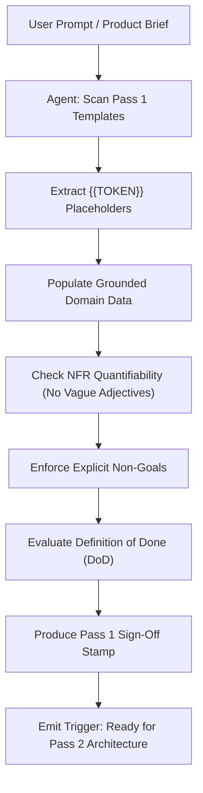

# Pass 1 Discovery Guide: Macro Domain & System Context Expansion (Zoom Level 1)

Welcome to **Pass 1** of the **5-Pass Progressive Expansion Engine**. This phase establishes the foundation of your system design by clarifying the problem space, target users, operational boundaries, and quantifiable success metrics before any architectural diagrams, service boundaries, or lines of code are written.

---

## 1. Why Discovery Matters in Agent-Native SDLC

When human engineers and autonomous AI agents (such as Antigravity, Claude Code, Windsurf, or Cursor) build complex distributed systems, the primary failure mode is **premature implementation and contract drift**. Jumping directly into code or container architectures without a locked problem space leads to:
1. **Agent Hallucination**: AI models invent arbitrary business rules, schema fields, and third-party integrations when requirements are vague.
2. **Scope Creep**: Systems expand uncontrolled without clear "out-of-scope" boundaries.
3. **Architectural Mismatch**: Building synchronous monoliths for asynchronous high-burst workloads, or over-engineering Kubernetes clusters when serverless Cloud Run suffices.
4. **Untestable NFRs**: Relying on qualitative adjectives ("fast", "scalable") instead of hard mathematical percentiles (`p99 <= 200ms`, `RPS >= 500`).

Pass 1 forces all stakeholders (human architects, product owners, and autonomous AI agents) to align on the **"Why"**, **"Who"**, **"What"**, and **"How Measured"** before moving to the **"How Built"** in Pass 2.

---

## 2. Directory Structure & Key Deliverables

This directory (`docs/00-discovery/`) contains two production-grade templates:

```
docs/00-discovery/
├── README.md                          # This guide: execution playbook for humans & agents
├── problem-statement-template.md      # Macro problem context, personas, JTBD, scope & NFRs
└── success-metrics-template.md        # Business KPIs, DORA metrics, 99.9% SLOs & Design DoD
```

### Artifact Summary

| Template File | Primary Purpose | Key Downstream Consumers |
|---|---|---|
| [`problem-statement-template.md`](./problem-statement-template.md) | Captures executive summary, user personas, Jobs To Be Done (JTBD), current vs. future gap analysis, strict in-scope vs. out-of-scope boundaries, and quantified Non-Functional Requirements (NFRs). | Pass 2 (`c4-context-model.md`, `system-rfc-template.md`), Pass 3 (`openapi.yaml`, schemas) |
| [`success-metrics-template.md`](./success-metrics-template.md) | Formulates business KPIs, operational DORA targets, Service Level Objectives (SLOs) anchored at 99.9% availability, Service Level Indicators (SLIs), Error Budget policies, and the Design Phase Definition of Done (DoD). | Pass 2 (Sync vs Async boundary), Pass 4 (Health checks & tests), Pass 5 (GCP Cloud Monitoring alert policies) |

---

## 3. Dual Execution Playbook: Humans & AI Agents

### 3.1 Human Engineer & Architect Workflow
1. **Initialize Discovery**:
   - Copy or directly edit `problem-statement-template.md` and `success-metrics-template.md`.
   - Update YAML frontmatter with system title, author, and current date.
2. **Conduct Requirements & Stakeholder Interviews**:
   - Capture user pain points and define at least two realistic personas (one primary business consumer, one operational/SRE actor).
   - Frame features into Jobs To Be Done: *"When [context], I want to [action], so I can [outcome]"*.
3. **Freeze Boundaries**:
   - Explicitly list non-goals in Section 4.2 of the problem statement. This prevents agents from expanding scope during later passes.
4. **Quantify All NFRs & SLOs**:
   - Replace placeholder percentiles with actual business constraints. Commit to a 99.9% ("Three Nines") availability baseline unless special tiering applies.
5. **Execute Definition of Done (DoD)**:
   - Review Section 5 of `success-metrics-template.md`. Once all checklist criteria are satisfied, sign off the verification stamp and proceed to Pass 2.

---

### 3.2 Autonomous AI Agent Workflow (Prompt Playbook)
Autonomous AI agents operating within this template must adhere to strict behavioral constraints:



#### Agent Rules of Engagement:
1. **Token Replacement**: Locate every `{{VARIABLE_NAME}}` instance and synthesize or extrapolate context from the user request or domain knowledge. Never leave raw tokens in an approved document.
2. **Preserve Annotations**: Do NOT delete machine-readable comment markers:
   - `<!-- @agent-meta: ... -->`
   - `<!-- @schema: ... -->`
   - `<!-- @nfr: ... -->`
3. **Zero Architectural Leaks**: In Pass 1, do NOT introduce specific database schemas, programming language classes, or network configurations. Focus purely on user intent, system boundaries, and verifiable constraints.
4. **Non-Functional Enforcement**: If the user prompt states "we need a fast API", the agent must convert this into concrete percentiles (e.g., `p99 <= 200ms`, `RPS >= 250`).
5. **Scope Lockdown**: Always document at least three explicit non-goals in the problem statement to prevent subagents in Pass 3 and Pass 4 from implementing extraneous services.

---

## 4. Machine-Readable Placeholder Taxonomy

When agents or humans customize these templates, the following standard token conventions apply:

| Placeholder Token | Description | Example Replacement Value |
|---|---|---|
| `{{SYSTEM_NAME}}` | The official name of the application or platform | `OrderStream Event Gateway` |
| `{{DOMAIN_OR_INDUSTRY}}` | The business vertical or problem space | `E-Commerce Supply Chain Logistics` |
| `{{TARGET_AUDIENCE}}` | The primary external or internal end users | `Enterprise Merchant Partners and Logistics Operators` |
| `{{PRIMARY_WORKFLOW_OR_BUSINESS_CAPABILITY}}` | The primary function performed | `real-time order ingestion, validation, and fulfillment dispatch` |
| `{{PEAK_TRAFFIC_RPS}}` | Anticipated peak requests per second | `1,500 RPS` |
| `{{TARGET_P99_MS}}` | Maximum allowable 99th-percentile latency | `250 ms` |
| `{{LATENCY_SLO_THRESHOLD_MS}}` | Latency threshold for the availability/latency SLI | `200 ms` |
| `{{TARGET_DEPLOYMENT_FREQUENCY_PER_DAY}}` | Daily deployment velocity target | `5` |
| `{{TARGET_MTTR_MINUTES}}` | Mean Time to Resolution SLA for Sev 1 issues | `15` |

---

## 5. Pass 1 Exit Gate: Transitioning to Pass 2

Do not begin Pass 2 until the following verification gate is satisfied:

### Exit Checklist
- [x] `problem-statement-template.md` fully completed and validated.
- [x] `success-metrics-template.md` fully completed, with 99.9% SLO baselines and mathematical SLIs.
- [x] All `{{...}}` tokens replaced with project-specific context (or maintained intentionally if using as a blank starter project).
- [x] Markdown syntax and tables validated.
- [x] Design Definition of Done (DoD) signed off.

### What Happens Next (Pass 2 Expansion)
Once this discovery gate is verified:
1. Move to `docs/01-architecture/`.
2. Author `docs/01-architecture/c4-context-model.md` using the external actors and boundaries established in Section 2 and 4 of the problem statement.
3. Author `docs/01-architecture/system-rfc-template.md` and `c4-container-model.md` to decompose the system into the standard 5-tier topology:
   - **Frontend Web UI**
   - **API Backend** (Cloud Run)
   - **Background Worker** (Cloud Run)
   - **Relational Database** (Cloud SQL PostgreSQL)
   - **Event Bus** (Cloud Pub/Sub with Dead-Letter Queues)
4. Record key architectural tradeoffs in `docs/adr/`.
