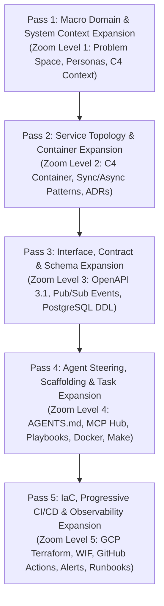
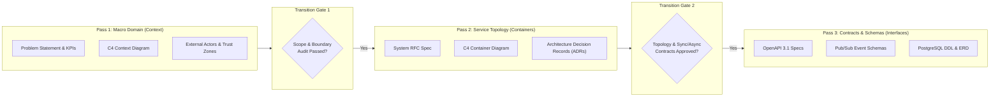

# 01 - Architecture: 5-Pass Progressive Plan Expansion

## 1. Executive Summary & Philosophy

Modern software architecture designed for **autonomous AI agents (Antigravity, Claude Code, Cursor, Windsurf) and human engineering teams** requires a disciplined, structured methodology. When agents are asked to design and implement complex distributed systems in a single prompt, they frequently suffer from scope drift, hallucinated contracts, mismatched interfaces, and leaky abstractions.

To eliminate these failure modes, this template implements the **5-Pass Progressive Plan Expansion Architecture**. 

Rather than attempting to specify every detail upfront or jumping straight into implementation, system design proceeds through **5 progressive zoom levels**, where each pass iteratively decomposes and refines the artifacts produced by the previous pass:

Each pass defines:
- **Strict Scope Boundaries**: What is modeled at this level and what is intentionally deferred.
- **Formal Expansion Mechanisms**: How higher-level abstractions are unpacked into concrete technical assets.
- **Automated Validation Gates**: Measurable quality checks required before progressing to the next pass.

---

## 2. Overview of the 5 Progressive Expansion Passes

| Pass | Zoom Level | Conceptual Focus | Key Deliverables | Validation Gates |
|---|---|---|---|---|
| **Pass 1** | **Zoom Level 1** | Macro Domain & System Context | `docs/00-discovery/problem-statement-template.md` `docs/00-discovery/success-metrics-template.md` `docs/01-architecture/c4-context-model.md` | Markdown linting, Persona completeness audit, Boundary trust zone review |
| **Pass 2** | **Zoom Level 2** | Service Topology & Communication Architecture | `docs/01-architecture/system-rfc-template.md` `docs/01-architecture/c4-container-model.md` `docs/adr/0001-record-architecture-decisions.md` `docs/adr/0002-cloud-run-serverless-microservices.md` | Mermaid syntax validation, ADR peer review, Communication pattern audit |
| **Pass 3** | **Zoom Level 3** | Interface, Contract & Schema Expansion | `contracts/api/openapi.yaml` `contracts/api/mock-server.json` `contracts/events/event-envelope.json` `contracts/database/schema.sql` `contracts/database/erd.md` | Spectral OpenAPI linting, JSON Schema validation, SQL DDL syntax verification |
| **Pass 4** | **Zoom Level 4** | Agent Steering, Scaffolding & Task Expansion | `AGENTS.md`, `.cursorrules`, `GEMINI.md` `.agents/playbooks/` `.mcp/*.json` `docker-compose.yml` `services/*/Dockerfile` `Makefile` | `docker compose config`, `make verify` passes, Subagent rule conformance |
| **Pass 5** | **Zoom Level 5** | IaC, Progressive CI/CD & Observability | `infra/modules/`, `infra/environments/` `.github/workflows/ci.yaml` `.github/workflows/deploy-*.yaml` `monitoring/alert-policies.yaml` `docs/03-operations/incident-runbook.md` | `terraform fmt -check`, `terraform validate`, `actionlint`, End-to-end dry run |

---

## 3. Transition Guidelines Across Early Passes

The transition from macro intent (Pass 1) to service topology (Pass 2) and contracts (Pass 3) forms the critical foundation of the entire architecture.

### 3.1 Transition Gate 1: Discovery (Pass 1) &rarr; Service Topology & Containers (Pass 2)

#### Purpose of Gate 1
Gate 1 ensures that the system's external boundaries, human actors, business motivations, and security perimeters are completely locked down before any internal component decomposition begins.

#### Exit Criteria / Checklist for Pass 1
- [ ] **Problem Scope Signed Off**: Core user pain points, functional requirements, and out-of-scope declarations are codified in `docs/00-discovery/problem-statement-template.md`.
- [ ] **Quantifiable Metrics Defined**: SLAs, SLOs, p99 latency targets, and throughput goals are articulated in `docs/00-discovery/success-metrics-template.md`.
- [ ] **C4 Context Model Finalized**: All personas (Web End-User, Admin Operator, External API Client) and external systems (Google Cloud Identity, Payment Gateway, Third-Party SaaS) are modeled in `docs/01-architecture/c4-context-model.md`.
- [ ] **Boundary Trust Zones Classified**: Untrusted public internet, DMZ edge, trusted platform VPC, and external partner perimeters are clearly demarcated.

#### What Happens in Pass 2 (How the Architecture Expands)
1. **Unpack Central System**: The opaque `{{SYSTEM_NAME}}` box is unpacked into discrete computational and data storage containers:
   - Web Frontend container (SPA / SSR)
   - API Backend service (Stateless REST / gRPC on Cloud Run)
   - Background Asynchronous Worker (Pub/Sub push subscriber on Cloud Run)
   - Managed Relational Database (Cloud SQL for PostgreSQL)
   - Asynchronous Event Bus (Google Cloud Pub/Sub)
2. **Author System RFC**: Write `docs/01-architecture/system-rfc-template.md` capturing synchronous vs. asynchronous data flow patterns, resilience mechanisms, and ingestion pipelines.
3. **Draft Architectural Decisions (ADRs)**: Author formal decisions in `docs/adr/` capturing why serverless containers (Cloud Run) and managed message queues (Pub/Sub) were chosen over complex orchestration frameworks like Kubernetes.

---

### 3.2 Transition Gate 2: Service Topology (Pass 2) &rarr; Contracts & Schemas (Pass 3)

#### Purpose of Gate 2
Gate 2 ensures that the internal service topology, inter-service communication protocols, and architectural trade-offs are validated before any interface schemas, DDL scripts, or endpoint contracts are authored.

#### Exit Criteria / Checklist for Pass 2
- [ ] **System RFC Complete**: `docs/01-architecture/system-rfc-template.md` details all synchronous REST flows, asynchronous event buffering, and security perimeters.
- [ ] **C4 Container Model Approved**: `docs/01-architecture/c4-container-model.md` defines container boundaries, container responsibilities, ports, and inter-service protocols.
- [ ] **ADR Framework Established**: `docs/adr/0001-record-architecture-decisions.md` and `docs/adr/0002-cloud-run-serverless-microservices.md` record the technology stack decisions and trade-offs.
- [ ] **Communication Topology Validated**: Every arrow between containers is explicitly marked as synchronous HTTPS, asynchronous Pub/Sub message, or direct database connection.

#### What Happens in Pass 3 (How the Architecture Expands)
1. **Author OpenAPI 3.1 Specification**: Decompose the API Backend container into machine-readable REST contracts in `contracts/api/openapi.yaml`, complete with request validation, RFC 7807 problem details, and mock server schemas (`contracts/api/mock-server.json`).
2. **Author Event Schemas**: Decompose Pub/Sub topics into versioned JSON Schema definitions in `contracts/events/` (e.g., standard CloudEvents envelope and `task-created.v1.json`).
3. **Author Database DDL & ERD**: Expand the database container into production-grade PostgreSQL DDL (`contracts/database/schema.sql`) with UUID primary keys, foreign key constraints, indexes, audit triggers, and a visual Mermaid Entity-Relationship Diagram (`contracts/database/erd.md`).

---

## 4. Architectural Governance & Multi-Agent Coordination

When implementing systems using autonomous AI agents:
1. **Strict Upward Grounding**: Any change in a lower pass (e.g., adding an endpoint in Pass 3) must trace directly back to an approved container in Pass 2 and a persona requirement in Pass 1.
2. **Contract-First Scaffolding**: Code implementation (Pass 4) may **never** precede contract specification (Pass 3). Agents must not hallucinate fields, endpoints, or database columns during implementation.
3. **Single Source of Truth**: `docs/01-architecture/` serves as the authoritative blueprint. Changes to architecture must be accompanied by an updated C4 model and a new ADR in `docs/adr/`.
