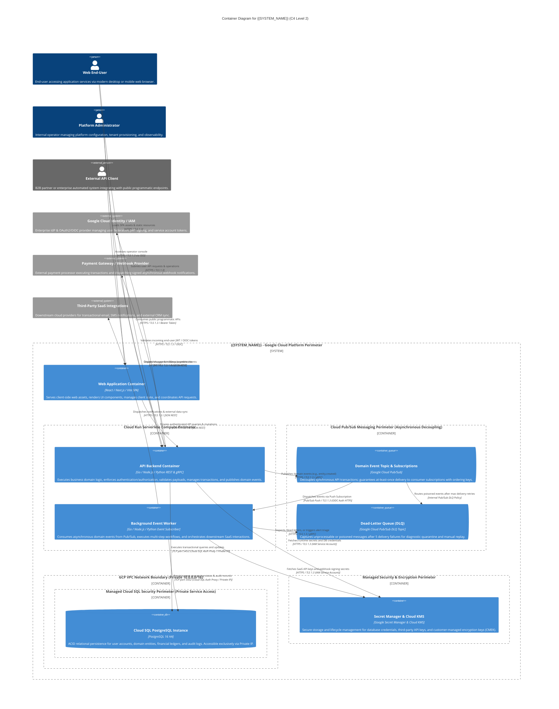
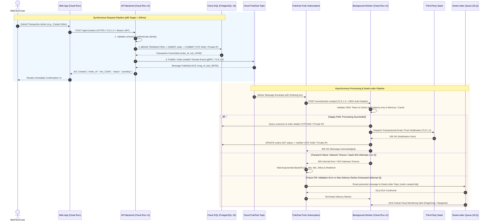

# C4 Level 2: Container Architecture Model

## 1. Architectural Intent & Scope

### 1.1 What is C4 Level 2 (Container Model)?
The **Container Model** represents the second zoom level (Zoom Level 2) in Simon Brown's C4 architectural modeling framework. In C4 parlance, a **Container** is **not** synonymous with a Docker container. Rather, it is defined as:

> An independently deployable, runnable unit that executes application code, handles compute workloads, or stores data within the system boundary.

Examples of containers in modern cloud-native architectures include:
- Single-page client applications (SPAs) or server-rendered frontends.
- Serverless microservices, API backends, or worker processes.
- Relational databases, document stores, key-value caches, and search indexes.
- Managed messaging buses, event brokers, and streaming queues.
- Security vaults and cryptographic key management services.

At this level, the architectural model intentionally zooms inside the opaque system boundary established in Pass 1 (`docs/01-architecture/c4-context-model.md`), decomposing the central platform into concrete, loosely coupled runtime units.

### 1.2 Role in the 5-Pass Progressive Plan Expansion Workflow
In the **5-Pass Progressive Plan Expansion Architecture**, Pass 2 bridges macro domain boundaries and concrete technical contracts:

```
Pass 1: Macro Domain & Context (Zoom Level 1)
   │  [Transition Gate 1: Problem scope, personas, and system boundary locked]
   ▼
Pass 2: Service Topology & Containers (Zoom Level 2)  <-- CURRENT LEVEL
   │  • Unpack {{SYSTEM_NAME}} into deployable containers
   │  • Define network perimeters, VPC boundaries, and runtime profiles
   │  • Demarcate synchronous request paths vs. asynchronous event pipelines
   │  • Specify zero-trust protocols, ports, and IAM identity mechanisms
   │  [Transition Gate 2: Container responsibilities, protocols, and topology approved]
   ▼
Pass 3: Interfaces, Contracts & Schemas (Zoom Level 3)
   │  • OpenAPI 3.1 REST contracts for API Backend
   │  • CloudEvents JSON schemas for Pub/Sub messaging
   │  • PostgreSQL DDL & ERD for Cloud SQL persistence
```

By decomposing the system into containers before generating interface contracts (Pass 3) or code scaffolding (Pass 4), engineering teams and autonomous AI agents prevent monolithic coupling, unmanageable microservice sprawl, and protocol inconsistencies.

### 1.3 Architectural Design Principles for Containers
1. **Serverless Compute First**: Containerized workloads run on **Google Cloud Run (v2)**, providing automatic scaling from zero to peak demand, zero server maintenance overhead, built-in TLS termination, and pay-per-use economics.
2. **Asynchronous Decoupling**: Non-critical-path operations (transactional notifications, reporting, external webhooks) are decoupled from synchronous API requests via **Google Cloud Pub/Sub** with dead-letter queue (DLQ) safeguards.
3. **Zero-Trust Network Isolation**: Managed databases (Cloud SQL) and backend workers have **zero public IP exposure**. Inter-container traffic traverses Google's Private Service Access (PSA) and Serverless VPC Access connectors over authenticated TLS channels.
4. **Least-Privilege Identity & Secret Management**: No container holds long-lived static credentials or hardcoded API keys. Compute runtimes authenticate via dedicated Google Cloud IAM Service Accounts, resolving ephemeral credentials from **Secret Manager** and **Cloud KMS**.

---

## 2. Interactive Mermaid C4 Container Architecture Diagram

The following diagram models the runtime containers, network boundaries, and communication protocols forming the core platform of `{{SYSTEM_NAME}}`.



---

## 3. Container Responsibility & Specification Matrix

The following matrix defines the operational profile, runtime characteristics, and domain boundaries for each container in `{{SYSTEM_NAME}}`.

| Container Name | Technology Stack | Primary Responsibilities | Scaling & Concurrency Profile | Persistence Model | Failure Modes & Resilience |
|---|---|---|---|---|---|
| **Web Application Container** | React / Next.js / Vite SPA served via Cloud Run & Cloud CDN | • Renders responsive browser UI and management consoles.<br/>• Handles client-side routing, optimistic state, and form validation.<br/>• Stores session tokens securely in HTTP-only, SameSite cookies. | • Autoscale: 1 to 10 instances.<br/>• Concurrency: 80 requests/instance.<br/>• Global Edge CDN caching for immutable static assets. | Stateless (client-side browser cache + sessionStorage). | • CDN fallback to stale cache on origin error.<br/>• Client offline banner and progressive retry on network disconnect. |
| **API Backend Container** | Go 1.22 / Node.js 20 / Python 3.11 on Cloud Run v2 | • Primary entry point for authenticated client requests.<br/>• Validates request schemas and sanitizes input data.<br/>• Enforces RBAC/ABAC authorization rules.<br/>• Coordinates atomic ACID transactions against Cloud SQL.<br/>• Emits asynchronous domain events to Cloud Pub/Sub. | • Autoscale: 2 to 50 instances (min instances = 2 for warm start).<br/>• Concurrency: 40 requests/instance.<br/>• CPU allocated during request processing only (with CPU always-on option for high-throughput tiers). | Stateless (connection pooling to Cloud SQL; no local filesystem state). | • Graceful shutdown on SIGTERM (15-second drain window).<br/>• Circuit breaker pattern on external payment calls.<br/>• Automated health check probe (`/healthz`). |
| **Background Event Worker Container** | Go 1.22 / Node.js 20 / Python 3.11 on Cloud Run v2 | • Consumes asynchronous events pushed by Cloud Pub/Sub.<br/>• Executes compute-intensive or long-running workflows (PDF generation, bulk data sync).<br/>• Enforces idempotent message execution via deduplication keys.<br/>• Delivers transactional emails, SMS, and downstream webhooks. | • Autoscale: 0 to 20 instances (scale to zero when queue is empty).<br/>• Concurrency: 10 requests/instance (tunable for CPU-heavy tasks).<br/>• Request timeout: up to 600 seconds. | Stateless (records task completion states in Cloud SQL). | • Pub/Sub at-least-once delivery with idempotency verification.<br/>• Exponential backoff retries with automatic routing to DLQ after 5 attempts. |
| **Cloud Pub/Sub Message Bus** | Managed Google Cloud Pub/Sub (Topic + Subscriptions) | • Decouples synchronous API transactions from asynchronous processing.<br/>• Guarantees high-throughput, low-latency event buffering.<br/>• Enforces message ordering using partition ordering keys when required.<br/>• Dead-letter queue isolation for corrupted/unparseable payloads. | • Fully managed, distributed event stream.<br/>• Millions of messages/sec throughput capacity.<br/>• 7-day retention period. | Durable distributed log replicated across multiple Google Cloud zones. | • Automatic multi-zone failover.<br/>• Dead-Letter Topic (`{{SYSTEM_NAME}}-events-dlq`) with automated threshold alerting. |
| **Cloud SQL PostgreSQL Instance** | PostgreSQL 16 (Enterprise High Availability) | • Authoritative system of record for all business entities, user accounts, and financial ledgers.<br/>• Enforces foreign key constraints, uniqueness, and ACID compliance.<br/>• Hosts database audit logs and event idempotency tables. | • Regional High Availability (Automatic failover to secondary zone in < 60s).<br/>• Storage autoscaling enabled (starts at 50 GB SSD).<br/>• Connection pooling via Cloud SQL Auth Proxy / PgBouncer. | Persistent SSD storage with point-in-time recovery (PITR) and automated daily snapshots. | • Synchronous replication to standby replica in distinct zone.<br/>• Automated failover without manual intervention. |
| **Secret Manager & Cloud KMS** | Google Secret Manager & Cloud KMS | • Secure vaulting of sensitive credentials, database passwords, and third-party API tokens.<br/>• Customer-Managed Encryption Keys (CMEK) for encrypting Cloud SQL disks and Pub/Sub storage.<br/>• Automatic secret versioning and cryptographic audit trail. | • Globally distributed, high-availability managed API.<br/>• Sub-100ms secret retrieval latency. | Highly durable, HSM-backed encrypted storage. | • Immutable version history; automated alerts on unauthorized secret access attempts. |

---

## 4. Network Security, Boundaries & Port/Protocol Specifications

### 4.1 Boundary Security Architecture & Isolation Zones

```
+----------------------------------------------------------------------------------------------------+
| ZONE 0: UNTRUSTED PUBLIC INTERNET                                                                  |
| Web End-Users, Admin Operators, External API Clients, Payment Gateway Webhooks                     |
+----------------------------------------------------------------------------------------------------+
                                                │
                                                │ Ingress: HTTPS / Port 443 (TLS 1.3 / Strict Ciphers)
                                                ▼
+----------------------------------------------------------------------------------------------------+
| ZONE 1: INGRESS PERIMETER & EDGE ACCELERATION                                                      |
| Google Cloud External Application Load Balancer + Cloud CDN + Cloud Armor (WAF & DDoS Mitigation)  |
+----------------------------------------------------------------------------------------------------+
                                                │
                                                │ Authenticated Serverless Ingress
                                                ▼
+----------------------------------------------------------------------------------------------------+
| ZONE 2: SERVERLESS COMPUTE PERIMETER (Google Cloud Run v2)                                         |
| Web Application Container  │  API Backend Container  │  Background Event Worker Container          |
+----------------------------------------------------------------------------------------------------+
                    │                                             │
                    │ Pub/Sub API (gRPC / TLS 1.3)                │ Serverless VPC Access Connector
                    ▼                                             ▼ (Subnet: 10.8.0.0/28)
+-------------------------------------------------+  +-----------------------------------------------+
| ZONE 3A: ASYNC MESSAGING BROKER                 |  | ZONE 3B: PRIVATE VPC NETWORK (10.0.0.0/16)    |
| Cloud Pub/Sub Topic & Push Subscription         |  | Private Service Access (PSA)                  |
| Dead-Letter Queue (DLQ) Topic                   |  | Cloud SQL PostgreSQL 16 (Port 5432)           |
+-------------------------------------------------+  +-----------------------------------------------+
                    │                                             ▲
                    │ Push (OIDC Authenticated HTTP)              │ Cloud SQL Auth Proxy / TLS 1.3
                    └─────────────────────────────────────────────┘
                                                │
                                                │ IAM Authenticated HTTPS / TLS 1.3
                                                ▼
+----------------------------------------------------------------------------------------------------+
| ZONE 4: MANAGED SECURITY & IDENTITY PLANE                                                          |
| Google Secret Manager  │  Cloud KMS (CMEK)  │  Google Cloud IAM (Workload Identity Federation)     |
+----------------------------------------------------------------------------------------------------+
```

### 4.2 Port, Protocol & Network Traffic Specification Matrix

| Source Container | Destination Container | Network Boundary Traversal | Protocol | Port / Cipher | Encryption in Transit | Identity & Authentication | Traffic Pattern | Purpose |
|---|---|---|---|---|---|---|---|---|
| **Web End-User** | Web Application | Zone 0 &rarr; Zone 1 | HTTPS | 443 (TLS 1.3) | TLS 1.3 (ECDHE-ECDSA-AES128-GCM-SHA256) | Anonymous / Session Cookie | Synchronous Ingress | Download SPA assets and client bundle. |
| **Web End-User** | API Backend | Zone 0 &rarr; Zone 1 &rarr; Zone 2 | HTTPS | 443 (TLS 1.3) | TLS 1.3 | OIDC End-User Bearer JWT | Synchronous Request | Execute business operations and user queries. |
| **Admin Operator** | Web Application | Zone 0 &rarr; Zone 1 &rarr; Zone 2 | HTTPS | 443 (TLS 1.3) | TLS 1.3 | Google Identity SSO + MFA | Synchronous Ingress | Platform administration and tenant operations. |
| **External API Client** | API Backend | Zone 0 &rarr; Zone 1 &rarr; Zone 2 | HTTPS | 443 (TLS 1.3) | TLS 1.3 | API Key / Bearer OAuth2 Token | Synchronous Request | Automated B2B data consumption and mutations. |
| **Payment Gateway** | API Backend | Zone 0 &rarr; Zone 1 &rarr; Zone 2 | HTTPS | 443 (TLS 1.3) | TLS 1.3 | HMAC-SHA256 Signature Header | Synchronous Inbound Webhook | Real-time payment settlement notifications. |
| **Web Application** | API Backend | Zone 2 &rarr; Zone 2 (Internal/Edge) | HTTPS | 443 (TLS 1.3) | TLS 1.3 | Forwarded User Bearer JWT | Synchronous Request | Proxy client-side REST and GraphQL requests. |
| **API Backend** | Cloud Pub/Sub Topic | Zone 2 &rarr; Zone 3A | HTTPS / gRPC | 443 (TLS 1.3) | TLS 1.3 (Google Private API) | IAM Service Account (`sa-api-backend`) | Asynchronous Publish | Emit domain event payloads for decoupled handling. |
| **Cloud Pub/Sub Subscription** | Background Event Worker | Zone 3A &rarr; Zone 2 | HTTPS (Push) | 443 (TLS 1.3) | TLS 1.3 | OIDC Service Account Token (Pub/Sub Invoker) | Asynchronous Push Delivery | Deliver event messages to worker HTTP endpoint. |
| **Cloud Pub/Sub Topic** | Dead-Letter Queue (DLQ) | Zone 3A &rarr; Zone 3A | Internal GCP Bus | N/A | Google Internal Encryption | Cloud Pub/Sub System Policy | Asynchronous Dead-Lettering | Quarantine messages failing 5 consecutive deliveries. |
| **API Backend** | Cloud SQL PostgreSQL | Zone 2 &rarr; Zone 3B | TCP | 5432 (TLS 1.3) | TLS 1.3 via Cloud SQL Auth Proxy / Private IP | IAM DB Auth / Database User Credentials | Synchronous Database Session | Read/write application state and transactional records. |
| **Background Event Worker** | Cloud SQL PostgreSQL | Zone 2 &rarr; Zone 3B | TCP | 5432 (TLS 1.3) | TLS 1.3 via Cloud SQL Auth Proxy / Private IP | IAM DB Auth / Database User Credentials | Synchronous Database Session | Update asynchronous job status and audit ledgers. |
| **API Backend** | Secret Manager & KMS | Zone 2 &rarr; Zone 4 | HTTPS / REST | 443 (TLS 1.3) | TLS 1.3 | IAM Service Account (`sa-api-backend`) | Synchronous On-Demand | Retrieve database passwords and signing keys at boot. |
| **Background Event Worker** | Secret Manager & KMS | Zone 2 &rarr; Zone 4 | HTTPS / REST | 443 (TLS 1.3) | TLS 1.3 | IAM Service Account (`sa-event-worker`) | Synchronous On-Demand | Retrieve third-party SaaS integration tokens. |
| **API Backend** | Payment Gateway | Zone 2 &rarr; Zone 0 | HTTPS | 443 (TLS 1.3) | TLS 1.3 | Secret API Key (Bearer header) | Synchronous Egress | Create checkout sessions and execute charges. |
| **Background Event Worker** | Third-Party SaaS | Zone 2 &rarr; Zone 0 | HTTPS | 443 (TLS 1.3) | TLS 1.3 | OAuth2 / Bearer Token | Asynchronous Egress | Send customer notifications and sync partner data. |

---

## 5. Synchronous vs. Asynchronous Communication Topologies

### 5.1 End-to-End Request and Event Lifecycle

To ensure system responsiveness and prevent cascading failures, the architecture strictly segregates **synchronous request-response interactions** (which must complete within strict user latency budgets) from **asynchronous background workflows** (which are buffered and retried resiliently).



### 5.2 Asynchronous Event Specifications & Reliability Controls
- **Event Envelope Standard**: All asynchronous messages published to Cloud Pub/Sub adhere strictly to the **CloudEvents v1.0** specification.
- **Idempotency Guarantee**: Because Cloud Pub/Sub guarantees **at-least-once delivery**, workers MUST enforce idempotency. Each event contains an `idempotency_key` (UUIDv4) and `event_id`. The worker maintains an `idempotency_records` table in Cloud SQL with a `UNIQUE` constraint. Duplicate messages trigger an immediate HTTP `200 OK` without re-executing side-effects.
- **Dead-Letter Queue (DLQ) Configuration**:
  - `max_delivery_attempts`: Configured to `5`.
  - `dead_letter_topic`: `projects/{{GCP_PROJECT_ID}}/topics/{{SYSTEM_NAME}}-events-dlq`.
  - `minimum_backoff`: `10s`; `maximum_backoff`: `600s`.
  - Retention on DLQ: 14 days, with automated Cloud Monitoring alerts firing when `dead_letter_queue_undelivered_message_count > 0`.

---

## 6. Data Protection, Secret Management & Cryptographic Security

### 6.1 Secret Resolution Architecture
Static secrets, database connection passwords, and private API keys are strictly forbidden from appearing in source code, Dockerfiles, or unencrypted environment variables.

1. **Vaulting**: All secrets are stored in **Google Secret Manager** with semantic versioning (`projects/{{GCP_PROJECT_ID}}/secrets/{{SYSTEM_NAME}}-db-credentials/versions/latest`).
2. **Runtime Access**:
   - Cloud Run services bind secrets at deployment time as secure environment variables or mounted files using Secret Manager volume mounts.
   - IAM access is restricted strictly to each container's dedicated Service Account:
     - `sa-api-backend@{{GCP_PROJECT_ID}}.iam.gserviceaccount.com` has `roles/secretmanager.secretAccessor` on backend secrets only.
     - `sa-event-worker@{{GCP_PROJECT_ID}}.iam.gserviceaccount.com` has `roles/secretmanager.secretAccessor` on worker secrets only.
3. **Rotation & Zero-Downtime Reload**: Secret updates create a new version in Secret Manager. Cloud Run revisions are automatically triggered via CI/CD pipelines to mount the updated version without downtime.

### 6.2 Encryption at Rest & In Transit
- **Customer-Managed Encryption Keys (CMEK)**:
  - All Cloud SQL persistent storage disks, database backups, and Cloud Pub/Sub message queues are encrypted using keys hosted in **Cloud KMS**: `projects/{{GCP_PROJECT_ID}}/locations/{{GCP_REGION}}/keyRings/{{SYSTEM_NAME}}-ring/cryptoKeys/{{SYSTEM_NAME}}-cmek`.
  - Key rotation is scheduled automatically every 90 days.
- **Encryption in Transit**:
  - All inter-container communication strictly requires **TLS 1.3**.
  - Internal database traffic from Cloud Run to Cloud SQL traverses a dedicated **Serverless VPC Access connector** using ephemeral client certificates generated dynamically by the Cloud SQL Auth Proxy client library.

---

## 7. Transition Gate 2 Exit Criteria (Pass 2 &rarr; Pass 3)

Before proceeding to **Pass 3: Interface, Contract & Schema Expansion**, the engineering team and autonomous agents must verify the following checklist against this C4 Level 2 Container model:

- [ ] **Container Topology Approved**: All computational units (Web App, API Backend, Event Worker) and storage units (Cloud SQL, Pub/Sub, Secret Manager) are explicitly accounted for.
- [ ] **No Monolithic Leaks**: Background workflows are completely decoupled from the synchronous API request lifecycle via Pub/Sub.
- [ ] **Port & Protocol Rigor**: Every inter-container communication channel has an identified protocol (TLS 1.3, TCP 5432, OIDC HTTP), port, and identity mechanism.
- [ ] **Zero Public Database Exposure**: Cloud SQL PostgreSQL is confirmed to reside exclusively on Private IP within the VPC, accessible only via Serverless VPC Access or Cloud SQL Proxy.
- [ ] **Dead-Letter Handling Codified**: The Pub/Sub topic and worker contract includes an explicit dead-letter queue (DLQ) topology, retry budget (5 attempts), and idempotency mechanism.
- [ ] **Ready for Contract Expansion**:
  - API Backend is ready to be expanded into **OpenAPI 3.1** specification (`contracts/api/openapi.yaml`).
  - Pub/Sub message bus is ready to be expanded into **CloudEvents JSON Schemas** (`contracts/events/`).
  - Cloud SQL PostgreSQL instance is ready to be expanded into **Relational DDL & ERD** (`contracts/database/`).

---

## 8. Template Variable Glossary

When instantiating this template for a specific application implementation, substitute the following template placeholders:

| Variable Placeholder | Description | Example Target Value |
|---|---|---|
| `{{SYSTEM_NAME}}` | Canonical name of the platform/application | `OmniCommerce Engine` |
| `{{ORGANIZATION_NAME}}` | Enterprise or organizational owner | `Acme Global Enterprises` |
| `{{GCP_PROJECT_ID}}` | Google Cloud project identifier | `omnicommerce-prod-2026` |
| `{{GCP_REGION}}` | Primary Google Cloud deployment region | `us-central1` |
| `{{VPC_NAME}}` | Virtual Private Cloud network name | `vpc-omnicommerce-main` |
| `{{DB_INSTANCE_NAME}}` | Cloud SQL PostgreSQL instance identifier | `pg-omnicommerce-primary-ha` |
| `{{PUBSUB_TOPIC_PREFIX}}` | Prefix for Cloud Pub/Sub domain event topics | `omnicommerce-events` |
