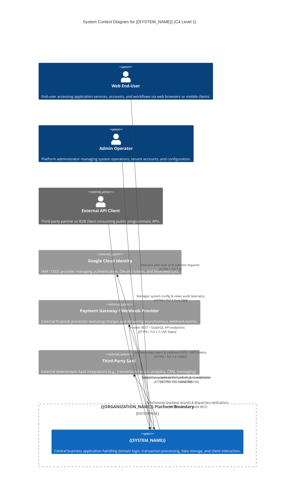

# C4 Level 1: System Context Model

## 1. Architectural Intent & Scope

### 1.1 What is C4 Level 1 (System Context)?
The **System Context** diagram represents the highest level of abstraction (Zoom Level 1) in Simon Brown's C4 architectural modeling framework. It provides a 10,000-foot view of the entire software ecosystem. 

At this level, the model intentionally abstracts away:
- Internal service topologies, microservices, and containers
- Programming languages, frameworks, and runtime libraries
- Data stores, caches, queues, and storage mechanisms
- Underlying infrastructure, cloud primitives, and network routing

Instead, C4 Level 1 concentrates strictly on:
1. **The System Itself**: The central software platform (`{{SYSTEM_NAME}}`) treated as an opaque black box.
2. **Human Personas**: Primary users, administrative operators, and stakeholders who directly interact with the system.
3. **External Software Systems**: Third-party APIs, SaaS platforms, identity providers, and banking/payment processors upon which the system depends or which consume services from the system.
4. **Boundary Interactions & Trust Zones**: Protocols, directional data flows, and trust boundaries separating external untrusted networks from internal services.

### 1.2 Role in the 5-Pass Progressive Expansion Engine
In this SDLC template, Pass 1 establishes the macro domain boundary. Autonomous AI agents and human architects use this document as an unshakeable boundary anchor before zooming into containers (Pass 2) or API contracts (Pass 3). By freezing external actors and integration contracts first, the system prevents scope creep, integration mismatch, and hallucinated architecture.

---

## 2. Interactive Mermaid C4 System Context Diagram



---

## 3. Actor & Persona Specifications

| Persona / Actor | Type | Description | Primary Access Channels | Authentication & Credential Type |
|---|---|---|---|---|
| **Web End-User** | Human Persona (Internal / External) | Primary consumer of the application. Executes standard business flows, views personal records, and manages their account. | Desktop Web (Chrome, Safari, Firefox), Mobile Web / PWA | OIDC Authorization Code Flow + PKCE / Session Cookie |
| **Admin Operator** | Human Persona (Internal) | Privileged operator, system reliability engineer, or customer support specialist managing platform health, tenant provisioning, and auditing. | Web Administration Console, Operator CLI | Corporate SSO / Google Cloud IAM with Multi-Factor Authentication (MFA) |
| **External API Client** | Machine / External Persona | Automated third-party application, B2B partner, or customer system consuming headless API capabilities. | Public API Gateway (`/api/v1/`) | Bearer Token / API Key / mTLS Client Certificate |

---

## 4. Central System Definition

- **System Name**: `{{SYSTEM_NAME}}`
- **Purpose**: Acts as the central core system responsible for hosting business logic, managing state persistence, orchestrating background processing, and exposing secure user and API interfaces.
- **Scope Responsibilities**:
  - Exposing web user experiences and programmatic API endpoints.
  - Enforcing authorization rules, rate limiting, and input sanitization.
  - Orchestrating asynchronous message publishing and background workflows.
  - Ensuring persistence, ACID integrity, and relational data consistency.
- **Out of Scope for this System**:
  - Direct processing of raw credit card PAN data (delegated to PCI-DSS certified Payment Gateway).
  - Primary user credential hashing and identity storage (delegated to Google Cloud Identity / OIDC Provider).
  - Bulk email deliverability and physical SMS delivery infrastructure (delegated to Third-Party SaaS).

---

## 5. External System Integrations

### 5.1 Google Cloud Identity (IAM / OIDC)
- **Role**: Authoritative Identity Provider (IdP).
- **Integration Mechanics**:
  - End-users and operators initiate OAuth 2.0 / OIDC flows.
  - `{{SYSTEM_NAME}}` verifies JSON Web Tokens (JWT) against Google's public JSON Web Key Sets (JWKS).
  - Internal service-to-service calls leverage Google Cloud IAM Service Account ID tokens or Workload Identity Federation (WIF).
- **Protocol**: HTTPS / TLS 1.3, OpenID Connect 1.0, OAuth 2.0.

### 5.2 Payment Gateway / External Webhook Provider
- **Role**: Financial payment processing and asynchronous notification provider.
- **Integration Mechanics**:
  - **Outbound**: `{{SYSTEM_NAME}}` initiates charges, creates payment intents, or provisions customer billing portals over synchronous REST endpoints.
  - **Inbound**: Payment provider delivers asynchronous events (e.g., `payment_intent.succeeded`, `charge.dispute.created`) to an authenticated webhook endpoint on `{{SYSTEM_NAME}}`.
- **Security & Integrity**:
  - Inbound webhooks must be verified using symmetric cryptographic signatures (HMAC-SHA256) matching a shared secret.
  - Timestamp validation prevents replay attacks within a 5-minute drift window.
- **Protocol**: HTTPS / TLS 1.3, JSON payloads, HMAC signature header.

### 5.3 Third-Party SaaS
- **Role**: Specialized external downstream capabilities (e.g., transactional messaging, observability, CRM sync).
- **Integration Mechanics**:
  - `{{SYSTEM_NAME}}` emits events or pushes data via secure outbound HTTP clients.
  - Resilient retry policies with exponential backoff and circuit breaking protect against downstream degradation.
- **Protocol**: HTTPS / TLS 1.3, REST / JSON with bearer API keys or mutual TLS.

---

## 6. Boundary Trust Zones & Security Perimeters

```
+-----------------------------------------------------------------------------------------+
| UNTRUSTED EXTERNAL ZONE (Public Internet)                                               |
| Web End-Users, External API Clients, Public Webhook Callers                             |
+-----------------------------------------------------------------------------------------+
                                         |
                                         | Ingress (HTTPS / TLS 1.3, WAF, Rate Limiting)
                                         v
+-----------------------------------------------------------------------------------------+
| DMZ / INGRESS PERIMETER                                                                 |
| Cloud Load Balancer / Google Cloud Armor / TLS Termination                              |
+-----------------------------------------------------------------------------------------+
                                         |
                                         | Authenticated Internal Transit (Private VPC / mTLS)
                                         v
+-----------------------------------------------------------------------------------------+
| TRUSTED PLATFORM CORE (VPC / Service Perimeter)                                         |
| {{SYSTEM_NAME}} Workloads (Cloud Run, VPC Connectors, Managed Databases)                |
+-----------------------------------------------------------------------------------------+
                                         |
                                         | Egress (Egress NAT / Private Google Access / TLS 1.3)
                                         v
+-----------------------------------------------------------------------------------------+
| TRUSTED EXTERNAL PARTNERS                                                               |
| Google Cloud IAM, Payment Gateways, Third-Party SaaS                                    |
+-----------------------------------------------------------------------------------------+
```

### 6.1 Trust Zone Classifications
1. **Zone 0: Public Untrusted Zone**
   - The open internet. All inputs are considered potentially adversarial.
   - Requirements: Strict TLS 1.3 enforcement, DDoS mitigation, web application firewall (Cloud Armor) filtering, and rate limiting.
2. **Zone 1: DMZ / Ingress Perimeter**
   - Public-facing load balancers and edge proxies.
   - Responsibilities: SSL/TLS certificate offloading, security header injection (HSTS, CSP), and initial routing.
3. **Zone 2: Trusted Platform Core**
   - The virtual private cloud (VPC) enclosing `{{SYSTEM_NAME}}` application runtimes and managed data stores.
   - Responsibilities: Principle of least privilege, zero-trust service-to-service communication, private VPC egress, and encrypted at-rest storage.
4. **Zone 3: Trusted External Partners**
   - Regulated third-party APIs reachable over public internet or Private Service Connect.
   - Responsibilities: Egress controls, credential secrets stored in Secret Manager, strict payload validation.

---

## 7. Communication & Protocol Matrix

| Source | Destination | Direction | Protocol | Port / Cipher | Auth / Verification | Purpose |
|---|---|---|---|---|---|---|
| Web End-User | `{{SYSTEM_NAME}}` | Inbound | HTTPS | 443 (TLS 1.3) | OIDC Bearer JWT / Session | User UI interaction and API operations |
| Admin Operator | `{{SYSTEM_NAME}}` | Inbound | HTTPS | 443 (TLS 1.3) | Google Cloud Identity SSO + MFA | Platform governance and operations |
| External API Client | `{{SYSTEM_NAME}}` | Inbound | HTTPS | 443 (TLS 1.3) | Bearer Token / API Key / mTLS | Automated B2B data consumption |
| `{{SYSTEM_NAME}}` | Google Cloud Identity | Outbound | HTTPS | 443 (TLS 1.3) | OIDC / OAuth 2.0 Client Creds | Token introspection & JWKS discovery |
| `{{SYSTEM_NAME}}` | Payment Gateway | Outbound | HTTPS | 443 (TLS 1.3) | Secret API Key (Authorization header) | Payment intent creation & transaction settlement |
| Payment Gateway | `{{SYSTEM_NAME}}` | Inbound | HTTPS | 443 (TLS 1.3) | HMAC-SHA256 Webhook Signature | Real-time payment lifecycle notifications |
| `{{SYSTEM_NAME}}` | Third-Party SaaS | Outbound | HTTPS | 443 (TLS 1.3) | API Key / OAuth 2.0 Bearer | Asynchronous notification & data sync |

---

## 8. Template Variable Glossary

When instantiating this template for a specific project, replace the following template variables:

| Variable | Description | Example Replacement |
|---|---|---|
| `{{SYSTEM_NAME}}` | Canonical name of the system being designed | `OmniCommerce Platform`, `TaskFlow Engine` |
| `{{ORGANIZATION_NAME}}` | Name of the enterprise or hosting organization | `Acme Global Corp`, `Vertex Logistics` |
| `{{DOMAIN_NAME}}` | Top-level domain for the production environment | `api.omnicommerce.io` |
