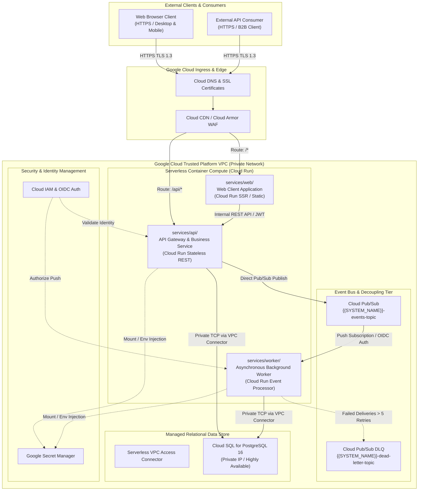
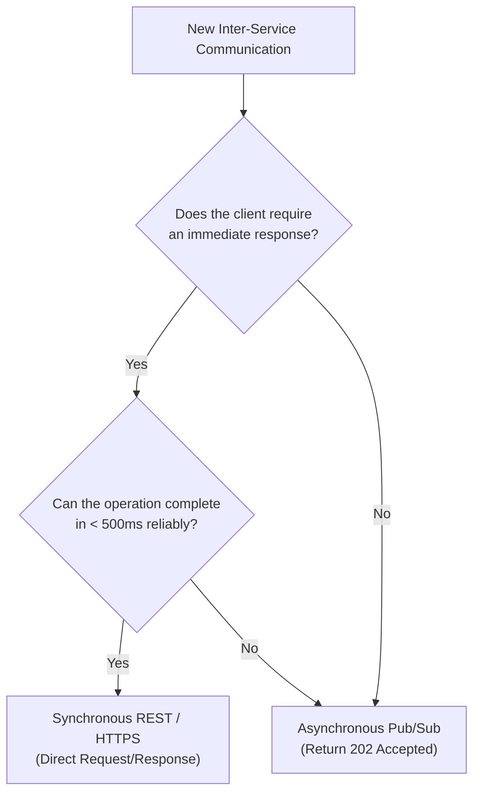
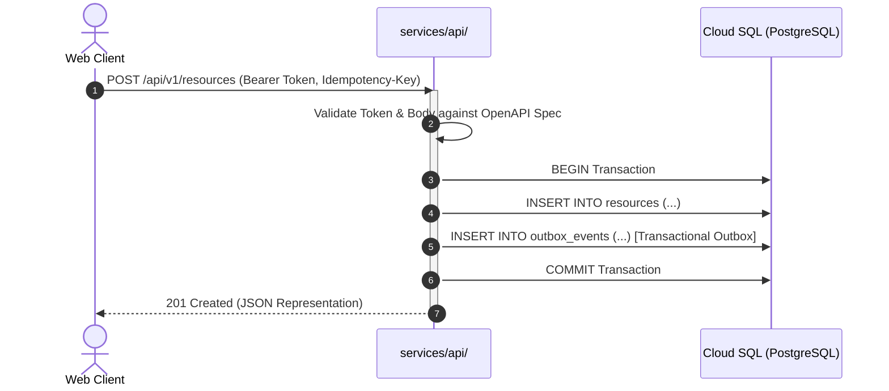
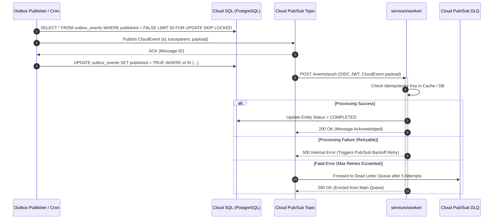
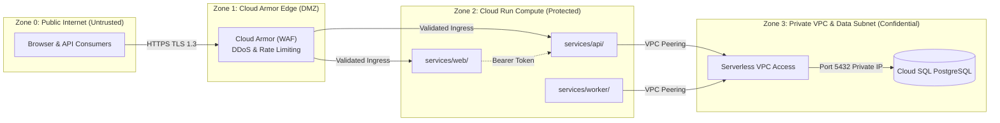
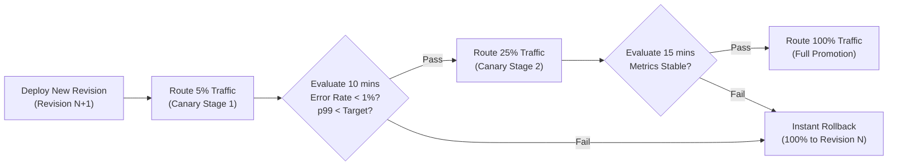
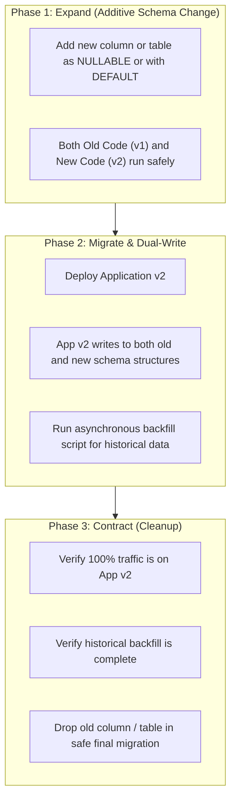

<!--
================================================================================
INSTRUCTIONS FOR AUTHORS AND AI CODING AGENTS
================================================================================
This Request for Comments (RFC) template defines the technical architecture,
subsystem topology, communication protocols, resilience patterns, and operational
sizing for {{SYSTEM_NAME}}. It serves as the foundational artifact of Pass 2
(Zoom Level 2: Service Topology & Containers) in the 5-Pass Progressive Expansion
Engine.

UPSTREAM GROUNDING (PASS 1 REQUIREMENTS):
1. Every subsystem, SLA, and security boundary defined here MUST trace directly
   back to:
   - docs/00-discovery/problem-statement-template.md (Business problem & requirements)
   - docs/00-discovery/success-metrics-template.md (SLAs, SLOs, p99 latencies)
   - docs/01-architecture/c4-context-model.md (External actors & system perimeter)

AI AGENT STEERING & REPLACEMENT RULES:
1. Scan for all double curly-bracket placeholders (e.g., `{{SYSTEM_NAME}}`,
   `{{PRIMARY_REGION}}`, `{{MAX_INSTANCES}}`) and replace them with project-specific
   domain and operational values.
2. Maintain all machine-readable annotations (<!-- @schema: ... --> and
   <!-- @agent-meta: ... -->) intact for programmatic linting.
3. Strict scope enforcement:
   - IN SCOPE (Pass 2): Container boundaries, compute tiers, sync vs async
     patterns, resilience strategies, sizing, and deployment lifecycle.
   - DEFERRED (Pass 3): Concrete OpenAPI schemas, Pub/Sub JSON schemas, SQL DDL
     tables, and ERDs. Do NOT write DDL or full OpenAPI specs in this document.
   - DEFERRED (Pass 4 & 5): Source code implementations, Dockerfiles, and Terraform
     configuration files.

GATE 2 TRANSITION CRITERIA:
This RFC must achieve status "ACCEPTED" and pass Transition Gate 2 before initiating
Pass 3 (Interface, Contract & Schema Expansion).
================================================================================
-->

# System Architecture RFC: {{SYSTEM_NAME}}

<!-- @agent-meta: {"phase": "pass-2", "artifact": "system-rfc", "system": "{{SYSTEM_NAME}}", "version": "1.0.0", "status": "PROPOSED"} -->

## 1. Executive Summary & Problem Scope

### 1.1 Context & Problem Overview
This Request for Comments (RFC) formalizes the target container topology, communication mechanisms, security model, and resiliency strategy for **{{SYSTEM_NAME}}**. 

As documented in [`docs/00-discovery/problem-statement-template.md`](../00-discovery/problem-statement-template.md), {{SYSTEM_NAME}} addresses critical operational bottlenecks in {{DOMAIN_OR_INDUSTRY}} by replacing legacy or manual processes with a cloud-native, horizontally scalable platform. To achieve the business outcomes defined in discovery, the system transitions from the black-box context view established in Pass 1 ([`docs/01-architecture/c4-context-model.md`](./c4-context-model.md)) to an explicit multi-tier containerized service topology.

### 1.2 Target Performance & Availability Envelope
The architecture codified in this RFC is engineered to strictly satisfy the Service Level Objectives (SLOs) established in [`docs/00-discovery/success-metrics-template.md`](../00-discovery/success-metrics-template.md):

* **Service Availability**: `{{TARGET_AVAILABILITY_PERCENTAGE}}%` (Standard: 99.9% / Three Nines) across all customer-facing endpoints.
* **Synchronous API Latency**: `p95 <= {{API_P95_LATENCY_MS}}ms`, `p99 <= {{API_P99_LATENCY_MS}}ms` for standard read/write transactions under steady-state load.
* **Asynchronous Task Processing**: `p95 <= {{ASYNC_TASK_P95_LATENCY_SEC}}s` turnaround from message ingestion to terminal processing.
* **Target Throughput**: Sustained `{{SUSTAINED_RPS}} RPS`, peak burst capability of `{{BURST_RPS}} RPS`.
* **Recovery Objectives**: RTO `<= {{TARGET_RTO}}`, RPO `<= {{TARGET_RPO}}`.

### 1.3 Upstream Traceability Matrix
<!-- @schema:traceability-matrix -->
| Pass 1 Requirement / Actor | Primary Need / Constraint | Pass 2 Architectural Response | Target Subsystem |
|---|---|---|---|
| **Web End-User** | Responsive, low-latency UI with instant updates | Stateless containerized frontend backed by global CDN edge caching | `services/web/` |
| **API Client** | High-throughput programmatic REST API | High-concurrency API service with sub-millisecond connection pooling | `services/api/` |
| **Background Processing** | Non-blocking execution of heavy computation & webhooks | Event-driven worker pool decoupled via managed Pub/Sub topics | `services/worker/` |
| **Data Integrity** | ACID compliance, transactional consistency, auditability | Cloud SQL PostgreSQL with private IP and Transactional Outbox | Managed Cloud SQL |
| **Security & Compliance** | Zero Trust, least privilege, encrypted data | Serverless VPC Access, OIDC identity tokens, Secret Manager | Shared Cloud Infra |

### 1.4 Out-of-Scope Boundaries for this RFC
To maintain architectural focus and prevent premature optimization, the following concerns are explicitly deferred:
* **Interface Payloads & DDL**: Exact REST endpoint request/response JSON models and PostgreSQL DDL table schemas are specified in Pass 3 (`contracts/`).
* **Source Code Scaffolding**: Language-specific framework selections (e.g., Express vs. Fastify, Gin vs. Echo) and application code belong to Pass 4 (`services/`).
* **Infrastructure as Code (IaC)**: Terraform HCL configurations and GitHub Actions workflows are implemented in Pass 5 (`infra/` and `.github/`).

---

## 2. Architectural Tenets & Invariants

### 2.1 Core Architectural Principles
Every technical decision within {{SYSTEM_NAME}} must adhere to the following seven architectural tenets:

1. **Stateless Compute by Default**: All compute containers (`services/web/`, `services/api/`, `services/worker/`) must remain entirely stateless. Any persistent state, user sessions, or shared artifacts must be stored in external managed data stores (Cloud SQL PostgreSQL or Cloud Storage). Containers must support instantaneous shutdown and restart without data loss.
2. **Event-Driven Asynchronous Decoupling**: Any transaction requiring more than `{{SYNC_TIMEOUT_THRESHOLD_MS}}ms` or depending on third-party SaaS availability must be offloaded from the synchronous request path via Google Cloud Pub/Sub. The synchronous API acknowledges receipt with `202 Accepted` and offloads execution to background workers.
3. **Zero Trust & Principle of Least Privilege (PoLP)**: No internal component implicitly trusts any other component. Every inter-service invocation requires cryptographic authentication (OIDC bearer tokens, IAM service accounts, or VPC-peered private networks). Workload Identity Federation (WIF) eliminates static service account keys in CI/CD.
4. **Immutability & Ephemerality**: Container images stored in Google Artifact Registry are strictly immutable and tagged with git commit SHAs. In-place patching or manual SSH access to runtime containers is strictly prohibited.
5. **Single Source of Truth & Relational Integrity**: All core transactional data must be anchored in Cloud SQL PostgreSQL. We prevent distributed dual-write inconsistency across databases and event streams by mandating the **Transactional Outbox Pattern**.
6. **Observability-First & Distributed Tracing**: Every ingress request generates or propagates a W3C `traceparent` context header. All application logs must be emitted as structured JSON with trace correlation (`logging.googleapis.com/trace`) to enable end-to-end distributed transaction tracing.
7. **Contract-First Decomposition**: Implementation code must never precede interface contracts. OpenAPI 3.1 specifications and JSON Schemas authored in Pass 3 represent binding commitments between frontend, backend, and asynchronous workers.

### 2.2 Invariant Enforcement Rules
> [!IMPORTANT]
> The following rules represent non-negotiable system invariants. Automated CI/CD gates and architecture reviews will reject changes violating these invariants:
> * **Invariant 1**: `services/web/` must never establish direct TCP connections to Cloud SQL PostgreSQL. All persistence operations must route through `services/api/`.
> * **Invariant 2**: `services/api/` must never wait synchronously for external third-party webhook deliveries or batch jobs during a client HTTP request.
> * **Invariant 3**: No secrets, tokens, or credentials may be baked into container images or checked into source control. All secrets are dynamically mounted or injected via Google Cloud Secret Manager.
> * **Invariant 4**: All asynchronous events must be designed for **at-least-once delivery** and processed **idempotently**.

---

## 3. High-Level Subsystem Topology & Responsibilities

### 3.1 Subsystem Topology Architecture Diagram



---

### 3.2 Subsystem Breakdown & Responsibilities

#### A. Web Client Subsystem (`services/web/`)
* **Physical Location**: `services/web/`
* **Runtime Target**: Google Cloud Run (Serverless Container) or Cloud Storage + Cloud CDN.
* **Primary Responsibilities**:
  1. Render dynamic client user interfaces, dashboards, and forms.
  2. Handle client-side routing, optimistic UI updates, and presentation state.
  3. Enforce strict HTTP security headers: Content Security Policy (CSP), HTTP Strict Transport Security (HSTS), and X-Content-Type-Options.
  4. Proxy authenticated user requests to `services/api/` via secure HTTP cookies or bearer authorization headers.
* **Explicit Constraints**:
  - Zero direct database access.
  - Zero business domain calculations; presentation rendering and client-side validation only.

#### B. Backend API Gateway & Service Subsystem (`services/api/`)
* **Physical Location**: `services/api/`
* **Runtime Target**: Google Cloud Run (Stateless Container Runtime).
* **Primary Responsibilities**:
  1. Terminate ingress REST API requests, validating JWT/OIDC authentication tokens.
  2. Validate request payloads against Pass 3 OpenAPI 3.1 contracts.
  3. Execute core business logic and coordinate ACID transactions with Cloud SQL PostgreSQL.
  4. Implement the Transactional Outbox Pattern: atomically commit entity updates and outbox events within a single database transaction.
  5. Publish asynchronous events to Cloud Pub/Sub for background processing.
  6. Return standard RFC 7807 Problem Details for all HTTP error responses.
* **Network & Security**:
  - Connects to Cloud SQL via Serverless VPC Access Connector using Private IP.
  - Authenticates database sessions using Cloud SQL IAM database authentication or secure credentials from Secret Manager.

#### C. Asynchronous Background Worker Subsystem (`services/worker/`)
* **Physical Location**: `services/worker/`
* **Runtime Target**: Google Cloud Run (Invoked via Cloud Pub/Sub Push Subscription with OIDC token).
* **Primary Responsibilities**:
  1. Ingest asynchronous events pushed by Cloud Pub/Sub topics.
  2. Execute heavy background processing, document transformations, analytics aggregation, and third-party SaaS synchronization.
  3. Enforce idempotency: verify message `idempotency_key` against PostgreSQL before executing side-effects.
  4. Acknowledge messages with HTTP `200 OK` on success; return non-2xx to trigger Pub/Sub exponential retry.
  5. Route unprocessable messages to the Dead Letter Queue (DLQ) after `{{DLQ_MAX_DELIVERY_ATTEMPTS}}` failed delivery attempts.

#### D. Relational Persistence Layer (Cloud SQL PostgreSQL)
* **Physical Location**: Managed Google Cloud Platform Resource (`infra/modules/cloud_sql/`).
* **Engine & Version**: PostgreSQL 16 Enterprise, Regional High Availability (HA) with automatic failover.
* **Primary Responsibilities**:
  1. Guarantee ACID transactional integrity for domain models (`users`, `tasks`, etc.).
  2. Maintain the `outbox_events` table for reliable event dispatch.
  3. Enforce foreign key constraints, indexes, and audit timestamps.
  4. Restrict access strictly to private VPC IP addresses; zero public internet exposure.
* **Connection Management**:
  - PgBouncer connection pooler or Cloud SQL Auth Proxy sidecar deployed to manage connection spikes and eliminate connection starvation.

#### E. Asynchronous Messaging & Event Bus (Google Cloud Pub/Sub)
* **Physical Location**: Managed Google Cloud Platform Resource (`infra/modules/pubsub/`).
* **Topology**:
  - Primary Topic: `{{SYSTEM_NAME}}-events-topic`
  - Worker Push Subscription: `{{SYSTEM_NAME}}-worker-sub` (Target: `https://worker-{{SYSTEM_NAME}}.run.app/events/push`)
  - Dead Letter Topic: `{{SYSTEM_NAME}}-dead-letter-topic`
  - Dead Letter Pull Subscription: `{{SYSTEM_NAME}}-dead-letter-sub`
* **Message Envelope**: Standard CloudEvents 1.0 JSON format with required metadata headers (`id`, `source`, `type`, `time`, `datacontenttype`, `traceparent`).

---

## 4. Synchronous vs. Asynchronous Communication Protocols & Latency Budgets

### 4.1 Decision Framework: Synchronous vs. Asynchronous
To maintain system responsiveness and decouple service availability, communication patterns are chosen strictly according to the following decision matrix:



* **Synchronous (REST/JSON over HTTPS)**: Used strictly for user authentication, CRUD operations completing within `{{SYNC_TIMEOUT_THRESHOLD_MS}}ms`, and read queries.
* **Asynchronous (Pub/Sub Events)**: Used for batch imports, third-party webhook dispatches, notification delivery, external API calls, and operations requiring guaranteed eventual consistency.

---

### 4.2 Comprehensive Inter-Subsystem Communication Matrix
<!-- @schema:communication-matrix -->
| Flow ID | Source Subsystem | Destination Subsystem | Channel / Protocol | Interaction Pattern | Payload Contract Reference | Latency Budget (p50 / p95 / p99) | Timeout | Retry Policy |
|---|---|---|---|---|---|---|---|---|
| `COM-01` | Browser Client | `services/web/` | HTTPS / TLS 1.3 | Synchronous SSR / Assets | Web Bundle / HTML | `50ms / 150ms / 300ms` | `5s` | Browser retry |
| `COM-02` | Browser / Client | `services/api/` | HTTPS / REST / JSON | Synchronous Request/Response | `contracts/api/openapi.yaml` | `40ms / 120ms / 250ms` | `10s` | 3x Exponential (Idempotent only) |
| `COM-03` | `services/web/` | `services/api/` | HTTPS / REST / JSON | Synchronous Internal Proxy | `contracts/api/openapi.yaml` | `15ms / 50ms / 100ms` | `5s` | 2x Exponential Backoff |
| `COM-04` | `services/api/` | Cloud SQL | PostgreSQL TCP (Port 5432) | Synchronous ACID Transaction | `contracts/database/schema.sql` | `5ms / 15ms / 35ms` | `3s` | Connection pool retry |
| `COM-05` | `services/api/` | Cloud Pub/Sub | HTTPS Google Cloud API | Async Fire-and-Forget (Outbox) | `contracts/events/event-envelope.json`| `10ms / 25ms / 50ms` | `2s` | Local retry buffer |
| `COM-06` | Cloud Pub/Sub | `services/worker/`| HTTPS Push (OIDC Auth) | Asynchronous Task Push | `contracts/events/task-created.v1.json`| `100ms / 500ms / 2000ms` | `60s` | 5x Exp. Backoff &rarr; DLQ |
| `COM-07` | `services/worker/`| Cloud SQL | PostgreSQL TCP (Port 5432) | Synchronous State Update | `contracts/database/schema.sql` | `5ms / 20ms / 50ms` | `5s` | 3x Transactional retry |
| `COM-08` | `services/worker/`| Third-Party SaaS | HTTPS / TLS 1.3 | Synchronous Outbound REST | External Vendor API | `200ms / 800ms / 2500ms` | `15s` | Circuit Breaker + Backoff |

---

### 4.3 Data Flow Sequence: Synchronous Transaction vs. Asynchronous Task

#### Synchronous Entity Creation Flow


#### Asynchronous Processing & Outbox Dispatch Flow


---

## 5. Security Perimeters & Data Protection

### 5.1 Zero Trust Perimeter Architecture
{{SYSTEM_NAME}} implements a multi-layered defense-in-depth security model:



1. **Zone 0 (Public Internet)**: All untrusted client traffic terminates at Google Cloud Front-End (GFE) over TLS 1.3.
2. **Zone 1 (Edge DMZ)**: Cloud Armor enforces IP allowlisting/blocklisting, WAF rules (OWASP Top 10 mitigation), and adaptive rate limiting.
3. **Zone 2 (Compute Zone)**: Cloud Run containers operate in an isolated environment. Ingress is restricted to internal-and-cloud-load-balancing where applicable.
4. **Zone 3 (Confidential Data Zone)**: Cloud SQL has **no public IP address**. Communication between Cloud Run and Cloud SQL occurs exclusively via the **Serverless VPC Access Connector** over RFC 1918 private IP space.

---

### 5.2 Identity & Access Management (IAM) & Least Privilege
Each compute workload runs under a dedicated, tightly scoped Google Cloud Service Account (SA). Static service account JSON keys are strictly forbidden.

<!-- @schema:iam-service-accounts -->
| Service Account | Assigned Subsystem | Granted Roles | Justification / Minimum Scope |
|---|---|---|---|
| `sa-web@{{PROJECT_ID}}.iam` | `services/web/` | `roles/run.invoker` (Targeting API) | Invoke internal API endpoints |
| `sa-api@{{PROJECT_ID}}.iam` | `services/api/` | `roles/cloudsql.client`<br/>`roles/pubsub.publisher`<br/>`roles/secretmanager.secretAccessor` | Query Cloud SQL via proxy, publish events to topic, read API secrets |
| `sa-worker@{{PROJECT_ID}}.iam` | `services/worker/` | `roles/cloudsql.client`<br/>`roles/secretmanager.secretAccessor` | Update task states in Cloud SQL, read worker credentials |
| `sa-pubsub-invoker@{{PROJECT_ID}}.iam` | Cloud Pub/Sub Subscription | `roles/run.invoker` (Targeting Worker) | Authorize Pub/Sub push subscription to trigger worker HTTP endpoint |
| `sa-deployer@{{PROJECT_ID}}.iam` | CI/CD GitHub Actions | `roles/run.developer`<br/>`roles/artifactregistry.writer` | Deploy Cloud Run revisions and push container images via WIF |

---

### 5.3 Workload Identity Federation (WIF) for CI/CD
To eliminate the credential theft risks associated with long-lived service account JSON keys, GitHub Actions connects to Google Cloud using **Workload Identity Federation (WIF)**:
1. GitHub Actions job requests an ephemeral OIDC token from GitHub's OIDC provider.
2. The workflow exchanges this token with Google Cloud STS (`https://iam.googleapis.com`) using a pre-configured Workload Identity Pool:
   - Pool: `projects/{{PROJECT_NUMBER}}/locations/global/workloadIdentityPools/github-pool`
   - Provider: `github-provider`
3. Google Cloud verifies the token signature and repo claim (`attribute.repository == "{{GITHUB_ORG}}/{{REPO_NAME}}"`) and grants short-lived credentials (maximum lifetime: 1 hour) impersonating `sa-deployer`.

---

### 5.4 Secret & Configuration Management
* **Zero Secrets in Code**: Secrets are never stored in git repositories, environment files (`.env`), or baked into container images.
* **Secret Manager Injection**: Sensitive values (database passwords, third-party API keys, JWT signing keys) are managed in **Google Cloud Secret Manager** and mounted directly into Cloud Run services as environment variables or secret volumes at container startup:
  ```yaml
  # Cloud Run Secret Injection Pattern
  - name: DB_PASSWORD
    valueFrom:
      secretKeyRef:
        name: {{SYSTEM_NAME}}-db-password
        version: latest
  ```
* **Rotation Policy**: All cryptographic keys and API secrets must support automated rotation every `{{SECRET_ROTATION_DAYS}}` days with dual-version support during migration windows.

---

### 5.5 Data Protection & Cryptography
* **In-Transit Encryption**: All network traffic is encrypted using **TLS 1.3** (TLS 1.2 minimum). Strict cipher suites (ECDHE-ECDSA-AES128-GCM-SHA256, ECDHE-RSA-AES128-GCM-SHA256) are enforced. Plaintext HTTP traffic is rejected or automatically upgraded.
* **At-Rest Encryption**: Cloud SQL instances and Cloud Storage buckets are encrypted at rest using Google-managed encryption keys (AES-256) or Customer-Managed Encryption Keys (CMEK) managed in Cloud KMS (`projects/{{PROJECT_ID}}/locations/{{PRIMARY_REGION}}/keyRings/{{SYSTEM_NAME}}-keyring`).
* **PII & Data Masking**: Personally Identifiable Information (PII) must be masked in application logs. Field-level encryption is required for high-risk attributes (`ssn`, `tax_id`, `card_details`) before persisting to database columns.

---

## 6. Failure Modes & Resiliency Strategy

### 6.1 Failure Modes & Effects Analysis (FMEA)
<!-- @schema:fmea-matrix -->
| Component | Failure Mode | Impact | Automated Detection | Resiliency & Mitigation Strategy | Target RTO / RPO |
|---|---|---|---|---|---|
| **Cloud SQL** | Primary instance hardware / zone failure | Inability to read or write persistent data | Cloud Monitoring alert: `cloudsql.googleapis.com/database/up == 0` | Automated regional failover to standby replica in Zone B via Cloud SQL HA. Clients reconnect with exponential backoff. | `RTO < 60s`<br/>`RPO = 0s` |
| **services/api/** | Container crash loop or OOM | API request drop, 502/503 errors | Cloud Run container restart count spike & HTTP 5xx rate > 1% | Cloud Run automatically terminates unhealthy instances, redirects traffic to warm instances, and scales out new containers. | `RTO < 5s`<br/>`RPO = N/A` |
| **Cloud Pub/Sub** | Worker endpoint timeout or unavailable | Message delivery backlog in topic | Subscription unacked message age metric > 60s | Pub/Sub retains unacknowledged messages for 7 days. Automatic retry with exponential backoff. Push to DLQ after 5 attempts. | `RTO < 10s`<br/>`RPO = 0s` |
| **services/worker/**| Third-party downstream API failure (500/timeout) | Background job processing stalled | Worker error logs & metric `worker/task_failure_count` | Circuit breaker opens to prevent cascading timeouts. Tasks are requeued with full jitter backoff. | `RTO < 5m`<br/>`RPO = 0s` |
| **Network / VPC** | Serverless VPC Access connector saturation | Elevated latency to database (p99 > 1s) | VPC connector throughput / packet drop alerts | Scale minimum connector throughput instances from `{{VPC_CONNECTOR_MIN}}` to `{{VPC_CONNECTOR_MAX}}`. | `RTO < 2m`<br/>`RPO = N/A` |

---

### 6.2 Circuit Breakers & Graceful Degradation
To prevent cascading failures across distributed components:
1. **Outbound Circuit Breakers**: When communicating with external third-party services (payment gateways, email APIs), the client library wraps calls in a circuit breaker:
   - **Threshold**: 5 consecutive failures or >50% failure rate over a 10-second rolling window.
   - **State Transition**: Moves from `CLOSED` &rarr; `OPEN`. In `OPEN` state, all requests immediately fail fast without calling the external service.
   - **Reset Evaluation**: After a cooldown window of 30 seconds, enters `HALF-OPEN` state, permitting a single probe request to test downstream health.
2. **Graceful UI Degradation**: If non-critical background services are offline, the frontend degrades gracefully (e.g., displaying cached reports or notifying users that exports are queued).

---

### 6.3 Exponential Backoff with Full Jitter
All inter-service retries must employ exponential backoff with full jitter to eliminate the "thundering herd" problem against recovered services.

The sleep duration $t_{\text{sleep}}$ for attempt $n$ is calculated as:

$$t_{\text{sleep}} = \text{random}(0, \min(t_{\text{max}}, t_{\text{base}} \times 2^n))$$

Where:
* $t_{\text{base}} = 500\text{ ms}$ (Initial backoff)
* $t_{\text{max}} = 30\text{ s}$ (Maximum backoff ceiling)
* $n \in \{0, 1, 2, \dots, \text{max\_attempts}\}$
* $\text{max\_attempts} = 5$

---

### 6.4 Idempotency & Deduplication Guarantees
Because Cloud Pub/Sub guarantees **at-least-once delivery**, the worker subsystem will inevitably receive duplicate messages during network partitions or retry cycles.

To ensure strict processing correctness:
1. **Idempotency Key Specification**: Every mutative request or event envelope must carry a unique `idempotency_key` (UUIDv4) or deterministic business key.
2. **Database De-duplication Table**:
   - Before executing side effects, `services/worker/` attempts an atomic insert into an `idempotency_records` table:
     ```sql
     INSERT INTO idempotency_records (key, status, locked_at, expires_at)
     VALUES ($1, 'PROCESSING', NOW(), NOW() + INTERVAL '1 hour')
     ON CONFLICT (key) DO NOTHING;
     ```
   - If the insert affects 0 rows, the worker inspects the existing record:
     - If `status == 'COMPLETED'`, the worker acknowledges the message immediately (`200 OK`) and skips execution.
     - If `status == 'PROCESSING'` and not expired, the worker returns `429 Too Many Requests` or `500` to trigger a delayed retry.

---

### 6.5 Dead Letter Queue (DLQ) & Poison Pill Quarantine
1. **Poison Pill Detection**: If a malformed or poison message causes `services/worker/` to crash or return non-2xx repeatedly, Cloud Pub/Sub automatically counts delivery attempts.
2. **DLQ Routing**: After `{{DLQ_MAX_DELIVERY_ATTEMPTS}}` failed attempts (default: 5), the message is routed to `{{SYSTEM_NAME}}-dead-letter-topic` and evicted from the primary queue.
3. **Alerting & Investigation**: An automated Cloud Monitoring alert notifies the on-call engineer immediately upon any message entering the DLQ.
4. **Replay Workflow**: Once the bug is patched, operators use the operational runbook script (`make replay-dlq`) to safely re-inject dead-lettered messages into the primary topic.

---

## 7. Scalability & Sizing Guidelines

### 7.1 Cloud Run Compute Sizing
<!-- @schema:compute-sizing-table -->
| Service | CPU Allocation | Memory Allocation | Concurrency (Req/Instance) | Min Instances (Dev/Staging) | Min Instances (Production) | Max Instances (Production) | Autoscaling Trigger Metric |
|---|---|---|---|---|---|---|---|
| `services/web/` | `{{WEB_CPU}}` (e.g. 1 vCPU) | `{{WEB_MEMORY}}` (e.g. 512MiB) | `{{WEB_CONCURRENCY}}` (e.g. 80) | `0` | `{{WEB_MIN_INSTANCES}}` (e.g. 1) | `{{WEB_MAX_INSTANCES}}` (e.g. 20) | CPU > 60% or Concurrency > 60 |
| `services/api/` | `{{API_CPU}}` (e.g. 2 vCPU) | `{{API_MEMORY}}` (e.g. 1024MiB) | `{{API_CONCURRENCY}}` (e.g. 80) | `0` | `{{API_MIN_INSTANCES}}` (e.g. 2) | `{{API_MAX_INSTANCES}}` (e.g. 50) | CPU > 65% or Concurrency > 50 |
| `services/worker/` | `{{WORKER_CPU}}` (e.g. 2 vCPU) | `{{WORKER_MEMORY}}` (e.g. 2048MiB)| `{{WORKER_CONCURRENCY}}` (e.g. 10) | `0` | `{{WORKER_MIN_INSTANCES}}` (e.g. 1) | `{{WORKER_MAX_INSTANCES}}` (e.g. 30) | CPU > 70% or Pub/Sub Queue Depth |

> [!TIP]
> Setting `Min Instances = 1` or `2` in production eliminates cold starts for client-facing paths, maintaining sub-100ms p95 latencies around the clock.

---

### 7.2 Database Sizing & Connection Budgeting
Cloud Run instances scale dynamically up and down, which can rapidly exhaust PostgreSQL connection limits if not governed carefully.

#### Instance Tier Sizing
* **Production Instance Class**: `{{DB_INSTANCE_TIER}}` (Recommended baseline: `db-custom-2-7680` — 2 vCPU, 7.5 GB RAM).
* **Storage Allocation**: `{{DB_STORAGE_GB}}` GB SSD with **Automatic Storage Increase** enabled (max ceiling: 1000 GB).
* **High Availability**: Regional HA enabled across two distinct Availability Zones (`{{PRIMARY_REGION}}-a` and `{{PRIMARY_REGION}}-b`).

#### Connection Math & Pool Sizing
PostgreSQL max client connections are capped at `{{DB_MAX_CONNECTIONS}}` (default: 200). 

To prevent connection starvation:
1. **Client-Side Connection Pooling**: Each `services/api/` container manages an internal pool capped at `{{API_POOL_SIZE_PER_CONTAINER}}` (e.g., 5 connections).
2. **Worst-Case Connection Ceiling**:
   $$\text{Max Connections} = (\text{Max API Instances} \times \text{API Pool Size}) + (\text{Max Worker Instances} \times \text{Worker Pool Size}) + \text{Reserved Admin}$$
   $$\text{Max Connections} = (50 \times 5) + (30 \times 2) + 10 = 250 + 60 + 10 = 320$$
3. **Connection Pooling Layer**: When total required connections exceed `{{DB_MAX_CONNECTIONS}}`, **PgBouncer** (transaction pooling mode) or **Cloud SQL Auth Proxy** must be deployed in front of PostgreSQL to multiplex thousands of client connections down to 50 active database backend connections.

---

### 7.3 Messaging Capacity & Quotas
* **Pub/Sub Throughput**: Up to 10,000 messages per second per region by default (scalable to 100k+ upon request).
* **Message Retention**: Unacknowledged messages retained for 7 days.
* **Ack Deadline**: 60 seconds per push attempt before unacknowledged messages are redelivered.

---

## 8. Migration & Deployment Strategy

### 8.1 Progressive Delivery & Canary Traffic Splitting
Deployments to Google Cloud Run follow a zero-downtime **Canary Release Strategy** orchestrated via GitHub Actions:



1. **Deploy New Revision**: GitHub Actions builds and pushes the immutable container to Artifact Registry, creating a new Cloud Run revision with 0% traffic allocation.
2. **Canary 5%**: Route 5% of ingress traffic to Revision $N+1$; 95% remains on stable Revision $N$.
3. **Automated Verification Gate**: Cloud Monitoring continuously samples error rates and p99 latency for 10 minutes. If 5xx errors increase by >0.5% or latency exceeds SLO, traffic is instantaneously flipped 100% back to Revision $N$.
4. **Incremental Rollout**: If stable, traffic progresses to 25%, then 50%, and finally 100%. Old revisions remain idle for 24 hours to support instantaneous one-click rollbacks before decommissioning.

---

### 8.2 Zero-Downtime Database Migrations (Expand/Contract Pattern)
Database schema changes must NEVER break active application instances. All schema modifications strictly follow the **Expand/Contract (Parallel Run) Pattern** executed across three distinct deployment phases:



* **Execution Engine**: Database migrations are managed via versioned migration scripts (`contracts/database/migrations/`) executed by an ephemeral Cloud Run Job (`{{SYSTEM_NAME}}-migration-job`) preceding any container traffic migration.
* **Prohibited DDL Operations in Zero-Downtime Mode**:
  - `ALTER TABLE ... DROP COLUMN` without a preceding Expand phase.
  - Adding a `NOT NULL` constraint without a default value on an existing table.
  - Renaming columns directly (use add new &rarr; dual-write &rarr; backfill &rarr; drop old).

---

### 8.3 Disaster Recovery, Backups & Business Continuity
* **Automated Daily Backups**: Cloud SQL executes automated full daily snapshots with 7-day retention.
* **Point-in-Time Recovery (PITR)**: Write-Ahead Logging (WAL) is enabled, allowing granular recovery to any specific second within the last 7 days.
* **Disaster Recovery Target**:
  - **RTO (Recovery Time Objective)**: `<= {{TARGET_RTO}}` (Time required to promote standby replica or restore snapshot).
  - **RPO (Recovery Point Objective)**: `<= {{TARGET_RPO}}` (Zero transaction loss within same region; `<= 5m` in regional catastrophe).

---

## 9. RFC Decision Log & Sign-Off Checklist

### 9.1 Stakeholder Reviewers & Approvals
<!-- @schema:rfc-approval-table -->
| Reviewer Role | Stakeholder Name / Agent | Review Status | Review Date | Sign-Off Notes / Conditions |
|---|---|---|---|---|
| **Lead Architect** | `{{LEAD_ARCHITECT}}` | `PENDING` | `{{DATE_YYYY_MM_DD}}` | Subsystem topology and invariants review |
| **Security Officer** | `{{SECURITY_LEAD}}` | `PENDING` | `{{DATE_YYYY_MM_DD}}` | Zero trust perimeter and IAM permissions audit |
| **Data / Database Lead** | `{{DATA_LEAD}}` | `PENDING` | `{{DATE_YYYY_MM_DD}}` | Cloud SQL sizing, connection math & migration model |
| **Site Reliability Lead** | `{{SRE_LEAD}}` | `PENDING` | `{{DATE_YYYY_MM_DD}}` | Latency budgets, DLQ handling & canary rollout |

---

### 9.2 Transition Gate 2 Checklist (Exit Criteria for Pass 2 &rarr; Pass 3)
Before advancing to Pass 3 (Interface, Contract & Schema Expansion), the team or orchestrating AI agent must verify all exit criteria:

- [ ] **RFC Formally Accepted**: This document is updated to `status: "ACCEPTED"` with all reviewer approvals documented.
- [ ] **Container Boundaries Locked**: `services/web/`, `services/api/`, and `services/worker/` responsibilities and runtime footprints are agreed upon.
- [ ] **Communication Matrix Finalized**: Every inter-subsystem arrow has an assigned protocol, latency budget, and timeout in Section 4.2.
- [ ] **Resilience Protocols Approved**: Circuit breaker thresholds, exponential backoff formulas, and DLQ mechanisms are codified.
- [ ] **Ready for Pass 3 Contract Generation**:
  - `services/api/` boundaries &rarr; Unlocks `contracts/api/openapi.yaml`.
  - Pub/Sub topics & subscriptions &rarr; Unlocks `contracts/events/event-envelope.json` and `task-created.v1.json`.
  - Persistence requirements &rarr; Unlocks `contracts/database/schema.sql` and `contracts/database/erd.md`.

<!-- @agent-meta: {"gate": "gate-2", "ready_for_pass_3": false, "last_verified": "{{DATE_YYYY_MM_DD}}"} -->
