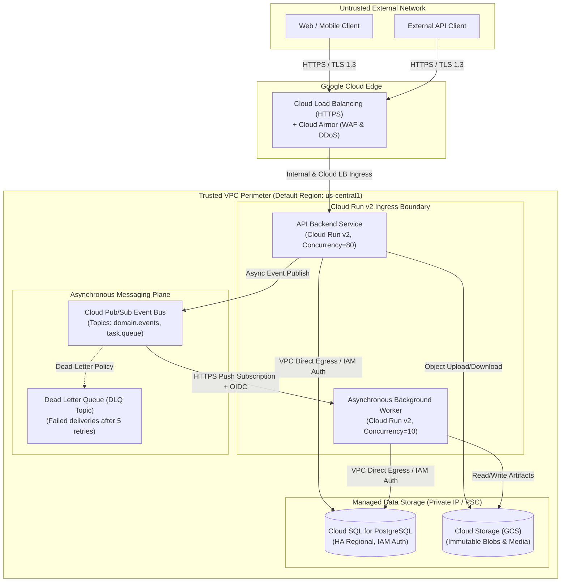

# ADR-0002: Cloud Run v2, Cloud Pub/Sub, and Cloud SQL for Serverless Architecture

## Status

*Accepted on 2026-09-21*

---

## Context and Problem Statement

During **Pass 2 (Service Topology & Container Decomposition)** of the 5-Pass Progressive Plan Expansion, the opaque system boundary established in Pass 1 (`docs/01-architecture/c4-context-model.md`) must be decomposed into concrete compute, messaging, and storage containers. 

The system topology requires three foundational application containers:
1. **Web Frontend Container**: Client-facing Single Page Application (SPA) / Server-Side Rendered (SSR) portal.
2. **API Backend Service**: Stateless synchronous REST/gRPC API service executing core business workflows and database transactions.
3. **Asynchronous Background Worker**: Event-driven worker processing long-running jobs, webhooks, transactional emails, and batch workflows decoupled from synchronous user requests.

### Core Architectural Requirements & Constraints
* **Cloud Platform**: Google Cloud Platform (GCP).
* **Multi-Environment Support**: The architecture must support Ephemeral Preview, Development, Staging, and Production environments without incurring exorbitant idle costs.
* **Lean Operations & Agent Ergonomics**: Engineering is maintained by a lean team leveraging autonomous AI agents. Infrastructure complexity (such as manual Kubernetes cluster upgrades, CNI networking, ingress controller configuration, and node autoscaling tuning) introduces severe operational friction and failure modes for autonomous agents.
* **Security & Compliance**: Zero public IP exposure for databases and internal workers; private VPC networking; managed IAM identity integration (no long-lived static database credentials or API keys).
* **Performance Targets**: Synchronous API p99 latency < 250ms; rapid auto-scaling from 0 to thousands of concurrent requests.

We must select the compute runtime, event distribution backbone, and relational database platform that fulfill these requirements while optimizing total cost of ownership (TCO) and operational simplicity.

---

## Decision Drivers

* **Driver 1: Operational Burden & "NoOps" Maintenance**: Eliminate infrastructure control plane management, OS kernel patching, Kubernetes cluster version upgrades, and manual node pool maintenance.
* **Driver 2: True Scale-to-Zero & Financial Efficiency**: Ephemeral preview and development environments must scale to zero instances and incur \$0 compute spend when idle. Production workloads must scale dynamically with incoming demand.
* **Driver 3: Cold-Start Mitigation & Latency SLOs**: P99 response times for synchronous customer traffic must remain < 250ms, with robust mitigations for container initialization latency.
* **Driver 4: Developer & Agent Velocity**: Standard Open Container Initiative (OCI) images that run identically in local development (via Docker Compose) and cloud production, with simple, declarative Terraform surfaces.
* **Driver 5: Reliable Asynchronous Decoupling**: Guaranteed at-least-once event delivery, automatic retries with exponential backoff, dead-letter queuing (DLQ), and protection against synchronous request timeouts.
* **Driver 6: Strong Enterprise VPC Security**: Private networking between compute, databases, and message brokers with Google Cloud IAM service-account-based authentication (Workload Identity).

---

## Considered Options

1. **Option 1: Google Cloud Run v2 + Cloud Pub/Sub + Cloud SQL (PostgreSQL)** [Selected]
2. **Option 2: Google Kubernetes Engine (GKE) Autopilot + Self-Hosted Kafka/RabbitMQ + Cloud SQL**
3. **Option 3: Google Compute Engine (GCE) Managed Instance Groups + Cloud Pub/Sub + Cloud SQL**
4. **Option 4: Google Cloud Functions (2nd Gen) + Cloud Pub/Sub + Cloud Firestore**

---

## Evaluation of Options

### Option 1: Google Cloud Run v2 + Cloud Pub/Sub + Cloud SQL (PostgreSQL)

*Deploy containerized microservices to Google Cloud Run v2 using Direct VPC Egress, trigger asynchronous workers via Cloud Pub/Sub push subscriptions, and persist relational state in Cloud SQL for PostgreSQL accessed via Private Service Connect (PSC) and IAM database authentication.*

* **Architecture Overview**:
  * **Compute (Cloud Run v2)**: Fully managed Knative-based serverless container runtime. API Backend runs with concurrency=80, scale-to-zero in non-prod, min-instances=1 in prod. Asynchronous Worker runs as a second Cloud Run service invoked directly via HTTPS push endpoints from Pub/Sub with OIDC token verification.
  * **Messaging (Cloud Pub/Sub)**: Fully managed, global messaging bus with automatic partitioning, built-in retry policies, and dead-letter queues (DLQs).
  * **Storage (Cloud SQL for PostgreSQL)**: Managed relational database with automated backups, point-in-time recovery (PITR), regional High Availability (HA), and Cloud SQL Auth Proxy / PSC integration.
* **Pros (+)**:
  * **+ Zero Control Plane Overhead**: No Kubernetes control plane to manage, upgrade, or troubleshoot.
  * **+ Genuine Scale-to-Zero**: Inactive dev/staging services scale to 0 vCPUs/memory, reducing non-production infrastructure costs by up to 85%.
  * **+ Direct VPC Egress (v2)**: Cloud Run v2 connects directly to VPC subnets without requiring expensive, throughput-constrained Serverless VPC Access connectors (\$25+/month per connector avoided).
  * **+ Standard OCI Containers**: Developers write standard Dockerfiles; 100% parity with local Docker Compose environments.
  * **+ Sub-Second Autoscaling**: Scales from 0 to hundreds of container instances in seconds based on HTTP concurrency or queue depth.
  * **+ Native IAM Security**: Built-in OIDC authentication for Pub/Sub push requests and Cloud SQL IAM database authentication eliminate static secrets.
* **Cons (-)**:
  * **- Cold Starts**: Containers scaling from zero experience initialization delays (mitigated via Startup CPU Boost and min-instances).
  * **- Connection Surges on Database**: Serverless container bursts can exhaust PostgreSQL connection limits if not pooled.
  * **- Max Request Duration**: Cloud Run HTTP requests have a 60-minute hard ceiling (adequate for APIs and workers, but unsuitable for indefinite background daemons).
* **Cost & Operational Profile**:
  * *Baseline Idle Cost*: ~\$45–70/month (dominated entirely by the smallest Cloud SQL db-f1-micro/db-custom-1-3840 instance; compute and messaging are \$0 at idle).
  * *Operational Complexity*: **Very Low**. Managed entirely through simple Terraform modules (`google_cloud_run_v2_service`).

---

### Option 2: Google Kubernetes Engine (GKE) Autopilot + Kafka + Cloud SQL

*Deploy a managed GKE Autopilot cluster running Kubernetes Deployments, Services, and Horizontal Pod Autoscalers (HPA), with self-hosted or managed Kafka for messaging.*

* **Pros (+)**:
  * **+ Limitless Flexibility**: Support for long-running stateful daemons, complex sidecars, custom service meshes (Istio), and raw TCP/UDP workloads.
  * **+ No Request Timeouts**: Pods can execute long-running computations indefinitely.
  * **+ Predictable Warm Pods**: Pods remain permanently scheduled with zero cold starts.
* **Cons (-)**:
  * **- High Baseline Cost**: GKE Autopilot charges a mandatory cluster management fee of \$74.40/month per cluster (waived for one cluster per billing account, but applies to multi-cluster or multi-region setups), plus minimum memory/CPU reservations per pod. Idle dev clusters cannot scale to \$0.
  * **- High Operational Overhead**: Autonomous AI agents frequently struggle with complex Kubernetes YAML manifests, Helm chart templating, CRDs, ingress controllers, CNI routing, and cluster version lifecycle updates.
  * **- Kafka Complexity**: Operating Kafka requires topic partition tuning, consumer group lag monitoring, and rebalancing overhead.
* **Cost & Operational Profile**:
  * *Baseline Idle Cost*: ~\$180–300/month per environment (cluster fees + persistent minimum resource reservations + Cloud SQL).
  * *Operational Complexity*: **High**. Requires dedicated SRE attention, pod disruption budgets, and continuous manifest maintenance.

---

### Option 3: Google Compute Engine (GCE) Managed Instance Groups (MIGs) + Pub/Sub + Cloud SQL

*Deploy containerized workloads onto GCE Virtual Machines organized into regional Managed Instance Groups with auto-healing and load balancing.*

* **Pros (+)**:
  * **+ Full OS Control**: Ability to tune Linux kernel parameters, custom sysctl settings, and install specialized kernel-level agents.
  * **+ Sustained Discount Pricing**: Long-term sustained use discounts on continuous workloads.
* **Cons (-)**:
  * **- No Scale-to-Zero**: VMs take 2–5 minutes to boot, initialize Docker, and join the load balancer. Cannot scale to zero for responsive traffic.
  * **- Heavy Day-2 Maintenance**: Requires OS image patching (Packer pipelines), security vulnerability scanning, and custom scaling policy tuning.
  * **- Poor Agent Ergonomics**: Agents must write and maintain Ansible playbooks, cloud-init scripts, or complex Packer HCL.
* **Cost & Operational Profile**:
  * *Baseline Idle Cost*: ~\$120–200/month (at least 2 continuous VMs across AZs for redundancy + Cloud SQL).
  * *Operational Complexity*: **Very High**. High operational toil.

---

### Option 4: Google Cloud Functions (2nd Gen) + Cloud Pub/Sub + Cloud Firestore

*Deploy fine-grained FaaS function handlers backed by Cloud Firestore (NoSQL document store).*

* **Pros (+)**:
  * **+ Granular Scale-to-Zero**: Functions scale strictly on an individual function invocation basis.
  * **+ Serverless Database**: Firestore scales transparently without connection pooling concerns.
* **Cons (-)**:
  * **- Framework & Vendor Lock-in**: Application logic is coupled to GCP function signatures (`cloudevents-sdk`), breaking local Docker Compose parity.
  * **- Architectural Fragmentation**: Managing dozens of independent functions creates severe deployment orchestration debt for agents and CI pipelines.
  * **- NoSQL Modeling Limitations**: Firestore lacks relational joins, strict ACID multi-table constraints, complex aggregations, and rich SQL analytical querying.
* **Cost & Operational Profile**:
  * *Baseline Idle Cost*: ~\$0–15/month.
  * *Operational Complexity*: **Medium**. Low infrastructure management, but high application code fragmentation.

---

## Comparison Matrix

| Evaluation Criteria | Option 1: Cloud Run v2 + Pub/Sub + Cloud SQL | Option 2: GKE Autopilot + Kafka + Cloud SQL | Option 3: GCE MIGs + Pub/Sub + Cloud SQL | Option 4: Cloud Functions + Firestore |
|---|:---:|:---:|:---:|:---:|
| **Operational Maintenance** | **Minimal (NoOps)** | High (K8s SRE) | Very High (SysAdmin) | Low |
| **Idle Cost in Non-Prod** | **Near Zero (~Cloud SQL only)** | High (\$150+/mo) | High (\$100+/mo) | Near Zero (\$0/mo) |
| **Cold-Start Performance** | **Sub-second (CPU Boost)** | Negligible (Warm) | None (Static VMs) | 1–3 seconds |
| **Autoscaling Latency** | **Seconds (Instant)** | Tens of Seconds | Minutes (Slow boot) | Seconds |
| **Local Dev Parity** | **High (Docker Compose)** | Medium (Kind/Minikube)| Low (Vagrant/VMs) | Poor (Emulators) |
| **Relational ACID Support**| **Full (PostgreSQL 16)** | Full (PostgreSQL 16) | Full (PostgreSQL 16) | No (NoSQL Document) |
| **Agent Maintainability** | **High (Simple Terraform)** | Low (Complex Helm/YAML)| Low (Shell/Ansible) | Medium |
| **Alignment Score** | **High (5/5)** | Medium (3/5) | Low (1/5) | Medium (3/5) |

---

## Detailed Architectural Blueprint & Decision Outcome

**Chosen Option**: **Option 1: Google Cloud Run v2 + Cloud Pub/Sub + Cloud SQL (PostgreSQL)**

### 1. Ingress & Compute Topology (Cloud Run v2)
* **API Backend Service**:
  * **Ingress Setting**: `internal-and-cloud-load-balancing`. Direct public HTTP access to the raw `*.run.app` URL is blocked; all traffic must traverse the Global External Application Load Balancer and Cloud Armor security policies.
  * **Concurrency**: Set to `80` concurrent requests per container instance. This maximizes CPU/RAM utilization and prevents unnecessary container sprawl under sustained traffic.
  * **CPU Allocation**: "CPU is only allocated during request processing" (request-based billing) for cost optimization.
  * **Scaling Configuration**:
    * Production: `min_instances = 1` (guarantees zero cold starts for baseline traffic), `max_instances = 50`.
    * Staging / Dev / Ephemeral: `min_instances = 0` (true scale-to-zero), `max_instances = 5`.

### 2. Asynchronous Event-Driven Decoupling (Cloud Pub/Sub)
* **Worker Service**:
  * Deployed as a distinct Cloud Run v2 service dedicated to asynchronous background execution.
  * **Ingress Setting**: `internal-only`. The worker is completely shielded from external internet ingress.
  * **Trigger Mechanism**: Cloud Pub/Sub **Push Subscriptions**. Pub/Sub pushes JSON event payloads directly to the worker's HTTP endpoint (`POST /tasks/execute`).
  * **Authentication**: The Pub/Sub subscription utilizes a dedicated service account to generate Google-signed **OIDC Identity Tokens** attached as `Authorization: Bearer <TOKEN>` in the push request. The worker validates this token on every incoming request.
  * **Resilience & Dead-Letter Queue (DLQ)**:
    * Exponential backoff retry policy (minimum backoff 10s, maximum backoff 600s).
    * Maximum retry count set to `5`. Messages failing 5 consecutive deliveries are automatically redirected to a dedicated Dead-Letter Topic (`*-dlq`) for inspection and alerting.
  * **Execution Timeout**: Worker service timeout configured up to 3600 seconds (60 minutes), accommodating heavy data synchronization and report generation tasks.

### 3. Relational Persistence (Cloud SQL for PostgreSQL)
* **Engine**: PostgreSQL 16 on Google Cloud SQL.
* **Connectivity**: Configured with **Private Service Connect (PSC)** or Private IP within the VPC. Public IP is strictly disabled.
* **Authentication**: **IAM Database Authentication** (`cloudsql_iam_authentication`). Application containers authenticate using short-lived OAuth2 tokens generated via the Cloud Run runtime service account, eliminating hardcoded passwords or secrets rotation overhead.
* **High Availability**: Regional dual-zone configuration in production with automatic synchronous replication and sub-minute failover.

---

## Cold-Start Mitigations & Production Hardening

Serverless container runtimes can introduce cold-start latency when scaling from 0 to 1 instance. We implement a multi-layered defense to guarantee strict latency SLO compliance:

### 1. Production Warm Instance Floor
In the production environment, `min_instances = 1` is enforced for the customer-facing API Backend. This ensures that at least one warm instance is always resident in memory, completely eliminating cold starts for standard traffic flows. During sudden traffic spikes, only incremental instances experience startup.

### 2. Cloud Run v2 Startup CPU Boost
We explicitly enable `startup_cpu_boost = true` in all Cloud Run service definitions. Google Cloud temporarily doubles the vCPU allocation during container boot and application initialization (e.g., framework bootstrap, dependency injection, connection pool warming). This accelerates container initialization by 40% to 60%.

### 3. Lightweight Multi-Stage Container Builds
All application Dockerfiles (Pass 4) must utilize multi-stage builds targeting Google **Distroless** (`gcr.io/distroless/static-debian12`) or lightweight Alpine base images. Final container images must be strictly kept under 100MB compressed, drastically reducing image download and container sandbox startup time.

### 4. Health Check Probes
We define explicit HTTP `startup_probe` and `liveness_probe` endpoints. Cloud Run will not route user requests to a new instance until the `startup_probe` returns HTTP 200, ensuring users never encounter 502/503 errors during cold start initialization.

---

## Database Connection Management & Mitigations

Serverless platforms can rapidly scale out container instances, risking PostgreSQL connection pool exhaustion (`FATAL: sorry, too many clients already`). We enforce the following mitigations:

1. **Max Instance Throttling**: The API service has an upper bound (`max_instances = 50`).
2. **Client-Side Connection Pool Limits**: Each container instance configures its internal connection pool (e.g., HikariCP, pgxpool, Prisma) with a strict maximum limit of `5-10` connections. With 50 instances, the maximum theoretical connections remain capped at 250–500, comfortably within Cloud SQL's threshold.
3. **PgBouncer Connection Pooling**: For higher scale, Cloud SQL built-in connection pooling or a dedicated PgBouncer sidecar proxy will be provisioned to multiplex thousands of virtual container connections into a static set of physical PostgreSQL backend connections.

---

## Cost Trade-Offs & Financial Analysis

| Resource | Development / Ephemeral Preview | Production (Baseline) | Production (High Traffic Peak) |
|---|---|---|---|
| **Cloud Run API** | \$0.00 (Scales to 0 at idle) | ~\$25.00/mo (1 warm instance 1 vCPU / 512MB) | ~\$120.00/mo (Dynamic scaling) |
| **Cloud Run Worker**| \$0.00 (Scales to 0 at idle) | \$0.00 (Billed per task execution) | ~\$35.00/mo (Task processing) |
| **Cloud Pub/Sub** | \$0.00 (< 10GB free tier) | ~\$0.40/mo (Low volume events) | ~\$15.00/mo (High throughput) |
| **Cloud SQL** | ~\$10.00/mo (`db-f1-micro`, single zone)| ~\$65.00/mo (`db-custom-1-3840`, HA regional)| ~\$140.00/mo (`db-custom-2-7680`, HA) |
| **Network Egress** | \$0.00 (VPC Direct Egress) | ~\$5.00/mo | ~\$25.00/mo |
| **Total Monthly Spend** | **~\$10.00 / month** | **~\$95.40 / month** | **~\$335.00 / month** |

*Comparison Note*: An equivalent GKE Autopilot setup in production would start at a baseline of **\$280+/month** regardless of whether any traffic is received, due to persistent node allocations and control plane management fees.

---

## Positive and Negative Consequences

### Positive Consequences
* **Extreme Operational Simplicity**: Zero Kubernetes clusters to patch, upgrade, or monitor. Autonomous agents can easily generate, maintain, and troubleshoot the declarative Terraform modules.
* **Massive Cost Reductions for Non-Prod**: Dev and preview environments scale to zero, reducing infrastructure spend by over 80% compared to GKE.
* **Seamless Local Developer Parity**: Containers are standard OCI images; developers and agents run the exact same containers locally using `docker-compose.yml` with local PostgreSQL and Pub/Sub emulators.
* **Enterprise Security Posture**: Ingress is strictly managed via Cloud Armor and Global Load Balancing; internal workers have zero public IP exposure; database access is locked inside private VPC networking with IAM authentication.

### Negative Consequences
* **Potential Cold Starts in Non-Prod**: Ephemeral dev environments will experience a 1–2 second delay on the first request after idle periods.
* **Database Connection Limits**: Unchecked container scaling could overwhelm Cloud SQL without strict pool sizing and PgBouncer.
* **Platform Constraints**: Long-running background processes cannot exceed the 60-minute Cloud Run execution timeout.

### Risk Mitigations
* **Cold Starts**: Production enforces `min_instances = 1` and `startup_cpu_boost = true`.
* **Database Connections**: Internal client connection pools capped at 5–10 per container; max instances capped at 50; PgBouncer proxy deployed if traffic expands.
* **60-Minute Execution Limit**: Any workflow exceeding 60 minutes is partitioned into discrete chained event stages coordinated via Pub/Sub topics.

---

## Implementation Plan & Downstream Impact

This decision directly anchors the subsequent passes of the 5-Pass Progressive Plan Expansion:

* **Pass 2 (Topology Artifacts)**:
  - Codify the containers, direct VPC egress, and Pub/Sub push paths in `docs/01-architecture/c4-container-model.md`.
  - Reference this ADR in `docs/01-architecture/system-rfc-template.md`.
* **Pass 3 (Contracts & Schemas)**:
  - Generate OpenAPI 3.1 specifications (`contracts/api/openapi.yaml`) for the Cloud Run API Backend endpoints.
  - Define Cloud Pub/Sub JSON event envelope schemas (`contracts/events/event-envelope.json`) matching the push subscription contracts.
  - Author PostgreSQL DDL (`contracts/database/schema.sql`) for Cloud SQL.
* **Pass 4 (Agent Scaffolding & Containers)**:
  - Provide lightweight multi-stage Dockerfiles (`services/api/Dockerfile`, `services/worker/Dockerfile`) based on Distroless images.
  - Provide `docker-compose.yml` orchestrating API, Worker, PostgreSQL, and Google Cloud Pub/Sub Emulator locally.
* **Pass 5 (Terraform & CI/CD)**:
  - Author modular Terraform (`infra/modules/cloud-run`, `infra/modules/pubsub`, `infra/modules/cloud-sql`).
  - Configure GitHub Actions CI/CD pipelines deploying container images to Artifact Registry and updating Cloud Run revisions.

---

## Compliance & Invariant Checklist

- [x] Evaluates at least three viable compute/messaging/storage alternatives.
- [x] Justifies Cloud Run v2, Pub/Sub, and Cloud SQL with empirical trade-offs.
- [x] Details scale-to-zero financial profile and operational burden metrics.
- [x] Formulates concrete, production-ready cold-start mitigations.
- [x] Documents database connection pooling risks and technical safeguards.
- [x] Master index in `docs/adr/README.md` updated and synchronized.
