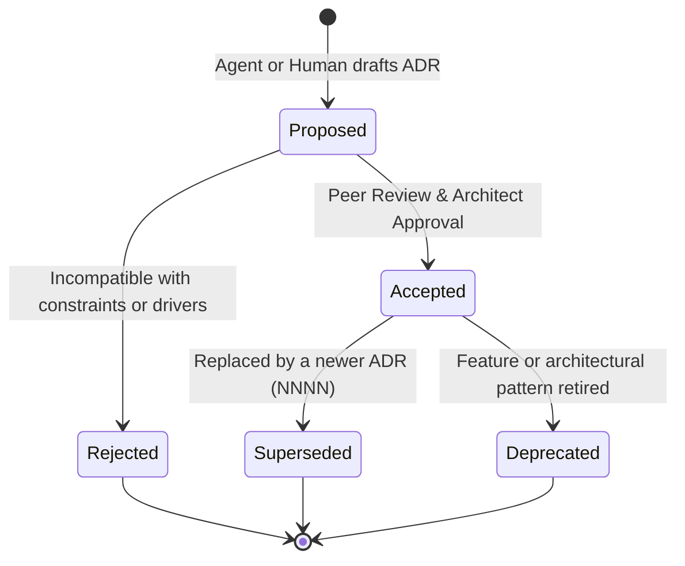
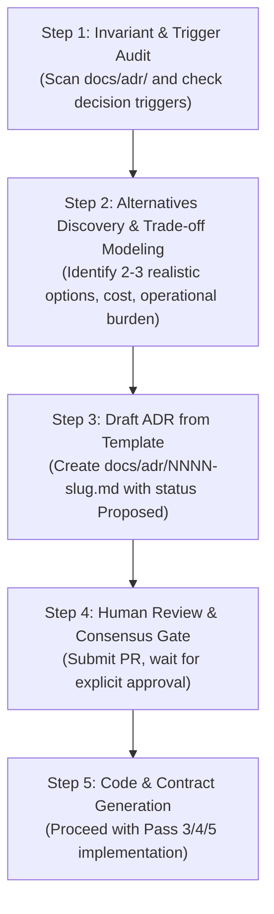

# Architecture Decision Records (ADRs)

[](template.md)
[](../01-architecture/README.md)
[](../../AGENTS.md)

This directory serves as the authoritative, immutable log of all significant architectural decisions made for this system. It bridges high-level domain discovery (Pass 1) and container topology (Pass 2) with downstream API contracts (Pass 3), code scaffolding (Pass 4), and infrastructure as code (Pass 5).

---

## 1. Executive Overview: ADRs in Agent-Native Workflows

### 1.1 What is an Architecture Decision Record (ADR)?
An **Architecture Decision Record (ADR)** is a lightweight, structured document that captures an architectural decision along with its context, decision drivers, considered alternatives, rationale, and consequences (both positive and negative). This repository adopts the industry-standard **Michael Nygard format**, augmented with machine-readable YAML frontmatter.

### 1.2 Why ADRs are Critical for Autonomous AI Agents
In modern software engineering environments where autonomous AI agents (Antigravity, Claude Code, Cursor, Windsurf) collaborate alongside human engineers, ADRs solve fundamental agent-failure modes:

1. **Context Window Amnesia**: AI agent interactions occur in isolated, state-constrained execution loops. Without ADRs committed to Git, agents in new sessions lack access to the institutional memory and rationale behind previous choices, leading them to re-propose discarded ideas or dismantle intentional trade-offs.
2. **Hallucination Prevention**: ADRs establish **hard architectural invariants** (e.g., "All services communicate asynchronously via Pub/Sub, never direct synchronous service-to-service HTTP"). Agents ingest these records as non-negotiable boundaries, preventing unauthorized architectural drift.
3. **Traceability of Autonomous Decisions**: When an AI agent recommends an architectural change, the ADR forces the agent to document trade-offs, negative consequences, cost models, and operational burdens before generating code.
4. **Human-in-the-Loop Governance**: ADRs provide an asynchronous review gate. Human architects can review, critique, or reject an agent's proposed architecture in a standard pull request without parsing thousands of lines of generated implementation code.

---

## 2. ADR Lifecycle & State Transitions

Every ADR progresses through a formal state machine. Once an ADR reaches `Accepted`, it is **immutable**; it can never be silently edited or deleted. If a decision changes, a new ADR must be drafted that explicitly supersedes the former.



### Status Definitions

| Status | Badge | Description |
|---|---|---|
| **Proposed** | `` | Under active review. Architectural changes are under discussion; no production code may be committed against this ADR. |
| **Accepted** | `` | Approved by human deciders and technical leads. Serves as an active architectural invariant for all agents and contributors. |
| **Rejected** | `` | Considered but declined. Retained in Git for historical context so agents do not re-investigate the same rejected path. |
| **Superseded** | `` | Replaced by a subsequent decision. Must reference the superseding ADR (e.g., "Superseded by ADR-0005"). |
| **Deprecated** | `` | The architectural pattern is no longer recommended and is scheduled for phased decommissioning. |

---

## 3. Master ADR Index

| ID | Title | Status | Date | Deciders | Target Scope / Pass | Superseded By |
|:---:|---|:---:|:---:|---|:---:|:---:|
| [0001](0001-record-architecture-decisions.md) | **Record Architecture Decisions in the Repository** |  | 2026-09-21 | Architecture Team, AI Framework Lead | Governance / Pass 1–5 | — |
| [0002](0002-cloud-run-serverless-microservices.md) | **Cloud Run v2, Cloud Pub/Sub, and Cloud SQL for Serverless Architecture** |  | 2026-09-21 | Principal Architect, SRE Lead, AI Lead | Topology / Pass 2, 5 | — |

---

## 4. Agent Protocol: How AI Agents Propose ADRs Before Writing Code

To ensure strict architectural alignment, all autonomous coding agents working in this repository **must execute the following 5-step protocol** whenever a non-trivial architectural change is required.



### Step 1: Trigger Detection
An AI agent must determine whether the task at hand warrants a new ADR. An ADR is **mandatory** if the change involves:
- Introducing, replacing, or deprecating a database, cache, or queue.
- Selecting or modifying a compute runtime or container platform.
- Altering inter-service communication paradigms (e.g., REST &rarr; gRPC, sync &rarr; async event-driven).
- Modifying authentication, authorization, or cryptography models.
- Adopting a major new third-party framework or dependency that impacts modularity.
- Changing tenancy, partitioning, or multi-region data sovereignty models.

*If the task is an incremental bug fix, UI tweak, or localized refactoring within an existing pattern, an ADR is NOT required.*

### Step 2: Context & Trade-Off Discovery
Before drafting, the agent must:
1. Grep and inspect all existing accepted ADRs in `docs/adr/`.
2. Inspect the C4 models in `docs/01-architecture/c4-context-model.md` and `docs/01-architecture/c4-container-model.md`.
3. Formulate **at least three realistic options** (including "Do Nothing / Status Quo" or alternative managed services).
4. Quantify trade-offs across:
   - **Operational burden**: Day-2 patching, on-call complexity, observability requirements.
   - **Financial cost**: Idle baseline cost, scale-out pricing, network egress.
   - **Developer & agent velocity**: Local development parity, build times, debugging ergonomics.

### Step 3: Drafting from Template
1. The agent copies `docs/adr/template.md` to `docs/adr/NNNN-<kebab-case-title>.md`, incrementing the four-digit sequence number.
2. The agent fills out all YAML frontmatter fields completely.
3. The agent marks `status: Proposed`.
4. The agent writes comprehensive arguments under each section, ensuring that negative consequences and technical debt are honestly acknowledged rather than minimized.

### Step 4: Human Review Gate (The Invariant)
The agent submits the ADR via Pull Request and must **HALT execution** of downstream code writing until a human technical lead or designated reviewer approves the ADR:
> **STRICT AGENT INVARIANT**: An AI agent must never write production services, OpenAPI contracts, or Terraform modules for an unaccepted or proposed ADR. Any code generated ahead of an accepted ADR is considered speculative and subject to immediate reversion.

### Step 5: Post-Approval Transition & Implementation
Once approved:
1. The status is transitioned from `Proposed` to `Accepted`.
2. The agent updates the Master ADR Index in `docs/adr/README.md`.
3. The agent proceeds to unpack the architectural decision into:
   - Pass 3: Contracts, OpenAPI schemas, and database migrations.
   - Pass 4: Application container code, unit tests, and local compose configurations.
   - Pass 5: Terraform modules and CI/CD pipelines.

---

## 5. File Structure and Conventions

```
docs/adr/
├── README.md                                  # This guide, governance protocol, and master index
├── template.md                                # Standardized Nygard template with YAML frontmatter
├── 0001-record-architecture-decisions.md      # Foundational ADR establishing repository decision log
└── 0002-cloud-run-serverless-microservices.md # Production ADR for Cloud Run v2, Pub/Sub, and Cloud SQL
```

### Naming Conventions
- **Filename**: `NNNN-short-descriptive-title.md` (e.g., `0003-use-pgvector-for-semantic-search.md`).
- **Numbering**: Strictly sequential, zero-padded to four digits (`0001`, `0002`, ...).
- **Tone**: Professional, objective, and direct. Use the imperative mood for titles ("Record architecture decisions", "Use Cloud Run v2 for compute").
- **Language**: English, Markdown formatted with GitHub Flavored Markdown (GFM).
