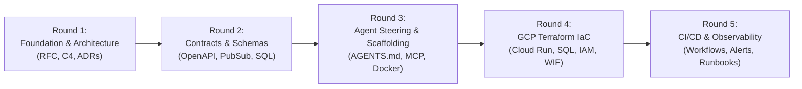

# System Design-to-Deployment Workflow Template: 5-Round Architecture Design

## Executive Summary
This design specification defines an end-to-end, agent-native SDLC workflow template designed for **vibe coding with autonomous AI agents (Antigravity, Claude Code, Cursor, Windsurf) and Model Context Protocol (MCP)** targeting Google Cloud Platform (GCP).

The lifecycle is consolidated into **5 strategic rounds**. Each round represents an isolated, independently testable milestone with clear inputs, deliverables, verification gates, and parallel subagent dispatch points.

---

## The 5-Round Lifecycle Architecture

---

## Round 1: Foundation & Architecture Blueprint

### Objective
Establish the foundational system intent, domain boundaries, C4 model diagrams, and critical architectural decisions before writing contracts or code.

### Deliverables
1. `docs/00-discovery/problem-statement.md`: Intent, target personas, business constraints, and non-functional requirements.
2. `docs/00-discovery/success-metrics.md`: Key performance indicators (KPIs), SLO targets, and acceptance criteria.
3. `docs/01-architecture/system-rfc.md`: Comprehensive system Request for Comments (RFC) detailing topology, communication patterns, and sync vs. async flows.
4. `docs/01-architecture/c4-architecture.md`: C4 Level 1 (System Context) and Level 2 (Container) Mermaid diagrams.
5. `docs/adr/0001-technology-stack.md` & `0002-cloud-run-and-pubsub.md`: Architecture Decision Records capturing rationale, trade-offs, and alternatives considered.

### Parallel Subagent Dispatch Strategy
- **Agent 1 (Discovery Lead):** Generates problem statement, user personas, and success metrics templates.
- **Agent 2 (Architecture Modeler):** Generates System RFC and C4 Mermaid diagrams for web, api, worker, and database.
- **Agent 3 (ADR Author):** Generates ADR templates and initial records for GCP Cloud Run, Cloud Pub/Sub, and PostgreSQL.

---

## Round 2: Contracts, Interfaces & Schema Specifications

### Objective
Define and validate strict service interface boundaries, message formats, and data storage definitions prior to implementation, preventing agent hallucinations and schema mismatch.

### Deliverables
1. `contracts/api/openapi.yaml`: OpenAPI 3.1 specification for the Backend API, including request/response schemas, error objects, and mock payloads.
2. `contracts/events/event-schema.json`: Google Cloud Pub/Sub JSON message contract for asynchronous worker processing.
3. `contracts/database/schema.sql`: PostgreSQL DDL defining database tables, relationships, indexes, foreign keys, and constraints.
4. `contracts/database/erd.md`: Mermaid Entity-Relationship Diagram (ERD) documenting data entities and cardinality.

### Parallel Subagent Dispatch Strategy
- **Agent 1 (API Designer):** Authors `openapi.yaml` with schema models and example mock responses.
- **Agent 2 (Event Modeler):** Authors Pub/Sub JSON schemas and publisher/subscriber payload definitions.
- **Agent 3 (Data Modeler):** Authors PostgreSQL DDL, indices, and Mermaid ERD documentation.

---

## Round 3: Agent Steering, MCP Tooling & Development Scaffolding

### Objective
Equip human developers and autonomous AI agents with unified project rules, Model Context Protocol (MCP) server profiles, slash command playbooks, and local container runtime automation.

### Deliverables
1. `AGENTS.md` & `.cursorrules`: Project instructions specifying code conventions, directory boundaries, testing mandates, and forbidden patterns.
2. `.mcp/gcp-mcp.json` & `.mcp/mcp-instructions.md`: MCP server configuration guides for Google Cloud (Cloud Run, Cloud Logging, Secret Manager), PostgreSQL, and GitHub MCPs.
3. `.agents/playbooks/`: Slash command playbooks (`design-service.md`, `scaffold-endpoint.md`, `verify-branch.md`).
4. `docker-compose.yml`: Local multi-tier environment (Frontend mock, API backend, Pub/Sub emulator, PostgreSQL).
5. `Makefile`: Unified commands (`make verify`, `make test`, `make lint`, `make docker-up`, `make clean`).

### Parallel Subagent Dispatch Strategy
- **Agent 1 (Agent Steering Architect):** Builds `AGENTS.md`, `.cursorrules`, and `.agents/playbooks/`.
- **Agent 2 (MCP Integration Engineer):** Configures `.mcp/` profiles and instructions for GCP, DB, and GitHub.
- **Agent 3 (Local Scaffolding Lead):** Creates `docker-compose.yml`, multi-stage Dockerfiles, and `Makefile`.

---

## Round 4: Infrastructure as Code (GCP Terraform Modules & Environments)

### Objective
Construct modular, declarative Terraform definitions to provision the multi-tier system on Google Cloud Platform with zero manual console intervention.

### Deliverables
1. `infra/modules/vpc/`: VPC network, subnets, Serverless VPC Access Connector.
2. `infra/modules/cloud_run/`: Cloud Run v2 service definitions for Web Frontend, API Backend, and Pub/Sub Worker with auto-scaling and health checks.
3. `infra/modules/cloud_sql/`: Cloud SQL PostgreSQL instance, databases, users, and private IP configuration.
4. `infra/modules/pubsub/`: Pub/Sub topics, dead-letter queues (DLQ), and push/pull subscriptions.
5. `infra/modules/iam_wif/`: Workload Identity Federation (WIF) pool, provider, and service accounts for keyless GitHub Actions authentication.
6. `infra/environments/{dev, staging, prod}/`: Environment-specific parameter bindings (`main.tf`, `variables.tf`, `terraform.tfvars.example`).

### Parallel Subagent Dispatch Strategy
- **Agent 1 (Platform & IAM Engineer):** Implements VPC, IAM, and Workload Identity Federation (WIF) modules.
- **Agent 2 (Compute Engineer):** Implements Cloud Run and Artifact Registry modules.
- **Agent 3 (Data & Messaging Engineer):** Implements Cloud SQL and Cloud Pub/Sub modules with DLQ.

---

## Round 5: Automated CI/CD, Progressive Rollout & Observability

### Objective
Automate build, security scan, and deployment pipelines using GitHub Actions with keyless GCP WIF, coupled with production monitoring, alerting, and incident response runbooks.

### Deliverables
1. `.github/workflows/ci.yaml`: Continuous integration workflow (linting, typechecks, unit tests, Docker build, Trivy vulnerability scan).
2. `.github/workflows/deploy-staging.yaml` & `deploy-prod.yaml`: Continuous deployment pipelines authenticating via WIF, pushing to Artifact Registry, and triggering zero-downtime Cloud Run revision rollouts.
3. `monitoring/alert-policies.yaml`: Google Cloud Monitoring metric-based alerting rules (HTTP 5xx rate, latency p99, Cloud Run container restarts, Pub/Sub unacknowledged message age).
4. `monitoring/logging-config.md`: Structured JSON logging conventions with correlation IDs (`trace`, `spanId`).
5. `docs/03-operations/incident-runbook.md`: Standard Operating Procedures (SOPs) for incident triage, rollbacks, and database recovery.

### Parallel Subagent Dispatch Strategy
- **Agent 1 (CI/CD Engineer):** Implements GitHub Actions workflows (`ci.yaml`, `deploy-staging.yaml`, `deploy-prod.yaml`).
- **Agent 2 (Observability Engineer):** Creates Cloud Monitoring alert policies, logging standards, and SLO definitions.
- **Agent 3 (SRE / Operations Author):** Writes incident runbooks, disaster recovery playbooks, and production readiness checklist.

---

## Quality & Verification Gates

| Round | Verification Gate |
|---|---|
| **Round 1** | Markdown linting, Mermaid diagram rendering check, ADR completeness audit |
| **Round 2** | Spectral OpenAPI validation (`spectral lint contracts/api/openapi.yaml`), SQL DDL syntax validation |
| **Round 3** | `make verify` passes; `docker compose config` validates; MCP json schema validation |
| **Round 4** | `terraform fmt -check`, `terraform validate`, `tflint` pass across all modules & environments |
| **Round 5** | GitHub Actions workflow syntax validation via `actionlint`; alert policy schema validation |
