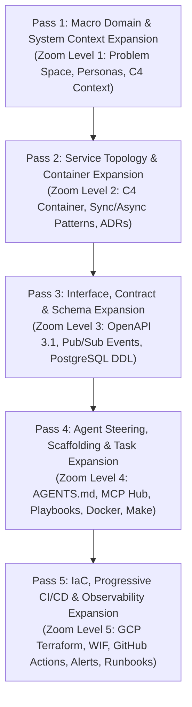

# System Design-to-Deployment Workflow Template: 5-Pass Progressive Expansion Architecture

## Executive Summary
This design specification defines an end-to-end, agent-native SDLC workflow template designed for **vibe coding with autonomous AI agents (Antigravity, Claude Code, Cursor, Windsurf) and Model Context Protocol (MCP)** targeting Google Cloud Platform (GCP).

Instead of treating system design and deployment as flat stages, this workflow template introduces a **5-Pass Progressive Plan Expansion Engine**. In the design and planning phases, a system concept is iteratively expanded across **5 distinct zoom levels**, starting from macro intent and progressively expanding level-by-level down to granular contracts, agent task playbooks, declarative Terraform IaC, and progressive cloud deployment.

---

## The 5-Pass Progressive Expansion Architecture

---

## Detailed Pass-by-Pass Progressive Expansion

### Pass 1: Macro Domain & System Context Expansion (Zoom Level 1)
- **Focus**: The 10,000-foot view. Clarify *why* the system exists, who interacts with it, boundary constraints, and non-functional targets before any technology or code is decided.
- **Expansion Mechanism**: Takes a rough user idea or product brief and expands it into formal discovery specs and a C4 Level 1 System Context model.
- **Key Deliverables**:
  - `docs/00-discovery/problem-statement-template.md`: Problem background, user personas, functional boundaries, out-of-scope declarations.
  - `docs/00-discovery/success-metrics-template.md`: Quantifiable KPIs, latency/throughput requirements, and business goals.
  - `docs/01-architecture/c4-context-model.md`: Mermaid C4 Level 1 diagram defining external users and third-party systems.
- **Parallel Subagent Opportunities**:
  - Agent 1: Generates problem statement and user personas framework.
  - Agent 2: Generates quantifiable metrics, SLA/SLO baselines.
  - Agent 3: Models C4 Context boundary diagrams and external dependencies.

---

### Pass 2: Service Topology & Communication Architecture Expansion (Zoom Level 2)
- **Focus**: Zoom in from the system boundary to the container/subsystem layer. Decompose the system into distinct computational tiers and define how data flows between them.
- **Expansion Mechanism**: Expands the C4 Context into multi-tier containers (Web Frontend, API Backend, Background Worker, PostgreSQL, Cloud Pub/Sub) and codifies architectural decisions in ADRs.
- **Key Deliverables**:
  - `docs/01-architecture/system-rfc-template.md`: Full architectural RFC detailing synchronous REST flows, asynchronous event buffering, and security perimeters.
  - `docs/01-architecture/c4-container-model.md`: C4 Level 2 Mermaid container topology and protocol specifications.
  - `docs/adr/0001-record-architecture-decisions.md`: ADR process standard.
  - `docs/adr/0002-cloud-run-serverless-microservices.md`: Formal decision record justifying Cloud Run, Pub/Sub, and Postgres over Kubernetes.
- **Parallel Subagent Opportunities**:
  - Agent 1: Authors the comprehensive System RFC template.
  - Agent 2: Authors the C4 Container architecture diagram and protocol mapping.
  - Agent 3: Constructs the Architecture Decision Record (ADR) framework.

---

### Pass 3: Interface, Contract & Schema Expansion (Zoom Level 3)
- **Focus**: Zoom inside the containers to define absolute interfaces and data models. Eliminates agent hallucination by providing strict, machine-readable contracts before implementation.
- **Expansion Mechanism**: Expands container definitions into OpenAPI 3.1 endpoints, CloudEvents-compliant Pub/Sub event schemas, and PostgreSQL DDL with relational ERDs.
- **Key Deliverables**:
  - `contracts/api/openapi.yaml`: Complete OpenAPI 3.1 contract (REST endpoints, query params, request/response bodies, RFC 7807 error details).
  - `contracts/api/mock-server.json`: Mock data definitions for client-server decoupling.
  - `contracts/events/event-envelope.json` & `task-created.v1.json`: JSON Schemas for asynchronous message publishing and worker ingestion.
  - `contracts/database/schema.sql`: Production-grade PostgreSQL DDL with UUID primary keys, indexes, foreign keys, and audit triggers.
  - `contracts/database/erd.md`: Mermaid Entity-Relationship Diagram documenting cardinality and relations.
- **Parallel Subagent Opportunities**:
  - Agent 1: Authors OpenAPI 3.1 specification and mock schemas.
  - Agent 2: Authors CloudEvents JSON schemas for Pub/Sub messaging.
  - Agent 3: Authors PostgreSQL DDL, indices, constraints, and Mermaid ERD.

---

### Pass 4: Agent Steering, Scaffolding & Task Expansion (Zoom Level 4)
- **Focus**: Zoom into the code and local developer experience. Equip developers and AI agents with clear rules, MCP tool integrations, prompt playbooks, and local container runtimes.
- **Expansion Mechanism**: Expands contracts into agent instruction files (`AGENTS.md`, `.cursorrules`), MCP connection profiles, command playbooks, and multi-tier local containers (`docker-compose.yml`, `Makefile`).
- **Key Deliverables**:
  - `AGENTS.md`, `.cursorrules`, and `GEMINI.md`: Strict agent guidelines (contract-first rules, coding conventions, testing requirements, forbidden patterns).
  - `.agents/playbooks/`: Executable slash command prompt playbooks (`design-service.md`, `scaffold-endpoint.md`, `verify-branch.md`).
  - `.mcp/gcp-mcp.json`, `.mcp/postgres-mcp.json`, `.mcp/github-mcp.json`: Model Context Protocol configs for GCP, Postgres, and GitHub.
  - `docker-compose.yml`: Local multi-service environment (Web, API, Worker, PostgreSQL, Pub/Sub emulator).
  - `services/{web,api,worker}/Dockerfile`: Multi-stage, non-root distroless/alpine Dockerfiles.
  - `Makefile`: One-command verification loop (`make verify`, `make test`, `make lint`).
- **Parallel Subagent Opportunities**:
  - Agent 1: Authors `AGENTS.md`, `.cursorrules`, and agent playbooks.
  - Agent 2: Configures MCP server integration files and guides.
  - Agent 3: Creates Dockerfiles, `docker-compose.yml`, and `Makefile`.

---

### Pass 5: IaC, Progressive CI/CD & Observability Expansion (Zoom Level 5)
- **Focus**: The cloud runtime and operational reality. Provision declarative GCP infrastructure, keyless CI/CD, and production monitoring.
- **Expansion Mechanism**: Expands the application topology into modular Terraform (`infra/modules/`, `infra/environments/`), GitHub Actions pipelines with Workload Identity Federation (WIF), and production observability runbooks.
- **Key Deliverables**:
  - `infra/modules/`: Reusable Terraform modules (`vpc`, `iam_wif`, `cloud_run`, `artifact_registry`, `cloud_sql`, `pubsub`).
  - `infra/environments/{dev,staging,prod}/`: Environment root configurations with cost and scaling guardrails.
  - `.github/workflows/ci.yaml`: Continuous integration with linting, testing, Docker build, and Trivy security scanning.
  - `.github/workflows/deploy-staging.yaml` & `deploy-prod.yaml`: Keyless WIF deployment, Artifact Registry push, and Cloud Run revision traffic splitting.
  - `monitoring/alert-policies.yaml`: Metric-based alert rules for error rates, latency p99, and container restart loops.
  - `docs/03-operations/incident-runbook.md` & `slo-sli-definitions.md`: Standard Operating Procedures for triage, rollbacks, and recovery.
  - `README.md`: Master template guide explaining the 5-Pass Progressive Expansion workflow.
- **Parallel Subagent Opportunities**:
  - Agent 1: Implements Terraform modules and environment roots.
  - Agent 2: Implements GitHub Actions CI/CD workflows with WIF.
  - Agent 3: Implements Cloud Monitoring alert policies, SLOs, and incident runbooks.

---

## Progressive Expansion Validation Matrix

| Expansion Pass | Input | Validation Gate | Output |
|---|---|---|---|
| **Pass 1: Macro Domain** | User request / Problem | Markdown linting, Persona completeness audit | Problem Statement, KPIs, C4 Context |
| **Pass 2: Service Topology** | C4 Context | ADR review, Mermaid syntax validation | C4 Containers, System RFC, ADRs |
| **Pass 3: Contracts** | Service topology | Spectral OpenAPI lint, JSON Schema check, SQL syntax check | `openapi.yaml`, PubSub schemas, `schema.sql` |
| **Pass 4: Agent Steering** | Contracts & Runtimes | `docker compose config`, `make verify` passes | `AGENTS.md`, `.mcp/`, Dockerfiles, `Makefile` |
| **Pass 5: IaC & Deployment** | Scaffolded services | `terraform fmt`, `terraform validate`, `actionlint` | Terraform modules, CI/CD, Monitoring, Runbooks |
