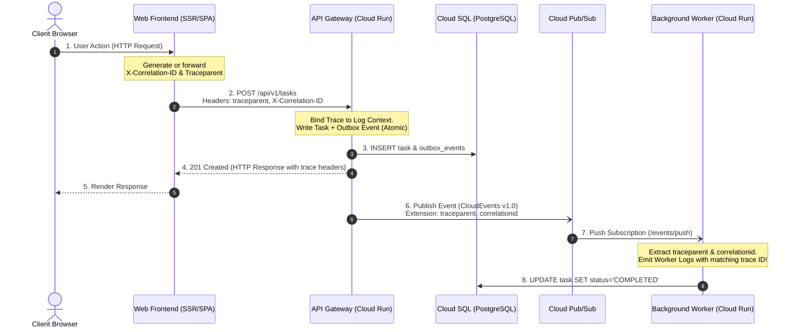

# Production Structured JSON Logging Guide & Standards

> **Pass 5 Artifact**: Observability, Telemetry & Operations (Zoom Level 5)  
> **Target Runtime**: Google Cloud Logging, Cloud Run v2, Cloud Pub/Sub, Node.js  
> **Status**: Active & Authoritative  
> **Last Updated**: 2026-09-21

---

## 1. Executive Summary

This document governs the structured logging architecture across all services in the System Design-to-Deployment workflow. All microservices (`services/web`, `services/api`, `services/worker`) MUST emit logs as **single-line structured JSON objects** to standard output (`stdout`) or standard error (`stderr`).

Google Cloud Logging automatically ingests stdout/stderr from Cloud Run containers, parsing special top-level JSON fields (such as `severity`, `message`, `logging.googleapis.com/trace`, and `httpRequest`) directly into native Cloud Logging LogEntry fields.

---

## 2. Standard Cloud Logging JSON Schema

Every log entry emitted by application runtimes MUST conform to the Google Cloud Logging structured payload specification:

```json
{
  "severity": "INFO",
  "message": "Task successfully created and enqueued for background processing",
  "timestamp": "2026-09-21T12:00:00.123456Z",
  "logging.googleapis.com/trace": "projects/PROJECT_ID/traces/0af7651916cd43dd8448eb211c80319c",
  "logging.googleapis.com/spanId": "b7ad6b7169203331",
  "logging.googleapis.com/trace_sampled": true,
  "httpRequest": {
    "requestMethod": "POST",
    "requestUrl": "/api/v1/tasks",
    "status": 201,
    "userAgent": "Mozilla/5.0 ...",
    "remoteIp": "192.0.2.1",
    "responseSize": "342",
    "latency": "0.045s"
  },
  "serviceContext": {
    "service": "template-api",
    "version": "1.0.0",
    "environment": "production"
  },
  "labels": {
    "tenant_id": "tenant-abc-123",
    "correlation_id": "c8b32607-28d8-4f16-8314-1e0f068565b9"
  },
  "context": {
    "task_id": "8f3b23c2-4017-486a-8b8f-36171804f5b2",
    "action": "task_create",
    "outbox_event_id": "019214b7-d1a1-7c9e-9d21-4f7f2b1892d1"
  }
}
```

### 2.1 Field Reference Table

| Field Name | Type | Description | Mandatory |
|---|---|---|---|
| `severity` | String | Log level: `DEBUG`, `INFO`, `NOTICE`, `WARNING`, `ERROR`, `CRITICAL`, `ALERT`, `EMERGENCY`. | **Yes** |
| `message` | String | Human-readable log summary message. | **Yes** |
| `timestamp` | String | RFC 3339 / ISO 8601 UTC timestamp with millisecond or nanosecond precision. | **Yes** |
| `logging.googleapis.com/trace` | String | Full resource trace name: `projects/{PROJECT_ID}/traces/{TRACE_ID}` (32-char hex). | **Yes (in HTTP/PubSub)** |
| `logging.googleapis.com/spanId` | String | 16-character hexadecimal span ID. | Optional |
| `logging.googleapis.com/trace_sampled` | Boolean | True if the trace was sampled for Cloud Trace export. | Optional |
| `httpRequest` | Object | Standard Cloud Logging HTTP context (requestMethod, requestUrl, status, latency, remoteIp). | **Yes (on HTTP responses)** |
| `serviceContext` | Object | Service identifier (`service`, `version`, `environment`) for Cloud Error Reporting grouping. | **Yes** |
| `labels` | Object | High-cardinality indexable labels (tenant ID, correlation ID). | Recommended |
| `context` | Object | Domain-specific metadata payload (entities, IDs, parameters). | Recommended |

---

## 3. Distributed Correlation & Trace Propagation

To allow end-to-end tracing across distributed components, a single transaction MUST preserve its trace context and correlation ID across all boundaries:



### 3.1 Trace Header Standards
1. **W3C Trace Context (`traceparent`)**:
   - Standard format: `00-{trace_id}-{span_id}-{trace_flags}`
   - Example: `00-4bf92f3577b34da6a3ce929d0e0e4736-00f067aa0ba902b7-01`
2. **Google Cloud Trace Header (`X-Cloud-Trace-Context`)**:
   - Injected by Cloud Load Balancer: `{trace_id}/{span_id};o={trace_flags}`
   - Example: `105445aa7843bc8bf206b120001000/1;o=1`
3. **Application Correlation Header (`X-Correlation-ID` or `X-Request-ID`)**:
   - UUIDv4 or UUIDv7 identifying the client-originated business transaction.

### 3.2 Pub/Sub CloudEvents Propagation
When publishing messages from the API Outbox to Pub/Sub, the trace context MUST be encoded in the CloudEvents v1.0 attributes:
```json
{
  "specversion": "1.0",
  "id": "e4f49432-8255-430b-9c7f-9cb4d752ad77",
  "source": "https://api.system.template/v1",
  "type": "com.system.task.created.v1",
  "time": "2026-09-21T12:00:00.500Z",
  "datacontenttype": "application/json",
  "traceparent": "00-4bf92f3577b34da6a3ce929d0e0e4736-00f067aa0ba902b7-01",
  "correlationid": "c8b32607-28d8-4f16-8314-1e0f068565b9",
  "data": {
    "taskId": "8f3b23c2-4017-486a-8b8f-36171804f5b2",
    "title": "Process dataset",
    "priority": "HIGH"
  }
}
```

---

## 4. PII & Sensitive Data Redaction Guidelines

Application logs MUST NOT contain secrets, credentials, or Personally Identifiable Information (PII).

### 4.1 Strictly Prohibited In Logs (Never Log)
- Passwords, password hashes, or PINs.
- Session tokens, API keys, JWT access/refresh tokens.
- Private encryption keys or certificates.
- Credit card numbers (PAN), CVVs, bank account routing details.
- Social Security Numbers (SSN), national identity numbers.

### 4.2 Automated Sanitization & Redaction Rules
Every logger wrapper MUST implement recursive object sanitization before serializing to JSON:

```javascript
// Example Redaction Filter implementation
const REDACTED_KEYS = new Set([
  'password', 'token', 'authorization', 'secret', 'apikey', 'api_key',
  'creditcard', 'credit_card', 'ssn', 'cvv', 'refreshtoken', 'privatekey'
]);

function sanitizeLogPayload(obj, depth = 0) {
  if (depth > 5 || !obj || typeof obj !== 'object') return obj;
  if (Array.isArray(obj)) return obj.map(item => sanitizeLogPayload(item, depth + 1));

  const sanitized = {};
  for (const [key, value] of Object.entries(obj)) {
    const lowerKey = key.toLowerCase().replace(/[-_]/g, '');
    if (REDACTED_KEYS.has(lowerKey)) {
      sanitized[key] = '[REDACTED]';
    } else if (typeof value === 'object') {
      sanitized[key] = sanitizeLogPayload(value, depth + 1);
    } else if (typeof value === 'string' && value.startsWith('Bearer ')) {
      sanitized[key] = 'Bearer [REDACTED]';
    } else {
      sanitized[key] = value;
    }
  }
  return sanitized;
}
```

---

## 5. Node.js Structured Logging Helper Implementation

Each service in `services/` utilizes a zero-dependency or lightweight structured logger that conforms to Cloud Logging:

```javascript
// services/common/logger.js
const PROJECT_ID = process.env.GCP_PROJECT || process.env.PROJECT_ID || 'local-project';
const SERVICE_NAME = process.env.SERVICE_NAME || 'template-api';
const VERSION = process.env.APP_VERSION || '1.0.0';

function formatLog(severity, message, meta = {}) {
  const { req, traceId, spanId, ...extra } = meta;
  
  const logEntry = {
    severity,
    message,
    timestamp: new Date().toISOString(),
    serviceContext: {
      service: SERVICE_NAME,
      version: VERSION,
      environment: process.env.NODE_ENV || 'development'
    },
    ...extra
  };

  // Attach Google Cloud Trace linking
  if (traceId) {
    logEntry['logging.googleapis.com/trace'] = `projects/${PROJECT_ID}/traces/${traceId}`;
  }
  if (spanId) {
    logEntry['logging.googleapis.com/spanId'] = spanId;
  }

  // Attach httpRequest context if present
  if (req) {
    logEntry.httpRequest = {
      requestMethod: req.method,
      requestUrl: req.url,
      status: req.res?.statusCode,
      userAgent: req.headers['user-agent'],
      remoteIp: req.headers['x-forwarded-for'] || req.socket?.remoteAddress,
    };
  }

  return JSON.stringify(logEntry);
}

const logger = {
  info: (msg, meta) => console.log(formatLog('INFO', msg, meta)),
  warn: (msg, meta) => console.warn(formatLog('WARNING', msg, meta)),
  error: (msg, meta) => console.error(formatLog('ERROR', msg, meta)),
  debug: (msg, meta) => {
    if (process.env.LOG_LEVEL === 'DEBUG') console.log(formatLog('DEBUG', msg, meta));
  }
};

module.exports = logger;
```

---

## 6. Cloud Logging Query Recipes (LogQL / GCP Filter Syntax)

Use these targeted queries in Google Cloud Logging Explorer or the `gcloud logging read` CLI:

### 6.1 Trace an End-to-End Transaction by Correlation ID
```
resource.type=("cloud_run_revision" OR "pubsub_subscription")
jsonPayload.correlation_id="c8b32607-28d8-4f16-8314-1e0f068565b9"
```

### 6.2 Cloud Run 5xx Errors and Unhandled Exceptions
```
resource.type="cloud_run_revision"
resource.labels.service_name="template-api"
(httpRequest.status >= 500 OR severity >= ERROR)
```

### 6.3 Identify High Latency Requests (> 1000ms)
```
resource.type="cloud_run_revision"
resource.labels.service_name="template-api"
httpRequest.latency > "1.0s"
```

### 6.4 Dead-Letter Queue & Worker Poison Pill Failures
```
resource.type="cloud_run_revision"
resource.labels.service_name="template-worker"
severity >= ERROR
(jsonPayload.message =~ "Poison pill" OR jsonPayload.message =~ "Dead-Letter")
```

### 6.5 Cloud SQL Connection Pool Exhaustion or Timeouts
```
resource.type="cloud_run_revision"
(textPayload =~ "remaining connection slots are reserved" OR textPayload =~ "timeout exceeded when acquiring connection")
```

---

## 7. Audit Trail & Compliance Standards

1. **Immutable Audit Events**: All state-mutating actions (create task, update status, delete entity) MUST emit an `AUDIT` log entry containing `actor_id`, `resource_id`, `action`, and `client_ip`.
2. **Log Retention**:
   - Operational logs: Retained for 30 days in Google Cloud Logging Default bucket.
   - Audit and security logs: Routed via Cloud Logging Sink to a Cloud Storage cold-line bucket with Object Retention Lock (WORM compliance) for 365 days.
3. **No Local Disk Spooling**: Containers MUST NOT write logs to the container filesystem (`/var/log/*`), as Cloud Run filesystems are ephemeral. All logs stream directly to standard streams (`stdout`/`stderr`).
